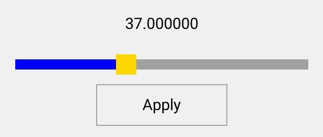
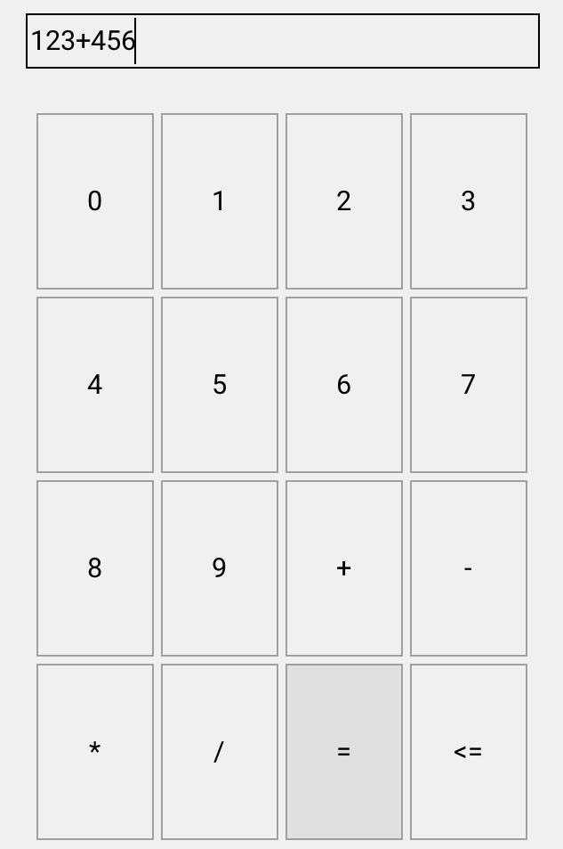

## 第 11 章 命令绑定

在传统的开发方式中，用户操作控件的时候，控件会触发一些事件，在这些事件处理函数中，去完成某些任务。在 MVVM 模式当中，则是通过命令绑定规则，建立控件事件与 Model 函数之间的联系，用户触发某个事件之后，框架自动执行 Model 中对应的函数。这种绑定关系更容易理解，让 View 与 Model 之间的耦合也更加松散。

### 11.1 命令绑定的基本用法

命令绑定规则也是一个控件属性：

属性的名称由两部分组成，两者之间用英文冒号分隔。

* v-on 表示该属性是一个命令绑定规则。
* 第二部分是控件事件的名称，表示对该事件触发时，自动执行指定的命令。

命令的名称放在'{'和'}'之间，命令对应 ViewModel 中的函数。

如：

```
v-on:click="{apply}" 表示将控件的"click"事件与 ViewModel 的"apply"命令关联起来。
```

目前支持的事件有（以后更加需要增加）:

* click 点击事件
* pointer_down 指针按下事件
* pointer_up 指针松开事件
* key_down 按键按下事件
* key_up 按键松开事件
* value_changed 值改变事件

我们还是以温度控制器为例，假设我们调节温度之后，点击"Apply"按钮，才让新的温度生效，如果新的温度与旧的温度相同，则禁用"Apply"按钮，否则启用"Apply"按钮。

新的界面大概是这样的：



它的界面描述文件是这样：

```
<window v-model="temperature">
  <label  x="center" y="middle:-40" w="80%" h="40" v-data:text="{value}"/>
  <slider x="center" y="middle" w="90%" h="20" v-data:value="{value}"/>
  <button text="Apply" x="center" y="middle:40" w="40%" h="40" v-on:click="{apply}"/>
</window>
```

拖动滑块改变温度的值，如果新的值与旧的值不同，"Apply"按钮处于启用状态，当点击"Apply"时，就会调用 ViewModel 中的"apply"，它将旧的值设置为新的值，"Apply"按钮重新处于禁用状态。

ViewModel 再调用 Model 的 apply 函数，ViewModel 的代码是自动生成的，这里只列出 Model 中的代码：

```
/**
 * @method temperature_apply
 * 使用新设置的值生效。
 *
 * @annotation ["command"]
 * @param {temperature_t*} temperature temperature 对象。
 *
 * @return {ret_t} 返回 RET_OK 表示成功；返回 RET_OBJECT_CHANGED 表示 Model 有变化，View 需要刷新；返回其它表示失败。
 */
ret_t temperature_apply(temperature_t* temperature);

/**
 * @method temperature_can_apply
 * 检查 apply 命令是否可以执行。
 *
 * @param {temperature_t*} temperature temperature 对象。
 *
 * @return {bool_t} 返回 FALSE 表示不能执行，否则表示可以执行。
 */
bool_t temperature_can_apply(temperature_t* temperature);

```

在命令绑定规则中，还可以指定一些高级参数，这些参数之间用英文逗号分隔，后面我们将详细介绍这些参数的作用。

Windows 的命令行下，读者可以运行 demo6 来查看实际的效果。

```
bin\demo6.exe
```

### 11.2 命令的参数

在命令绑定规则中，可以指定一个参数，该参数并不是必须的，但有时命令参数确实能带来不少便利。

在命令绑定规则中，通过 Args 指定命令的参数。如：

```
v-on:click="{add_char, Args=0}"
```

现在我们以一个简单计算器的例子，来看看命令参数是如何使用，以及它带来的便利性。

计算器的界面大概是这样的：



计算器的界面描述文件是这样的：

```
<window v-model="calculator">
  <edit x="c" y="10" w="90%" h="30" focus="true" input_type="custom" text="" tips="expression" v-data:text="{expr}"/>
  <view y="60" x="c" w="90%" h="-60" is_keyboard="true" 
    children_layout="default(r=4,c=4,m=5,s=5)" >
    <button name="key" text="0" v-on:click="{add_char, Args=0}"/>
    <button name="key" text="1" v-on:click="{add_char, Args=1}"/>
    <button name="key" text="2" v-on:click="{add_char, Args=2}"/>
    <button name="key" text="3" v-on:click="{add_char, Args=3}"/>
    <button name="key" text="4" v-on:click="{add_char, Args=4}"/>
    <button name="key" text="5" v-on:click="{add_char, Args=5}"/>
    <button name="key" text="6" v-on:click="{add_char, Args=6}"/>
    <button name="key" text="7" v-on:click="{add_char, Args=7}"/>
    <button name="key" text="8" v-on:click="{add_char, Args=8}"/>
    <button name="key" text="9" v-on:click="{add_char, Args=9}"/>
    <button name="key" text="+" v-on:click="{add_char, Args=+}"/>
    <button name="key" text="-" v-on:click="{add_char, Args=-}"/>
    <button name="key" text="*" v-on:click="{add_char, Args=*}"/>
    <button name="key" text="/" v-on:click="{add_char, Args=/}"/>
    <button name="key" text="=" v-on:click="{eval}"/>
    <button name="backspace" text="<=" v-on:click="{remove_char}"/>
  </view>
</window>

```

这里我们可以看到，数字和运算符全部绑定到"add_char"这个命令上，只是通过参数来区分的，ViewModel 中，我们只需要实现 add_char 函数即可。如果不使用命令参数，我们就要为每一个按钮写一个命令，那是非常繁琐的。

下面我们看看模型的声明(demo7/calculator.h)：

```c
/**
 * @class calculator_t
 *
 * @annotation ["model"]
 * 计算器。
 *
 */
typedef struct _calculator_t {
  /**
   * @property {const char*} expr
   * @annotation ["readable", "writable"]
   * 表达式。
   */
  str_t expr;

} calculator_t;

/**
 * @method calculator_create
 * 创建calculator对象。
 *
 * @annotation ["constructor"]
 * @return {calculator_t*} 返回calculator对象。
 */
calculator_t* calculator_create(void);

/**
 * @method calculator_destroy
 * 销毁calculator对象。
 *
 * @annotation ["destructor"]
 * @param {calculator_t*} calculator calculator对象。
 *
 * @return {ret_t} 返回RET_OK表示成功，否则表示失败。
 */
ret_t calculator_destroy(calculator_t* calculator);

/**
 * @method calculator_get_expr
 * 获取当前表达式。
 * @param {calculator_t*} calculator calculator对象。
 *
 * @return {const char*} 返回表达式。
 */
const char* calculator_get_expr(calculator_t* calculator);

/**
 * @method calculator_set_expr
 * 设置当前表达式。
 *
 * @param {calculator_t*} calculator calculator对象。
 * @param {const char*} expr 表达式。
 *
 * @return {ret_t} 返回RET_OK表示成功，否则表示失败。
 */
ret_t calculator_set_expr(calculator_t* calculator, const char* expr);

/**
 * @method calculator_add_char
 * 追加一个字符。
 *
 * @annotation ["command"]
 * @param {calculator_t*} calculator calculator对象。
 * @param {const char*} args 参数。
 *
 * @return {ret_t} 返回RET_OBJECT_CHANGED表示模型有变化，View需要刷新；返回其它表示失败。
 */
ret_t calculator_add_char(calculator_t* calculator, const char* args);

/**
 * @method calculator_remove_char
 * 删除最后一个字符串。
 *
 * @annotation ["command"]
 * @param {calculator_t*} calculator calculator对象。
 *
 * @return {ret_t} 返回RET_OBJECT_CHANGED表示模型有变化，View需要刷新；返回其它表示失败。
 */
ret_t calculator_remove_char(calculator_t* calculator);

/**
 * @method calculator_can_remove_char
 * 检查remove_char命令是否可以执行。
 *
 * @param {calculator_t*} calculator calculator对象。
 *
 * @return {bool_t} 返回FALSE表示不能执行，否则表示可以执行。
 */
bool_t calculator_can_remove_char(calculator_t* calculator);

/**
 * @method calculator_eval
 * 计算表达式。
 *
 * @annotation ["command"]
 * @param {calculator_t*} calculator calculator对象。
 *
 * @return {ret_t} 返回RET_OBJECT_CHANGED表示模型有变化，View需要刷新；返回其它表示失败。
 */
ret_t calculator_eval(calculator_t* calculator);

/**
 * @method calculator_can_eval
 * 检查eval命令是否可以执行。
 *
 * @param {calculator_t*} calculator calculator对象。
 *
 * @return {bool_t} 返回FALSE表示不能执行，否则表示可以执行。
 */
bool_t calculator_can_eval(calculator_t* calculator);
```

Windows 的命令行下，读者可以运行 demo7 来查看实际的效果。

```
bin\demo7.exe
```

### 11.3 更新 Model 的参数

在前面我们提到，将数据从 View 同步到 Model 有三种触发方式，其中一个称为显式更新，需要在命令执行之前，显式的将 View 的数据同步到 Model。

这可以通过命令的 UpdateModel 参数来实现。其用法如下：

先将数据更新的触发方式指定为 Explicit：

```
v-data:value="{value, Trigger=Explicit}"
```

然后再指定命令的 UpdateModel 参数：

```
v-on:click="{nothing, UpdateModel=true}"
```

> 这里我们用了 nothing 命令，它是一个特殊命令，除了参数要求的事情之外，它什么也不做。这里它就只是同步 View 的数据到 Model。

完整示例如下：

```
<window v-model="temperature">
  <label x="center" y="middle" w="50%" h="40" v-data:text="{value}"/>
  <slider x="center" y="middle:40" w="80%" h="20" v-data:value="{value, Trigger=Explicit}"/>
  <button name="apply" text="Apply" x="center" y="bottom:10" w="80%" h="30" 
    v-on:click="{nothing, UpdateModel=true}"/>
</window>

```

Windows 的命令行下，读者可以运行 demo4 来查看实际的效果。

```
bin\demo4.exe
```

### 11.4 关闭当前窗口的参数

有时，在执行完某个命令后，需要关闭当前窗口。但命令是在 ViewModel 中实现的，它不能直接操作界面，也就不能直接关闭窗口，否则就与 View 耦合起来了。

在执行完某个命令后，需要关闭当前窗口，可以通过命令的 CloseWindow 参数来实现。其用法如下：

```
v-on:click="{nothing, CloseWindow=true}"
```

如果只是单纯的关闭当前窗口，可以使用 nothing 命令，也可以在执行实际的命令后关闭。

比如，下面这个例子中：

* 点击"OK"按钮，执行 return 命令，然后关闭窗口。
* 点击"Cancel"按钮，执行 nothing 命令，然后关闭窗口。

```
<window children_layout="default(r=3, c=1)" v-model="room_settings">
 <label floating="true" x="center" y="10" w="50%" h="40" v-data:text="{room}"/>

  <view>
    <label x="center" y="30" w="90%" h="40" text="temperature"/>
    <label x="center" y="middle" w="50%" h="40" v-data:text="{temp}"/>
    <slider x="center" y="middle:40" w="80%" h="20" v-data:value="{temp, Trigger=Changing}"/>
  </view>

  <view>
    <label x="center" y="30" w="90%" h="40" text="humidity"/>
    <label x="center" y="middle" w="50%" h="40" v-data:text="{humidity}"/>
    <slider x="center" y="middle:40" w="80%" h="20" v-data:value="{humidity, Trigger=Changing}"/>
  </view>

  <button text="OK" floating="true" x="center:-90" y="bottom:40" w="100" h="40" 
    v-on:click="{return, CloseWindow=true}"/>

  <button text="Cancel" floating="true" x="center:90" y="bottom:40" w="100" h="40" 
    v-on:click="{nothing, CloseWindow=true}"/>
</window>
```

Windows 的命令行下，读者可以运行 demo12 来查看实际的效果。

```
bin\demo12.exe
```

### 11.5 退出应用程序的参数

有时，在执行完某个命令后，需要退出应用程序。但命令是在 ViewModel 中实现的，不能直接退出应用程序，否则该命令就无法进行单元测试。

在执行完某个命令后，需要退出应用程序，可以通过命令的 QuitApp 参数来实现。其用法如下：

```
v-on:click="{nothing, QuitApp=true}"
```

如果只是单纯的退出应用程序，使用 nothing 命令即可。

完整示例如下：

```
<window v-model="temperature">
  <label x="center" y="30" w="90%" h="40" text="temperature"/>
  <label x="center" y="middle" w="50%" h="40" v-data:text="{value}"/>
  <button text="Quit" x="center" y="middle:40" w="40%" h="40" v-on:click="{nothing, QuitApp=true}"/>
</window>
```

Windows 的命令行下，读者可以运行 demo10 来查看实际的效果。

```
bin\demo10.exe
```

### 11.6 按键过滤参数

在处理按键事件的时候，通常我们并不希望按任意键都触发命令，而是按下特殊的键时才触发命令。这有点像快捷键的处理方式，比如按下 ctrl+s 才触发"save"命令，按下 ctrl+o 时才触发"open"命令。

可以指定按键过滤参数来实现这种效果，指定按键过滤参数很简单，在事件后面紧跟按键的值即可。如：

```
 v-on:key_down:ctrl+s="{apply}" 表示按下 ctrl+s 时，执行 apply 命令。 
```

常用的按键符号与键值的对应关系如下：

> 符号名除了字母外不区分大小写，建议用小写。
> ctrl/shift/alt 表示左右的按键都可以。

|    按键的符号          | 键值     |
| ---------------- | --------- |
|   RETURN  |  TK_KEY_RETURN |
|   ESCAPE  |  TK_KEY_ESCAPE |
|   BACKSPACE  |  TK_KEY_BACKSPACE |
|   TAB  |  TK_KEY_TAB |
|   SPACE  |  TK_KEY_SPACE |
|   EXCLAIM  |  TK_KEY_EXCLAIM |
|   QUOTEDBL  |  TK_KEY_QUOTEDBL |
|   HASH  |  TK_KEY_HASH |
|   PERCENT  |  TK_KEY_PERCENT |
|   DOLLAR  |  TK_KEY_DOLLAR |
|   AMPERSAND  |  TK_KEY_AMPERSAND |
|   QUOTE  |  TK_KEY_QUOTE |
|   LEFTPAREN  |  TK_KEY_LEFTPAREN |
|   RIGHTPAREN  |  TK_KEY_RIGHTPAREN |
|   ASTERISK  |  TK_KEY_ASTERISK |
|   PLUS  |  TK_KEY_PLUS |
|   COMMA  |  TK_KEY_COMMA |
|   MINUS  |  TK_KEY_MINUS |
|   PERIOD  |  TK_KEY_PERIOD |
|   SLASH  |  TK_KEY_SLASH |
|   0  |  TK_KEY_0 |
|   1  |  TK_KEY_1 |
|   2  |  TK_KEY_2 |
|   3  |  TK_KEY_3 |
|   4  |  TK_KEY_4 |
|   5  |  TK_KEY_5 |
|   6  |  TK_KEY_6 |
|   7  |  TK_KEY_7 |
|   8  |  TK_KEY_8 |
|   9  |  TK_KEY_9 |
|   a  |  TK_KEY_a |
|   b  |  TK_KEY_b |
|   c  |  TK_KEY_c |
|   d  |  TK_KEY_d |
|   e  |  TK_KEY_e |
|   f  |  TK_KEY_f |
|   g  |  TK_KEY_g |
|   h  |  TK_KEY_h |
|   i  |  TK_KEY_i |
|   j  |  TK_KEY_j |
|   k  |  TK_KEY_k |
|   l  |  TK_KEY_l |
|   m  |  TK_KEY_m |
|   n  |  TK_KEY_n |
|   o  |  TK_KEY_o |
|   p  |  TK_KEY_p |
|   q  |  TK_KEY_q |
|   r  |  TK_KEY_r |
|   s  |  TK_KEY_s |
|   t  |  TK_KEY_t |
|   u  |  TK_KEY_u |
|   v  |  TK_KEY_v |
|   w  |  TK_KEY_w |
|   x  |  TK_KEY_x |
|   y  |  TK_KEY_y |
|   z  |  TK_KEY_z |
|   A  |  TK_KEY_A |
|   B  |  TK_KEY_B |
|   C  |  TK_KEY_C |
|   D  |  TK_KEY_D |
|   E  |  TK_KEY_E |
|   F  |  TK_KEY_F |
|   G  |  TK_KEY_G |
|   H  |  TK_KEY_H |
|   I  |  TK_KEY_I |
|   J  |  TK_KEY_J |
|   K  |  TK_KEY_K |
|   L  |  TK_KEY_L |
|   M  |  TK_KEY_M |
|   N  |  TK_KEY_N |
|   O  |  TK_KEY_O |
|   P  |  TK_KEY_P |
|   Q  |  TK_KEY_Q |
|   R  |  TK_KEY_R |
|   S  |  TK_KEY_S |
|   T  |  TK_KEY_T |
|   U  |  TK_KEY_U |
|   V  |  TK_KEY_V |
|   W  |  TK_KEY_W |
|   X  |  TK_KEY_X |
|   Y  |  TK_KEY_Y |
|   Z  |  TK_KEY_Z |
|   DOT  |  TK_KEY_DOT |
|   DELETE  |  TK_KEY_DELETE |
|   LEFTBRACE  |  TK_KEY_LEFTBRACE |
|   RIGHTBRACE  |  TK_KEY_RIGHTBRACE |
|   LCTRL  |  TK_KEY_LCTRL |
|   RCTRL  |  TK_KEY_RCTRL |
|   LSHIFT  |  TK_KEY_LSHIFT |
|   RSHIFT  |  TK_KEY_RSHIFT |
|   LALT  |  TK_KEY_LALT |
|   RALT  |  TK_KEY_RALT |
|   CAPSLOCK  |  TK_KEY_CAPSLOCK |
|   HOME  |  TK_KEY_HOME |
|   END  |  TK_KEY_END |
|   INSERT  |  TK_KEY_INSERT |
|   UP  |  TK_KEY_UP |
|   DOWN  |  TK_KEY_DOWN |
|   LEFT  |  TK_KEY_LEFT |
|   RIGHT  |  TK_KEY_RIGHT |
|   PAGEUP  |  TK_KEY_PAGEUP |
|   PAGEDOWN  |  TK_KEY_PAGEDOWN |
|   F1  |  TK_KEY_F1 |
|   F2  |  TK_KEY_F2 |
|   F3  |  TK_KEY_F3 |
|   F4  |  TK_KEY_F4 |
|   F5  |  TK_KEY_F5 |
|   F6  |  TK_KEY_F6 |
|   F7  |  TK_KEY_F7 |
|   F8  |  TK_KEY_F8 |
|   F9  |  TK_KEY_F9 |
|   F10  |  TK_KEY_F10 |
|   F11  |  TK_KEY_F11 |
|   F12  |  TK_KEY_F12; |

按键事件的处理，一般放在窗口的上，可以同时指定多个事件。

下面的例子中，我们对两个按键进行了处理：

* ctrl+s 执行 apply 命令。
* escape 退出应用程序。

```
<window v-model="temperature" 
 v-on:key_down:ctrl+s="{apply}" 
 v-on:key_down:escape="{nothing, QuitApp=true}">
  <label  x="center" y="middle:-80" w="80%" h="40" text="ctrl+s to apply, escape to quit"/>
  <label  x="center" y="middle:-40" w="80%" h="40" v-data:text="{value}"/>
  <slider x="center" y="middle" w="90%" h="20" v-data:value="{value}"/>
  <button text="Apply" x="center" y="middle:40" w="40%" h="40" v-on:click="{apply}"/>
</window>

```

Windows 的命令行下，读者可以运行 demo14 来查看实际的效果。

```
bin\demo14.exe
```

### 11.7 内置命令

AWTK-MVVM 框架内置了几条常用的命令，可以避免在每个 Model 里都去实现。即使 View 没有绑定 ViewModel，这些命令也是可以执行的，所以在一些简单的情况下，开发者甚至连 ViewModel 都不用提供。

#### 11.7.1 nothing

它本身什么也不做，行为取决于参数。前面已经出现了好几次，读者应该已经熟悉了，这里不再赘述了。

#### 11.7.2 navigate

打开新窗口是经常要处理的事情，如果不需要在新窗口和当前窗口之间传递数据，那么可以直接使用 navigate 命令，并把 args 指定为新窗口的名称即可。如：

```
  v-on:click="{navigate, args=humidity}"/>
```

我们来看看完整的例子，在这个例子中，并没有用 v-model 指定 ViewModel，这是可以的：

```
<window>
  <button text="Temperature" x="center" y="middle:-40" w="40%" h="40" 
    v-on:click="{navigate, args=temperature9}"/>
  <button text="Humidity" x="center" y="middle:40" w="40%" h="40" 
    v-on:click="{navigate, args=humidity}"/>
</window>
```

Windows 的命令行下，读者可以运行 demo10 来查看实际的效果。

```
bin\demo10.exe
```

窗口导航是一个有趣的话题，涉及的内容也比较多，下一章我们再详细讨论。
