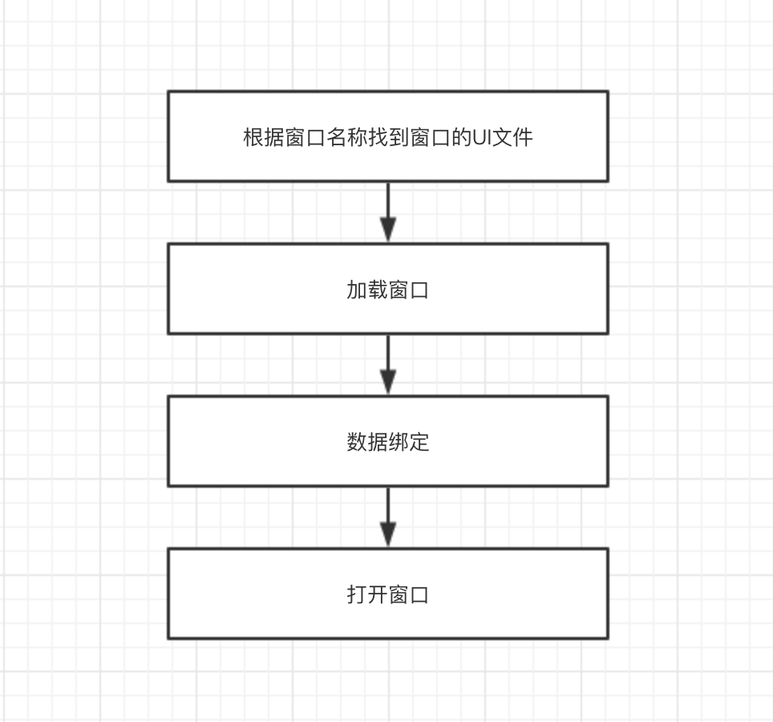

## 第 12 章 窗口导航

应用程序通常有多个窗口，窗口之间的切换以及参数的传递，这就是窗口导航。窗口导航是个常用的功能，有没有 MVVM 框架都需要这个功能，为什么我们要把它纳入 MVVM 框架内来讨论呢？

大家知道，模型是不能操作界面的，但是很多时候模型必须和用户进行交互。比如：

* 在写文件的过程中磁盘满了，要询问用户是中断操作还是清理垃圾。
* 购买的过程中，发现余额不足，要询问用户是放弃购买还是充值。
* 在执行某个命令时，需要打开另外一个窗口。

由此可见，模型有时就得操作界面！如果不能解决这个问题，就没有达到彻底隔离用户界面和业务逻辑的目标。这是 MVVM 窗口导航器要做的事情，所以把它放在 MVVM 中来讨论。

在传统分层设计中，将应用程序分成 3 层。分层设计的基本原则是，上层可以直接调用下层的函数，下层则只能通过回调函数或消息或事件通知上层，让上层执行某些动作。


提供回调函数给下层其实就是依赖注入，对于协议栈（如 TCP/IP) 来说，是非常方便的，因为需要提供的回调函数并不多。但是对应用程序来说，各种情况都有，虽然回调函数的方式不是不可能，但实际操作确实很困难，这样做的话，API 接口会很复杂，调用者理解也很困难。

Bob 大叔在《架构整洁之道》17 章中说：

>只要 GUI 是以插件形式插入业务逻辑的，那么 GUI 这边所发生的变更就不会影响系统的业务逻辑。

AWTK-MVVM 中的窗口导航器就是一个插件系统，在模型中通过 MVVM 的导航器打开窗口，并不会导致模型与视图的耦合。

假设我们要打开 settings 窗口：

AWTK 传统的打开方法是：

```
window_open("settings");
```

AWTK-MVVM 的打开方法是：

```
navigator_to("settings");
```

两者从外在看起来，除了函数名不同，好像也没有什么差别啊。但是两者本质上是不同的：

* 前者就是执行打开窗口的动作，如果执行成功就会打开窗口。这是编译的时候就定死了的，相当于硬编码，如果在模型中调用它，那模型就和 GUI 直接耦合到一起了。

* 后者则只是表达一个意图，发出一个请求，至于做什么，谁来做，调用者是完全不用关心的。在正常运行时，我们可以打开一个窗口，也可以执行另外一个应用程序。在测试时，我们可以什么也不做，让自动测试在没有用户的干预下继续往下运行。也就是说，它的行为完全由导航器这个插件系统中当前注册的插件决定。

AWTK-MVVM 中的导航器就是一个全局的依赖注入系统，一个视图的插件系统，让模型可以请求视图，同时又避免和视图的耦合到一起。

### 12.1 打开窗口的正确方式

在 AWTK-MVVM 中，不能直接打开窗口，而是通过导航器发出一个请求。下面我们来看看各种情况的处理：

#### 12.1.1 无参数无返回值的请求

这是最简单的情况，一般打开主窗口都用这种方式。

在代码中可以用函数 navigator\_to 来请求打开指定的窗口：

它的函数原型如下：

```
/**
 * @method navigator_to
 * 请求打开指定的窗口。
 *
 * @annotation ["static"]
 *
 * @param {const char*} target 目标窗口的名称及参数(请参考窗口导航文档)。
 *
 * @return {ret_t} 返回RET_OK表示成功，否则表示失败。
 */
ret_t navigator_to(const char* target);;
```

使用示例：

```
navigator_to("temperature1");
```

在 XML 中，也可以通过 navigate 命令来打开指定的窗口。如：

```
<window>
  <button text="Temperature" x="center" y="middle:-40" w="40%" h="40" 
    v-on:click="{navigate, args=temperature9}"/>
  <button text="Humidity" x="center" y="middle:40" w="40%" h="40" 
    v-on:click="{navigate, args=humidity}"/>
</window>
```

target 除了指定窗口名称外，还可以指定其它参数，窗口名后紧跟英文？表示后面还有其它参数。参数之间用英文&分隔，参数名和参数值之间用英文=分隔。如：

```xml
  <button text="Temperature" x="center" y="middle:40" w="80%" h="30" 
    v-on:click="{navigate, args=settings?close_current=true&open_new=false&mykey=myvalue}"/
```

其中下列参数是保留关键字，有特殊意义：

* close_current 打开新窗口时，是否关闭当前窗口。缺省为 false。
* open_new 是否始终打开新窗口。缺省为 true。当为 false 时，如果目标窗口存在，则切换到目标窗口，否则打开新窗口。

其它参数直接传递给新窗口的 ViewModel，具体用途由新窗口的 ViewModel 解释。

窗口名称有几个特殊取值：

* \_close\_ 用关闭指定窗口。
* \_back\_ 返回上一级窗口。
* \_home\_ 退回到主窗口。

```xml
  <button text="Back" x="center" y="middle" w="80%" h="30" 
    v-on:click="{navigate, args=_back_}"/

  <button text="Back" x="center" y="middle" w="80%" h="30" 
    v-on:click="{navigate, args=_home_}"/

  <button text="Home" x="center" y="middle:120" w="80%" h="30" 
    v-on:click="{navigate, args=_close_?name=demo33_a}"/>
```

还有几个函数，在特殊情况下，可能用得上：

```c
/**
 * @method navigator_replace
 * 请求打开指定的窗口，并关闭当前窗口。
 *
 * @annotation ["static"]
 *
 * @param {const char*} target 目标窗口的名称及参数(请参考窗口导航文档)。
 *
 * @return {ret_t} 返回RET_OK表示成功，否则表示失败。
 */
ret_t navigator_replace(const char* target);

/**
 * @method navigator_switch_to
 * 如果目标窗口已经存在，直接切换到该窗口，否则打开新窗口。
 *
 * @annotation ["static"]
 *
 * @param {const char*} target 目标窗口的名称及参数(请参考窗口导航文档)。
 * @param {bool_t} close_current 是否关闭当前窗口。
 *
 * @return {ret_t} 返回RET_OK表示成功，否则表示失败。
 */
ret_t navigator_switch_to(const char* target, bool_t close_current);

/**
 * @method navigator_back_to_home
 * 回到主屏。
 *
 * @annotation ["static"]
 *
 * @return {ret_t} 返回RET_OK表示成功，否则表示失败。
 */
ret_t navigator_back_to_home(void);

/**
 * @method navigator_back
 * 关闭当前窗口，回到前一窗口。
 *
 * @annotation ["static"]
 *
 * @return {ret_t} 返回RET_OK表示成功，否则表示失败。
 */
ret_t navigator_back(void);

/**
 * @method navigator_close
 * 关闭指定窗口。
 *
 * @param {const char*} name 目标窗口的名称。
 * @annotation ["static"]
 *
 * @return {ret_t} 返回RET_OK表示成功，否则表示失败。
 */
ret_t navigator_close(const char* name);

/**
 * @method navigator_request_close
 * 请求关闭关闭指定窗口。
 *
 * > 窗口是否被关闭，取决于窗口本身的处理逻辑。
 *
 * @param {const char*} name 目标窗口的名称。
 * @annotation ["static"]
 *
 * @return {ret_t} 返回RET_OK表示成功，否则表示失败。
 */
ret_t navigator_request_close(const char* name);
```

#### 12.1.2 需要传递参数给新窗口或需要返回数据给老窗口

这时，我们要创建一个 navigator\_request\_t 对象，设置相应的参数并调用函数 navigator\_to\_ex 发起打开窗口的请求。

如：

```
static ret_t home_on_room_result(navigator_request_t* req, const value_t* result) {
  object_t* res = value_object(result);
  home_t* h = (home_t*)(object_get_prop_pointer(OBJECT(req), STR_HOME));
  const char* room_name = object_get_prop_str(OBJECT(req), ROOM_SETTINGS_REQ_ARG_ROOM);
  double temp = object_get_prop_float(res, ROOM_SETTINGS_RESULT_TEMP, 0);
  double humidity = object_get_prop_float(res, ROOM_SETTINGS_RESULT_HUMIDITY, 0);

  if(tk_str_eq(room_name, h->bed_room->name)) {
    h->bed_room->temp = temp;
    h->bed_room->humidity = humidity;;
  } else {
    h->living_room->temp = temp;
    h->living_room->humidity = humidity;;
  }

  emitter_dispatch_simple_event(EMITTER(h), EVT_PROPS_CHANGED);

  return RET_OK;
}

static ret_t adjust_room_params(home_t* h, room_info_t* info) {
  navigator_request_t* req = navigator_request_create("room_settings", home_on_room_result);

  object_set_prop_pointer(OBJECT(req), STR_HOME, h);
  object_set_prop_str(OBJECT(req), ROOM_SETTINGS_REQ_ARG_ROOM, info->name);
  object_set_prop_float(OBJECT(req), ROOM_SETTINGS_REQ_ARG_TEMP, info->temp);
  object_set_prop_float(OBJECT(req), ROOM_SETTINGS_REQ_ARG_HUMIDITY, info->humidity);

  navigator_to_ex(req);

  object_unref(OBJECT(req));

  return RET_OK;
}
```

在这个例子中，下面这行代码，请求打开窗口 room\_settings 设置房间的参数，设置完成后，通过回调函数 home\_on\_room\_result 返回新的参数。

```
navigator_request_create("room_settings", home_on_room_result);
```

可以通过 object\_set\_prop\_xxx 设置请求参数，可以通过 object\_get\_prop\_xxx 获取处理结果。

Windows 的命令行下，读者可以运行 demo12 来查看实际的效果。

```
bin\demo12.exe
```

#### 12.1.3 简化版本的函数

创建 navigator\_request\_t 对象，通过 navigator\_to\_ex 发起打开窗口的请求。这在任何时候都是适用的，但是用起来有点繁琐。所以提供了一些常用的函数的简化版：

* 显示一个临时提示信息

```
/**
 * @method navigator_toast
 * 显示 toast 信息。
 *
 * @annotation ["static"]
 *
 * @param {const char*} content 信息内容。
 * @param {uint32_t} timeout 显示时间。
 *
 * @return {ret_t} 返回 RET_OK 表示成功，否则表示失败。
 */
ret_t navigator_toast(const char* content, uint32_t timeout);
```

* 显示一个提示信息，需用户确认后关闭（模态对话框）。

```
/**
 * @method navigator_info
 * 显示信息。
 *
 * @annotation ["static"]
 *
 * @param {const char*} title 标题。
 * @param {const char*} content 内容。
 *
 * @return {ret_t} 返回 RET_OK 表示成功，否则表示失败。
 */
ret_t navigator_info(const char* title, const char* content);
```

* 显示一个警告信息（模态对话框）

```
/**
 * @method navigator_warn
 * 显示警告信息。
 *
 * @annotation ["static"]
 *
 * @param {const char*} title 标题。
 * @param {const char*} content 内容。
 *
 * @return {ret_t} 返回 RET_OK 表示成功，否则表示失败。
 */
ret_t navigator_warn(const char* title, const char* content);
```

* 显示用户确认（模态对话框）

```
/**
 * @method navigator_confirm
 * 显示确认信息。
 *
 * @annotation ["static"]
 *
 * @param {const char*} title 标题。
 * @param {const char*} content 内容。
 *
 * @return {ret_t} 返回 RET_OK 表示成功，否则表示失败。
 */
```

* 选择目录（模态对话框）

```
/**
 * @method navigator_pick_dir
 * 选择目录。
 *
 * @annotation ["static"]
 *
 * @param {const char*} title 标题。
 * @param {str_t*} result 用于传递缺省值和返回结果。
 *
 * @return {ret_t} 返回 RET_OK 表示成功，否则表示失败。
 */
ret_t navigator_pick_dir(const char* title, str_t* result);
```

* 选择文件（模态对话框）

```
/**
 * @method navigator_pick_file
 * 选择文件。
 *
 * @annotation ["static"]
 *
 * @param {const char*} title 标题。
 * @param {const char*} mimetype 文件类型。
 * @param {bool_t} for_save TRUE 表示用于保存，FALSE 表示用于打开。
 * @param {str_t*} result 用于传递缺省值和返回结果。
 *
 * @return {ret_t} 返回 RET_OK 表示成功，否则表示失败。
 */
ret_t navigator_pick_file(const char* title, const char* mimetype, bool_t for_save, str_t* result);
```

* 选择颜色（模态对话框）

```
/**
 * @method navigator_pick_color
 * 选择颜色。
 *
 * @annotation ["static"]
 *
 * @param {const char*} title 标题。
 * @param {str_t*} result 用于传递缺省值和返回结果。
 *
 * @return {ret_t} 返回 RET_OK 表示成功，否则表示失败。
 */
ret_t navigator_pick_color(const char* title, str_t* result);
```

> 以上只是为调用者提供标准化的接口，缺省并没有提供实现，开发者可以根据需要，实现相应的插件。

下面我们看看如何实现自己的插件。

### 12.2 编写自己的插件

一般情况下，我们并不需要自己编写插件，使用 AWTK-MVVM 导航器缺省的实现就行了。

缺省的处理流程如下：



这意味着缺省处理流程，只能打开 UI 描述的窗口，而且必须支持 MVVM。在其它情况下，需要自己实现插件来处理这些请求。

* 实现前面提到的 toast/info/confirm 等窗口的处理插件。

* 测试程序不能打开真正的窗口，需要实现一些 Mock 的处理插件。

* 有的界面不适合用 MVVM 来实现，比如说需要动态增/删控件（除了 ListView)，这个时候需要实现自己的处理插件，用传统的方式来开发界面。

编写自己的处理插件相当简单，先实现 on\_request 函数，再注册到导航器中就行了。

下面我们来看几个例子：

#### 12.2.1 toast 在 AWTK 上的实现

先看看 toast 的实现（其它对话框的实现方式类似）。

* 实现 on_request 函数

我们可以从 req 中获取相应的参数，NAVIGATOR\_ARG\_CONTENT 是显示的文本内容，NAVIGATOR\_ARG\_DURATION 是显示的时间。参数是调用和实现者之间的约定，保持一致即可。

```
static ret_t toast_on_request(navigator_handler_t* handler, navigator_request_t* req) {
  object_t* o = OBJECT(req);
  const char* content = object_get_prop_str(o, NAVIGATOR_ARG_CONTENT);
  uint32_t duration = object_get_prop_int(o, NAVIGATOR_ARG_DURATION, 1000);

  dialog_toast(content, duration);

  return RET_OK;
}
```

* 注册到导航器：

```
  navigator_register_handler(navigator(), NAVIGATOR_REQ_TOAST,
                             navigator_handler_create(toast_on_request));
```

#### 12.2.2 实现自定义窗口

AWTK-MVVM 也有自己的局限，对于需要动态增删控件的界面，除了 ListView 之外，MVVM 都处理不了（动态显示和隐藏控件是可以的），这时可以采用传统的开发方式，通过导航器让 MVVM 窗口和传统窗口协同工作。

* 实现 on_request 函数

```
static ret_t mywindow_on_request(navigator_handler_t* handler, navigator_request_t* req) {
  widget_t* win = window_create(NULL, 0, 0, 0, 0);
  widget_t* ok = button_create(win, 0, 0, 0, 0);

  widget_set_text(ok, L"Close");
  widget_set_prop_str(win, WIDGET_PROP_ANIM_HINT, "htranslate");
  widget_set_self_layout_params(ok, "center", "middle", "50%", "30");
  widget_on(ok, EVT_CLICK, button_on_click, win);

  widget_layout(win);

  return RET_OK;
}
```

* 注册到导航器：

```
  navigator_register_handler(navigator(), "mywindow",
                             navigator_handler_create(mywindow_on_request));
```

Windows 的命令行下，读者可以运行 demo15 来查看实际的效果。

```
bin\demo15.exe
```
