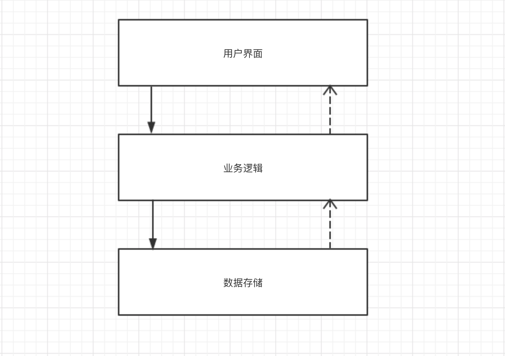

## 第 12 章 窗口导航

应用程序通常有多个窗口，窗口之间的切换以及参数的传递，这就是窗口导航。窗口导航是个常用的功能，有没有 MVVM 框架都需要这个功能，为什么我们要把它纳入 MVVM 框架内来讨论呢？

大家知道，模型是不能操作界面的，但是很多时候模型必须和用户进行交互。比如：

* 在写文件的过程中磁盘满了，要询问用户是中断操作还是清理垃圾。
* 购买的过程中，发现余额不足，要询问用户是放弃购买还是充值。
* 在执行某个命令时，需要打开另外一个窗口。

由此可见，模型有时就得操作界面！如果不能解决这个问题，就没有达到彻底隔离用户界面和业务逻辑的目标。这是 MVVM 窗口导航器要做的事情，所以把它放在 MVVM 中来讨论。

在传统分层设计中，将应用程序分成 3 层。分层设计的基本原则是，上层可以直接调用下层的函数，下层则只能通过回调函数或消息或事件通知上层，让上层执行某些动作。



提供回调函数给下层其实就是依赖注入，对于协议栈 (如 TCP/IP) 来说，是非常方便的，因为需要提供的回调函数并不多。但是对应用程序来说，各种情况都有，虽然回调函数的方式不是不可能，但实际操作确实很困难，这样做的话，API 接口会很复杂，调用者理解也很困难。

Bob 大叔在《架构整洁之道》17 章中说：

> 只要 GUI 是以插件形式插入业务逻辑的，那么 GUI 这边所发生的变更就不会影响系统的业务逻辑。

AWTK-MVVM 中的窗口导航器就是一个插件系统，在模型中通过 MVVM 的导航器打开窗口，并不会导致模型与视图的耦合。

假设我们要打开 settings 窗口：

AWTK 传统的打开方法是：

```
window_open("settings");
```

AWTK-MVVM 的打开方法是：

```
navigator_to("settings");
```

两者从外在看起来，除了函数名不同，好像也没有什么差别啊。但是两者本质上是不同的：

* 前者就是执行打开窗口的动作，如果执行成功就会打开窗口。这是编译的时候就定死了的，相当于硬编码，如果在模型中调用它，那模型就和 GUI 直接耦合到一起了。

* 后者则只是表达一个意图，发出一个请求，至于做什么，谁来做，调用者是完全不用关心的。在正常运行时，我们可以打开一个窗口，也可以执行另外一个应用程序。在测试时，我们可以什么也不做，让自动测试在没有用户的干预下继续往下运行。也就是说，它的行为完全由导航器这个插件系统中当前注册的插件决定。

AWTK-MVVM 中的导航器就是一个全局的依赖注入系统，一个视图的插件系统，让模型可以请求视图，同时又避免和视图的耦合到一起。

### 12.1 缺省的插件

AWTK-MVVM 中的导航器目前支持如下请求处理器（插件）：

| 类型                    | 说明                                   |
| ----------------------- | -------------------------------------- |
| default_handler         | 打开窗口，也是导航器默认的请求处理器。 |
| \_close\_               | 关闭窗口。                             |
| \_home\_                | 回到主窗口。                           |
| \_back\_                | 关闭最上面的窗口。                     |
| \_toast\_               | 打开内置的 toast 窗口。                |
| \_info\_                | 打开内置的提示窗口。                   |
| \_warn\_                | 打开内置的告警窗口。                   |
| \_confirm\_             | 打开内置的确认窗口。                   |
| \_pick\_file\_          | 打开内置的文件选择窗口。               |
| \_pick\_dir\_           | 打开内置的文件夹选择窗口。             |
| \_count\_view\_model\_  | 获取 View Model 实例的数量。           |
| \_get\_view\_model\_    | 获取 View Model 实例。                 |
| \_notify\_view\_model\_ | 触发 View Model 实例的变化事件。       |

> 可以在导航请求中通过 request 参数指定请求的类型，如果没有指定，则为default_handler。

下面详细介绍一下上述插件。

#### 12.1.1 打开窗口

打开窗口一般是界面操作中的第一步操作，因此将其作为导航器默认的插件。发送请求时可以设置如下参数：

| 参数          | 说明                                                         |
| ------------- | ------------------------------------------------------------ |
| target        | 表示目标窗口的名称。                                         |
| close_current | 表示是否关闭当前窗口。缺省为 false。                         |
| open_new      | 表示存在同名窗口时，是否打开新的窗口。当为 true 时则打开一个新的窗口，否则切换到已存在的窗口。缺省为 true。 |

> 导航请求中也可以添加其它自定义的参数，会一起传递给新窗口的 View Model，具体用途由新窗口的 View Model 解释。

下面我们来看看各种情况的处理：

##### 1. 无需返回数据的请求

这是最简单的情况，一般打开窗口都用这种方式。

在代码中可以用 navigator_to 函数来请求打开窗口。

函数原型如下：

```c
/**
 * @method navigator_to
 * 发送指定的请求。
 * 发送请求时可以用"string?"为前缀、用"&"分隔的格式传递参数。
 * 比如，"string?arg1=xx&arg2=yy"表示有两个参数，参数arg1的值为"xx"，参数arg2的值为"yy",
 * 如果没有用上述格式指定参数，则默认为target参数的值。
 *
 * @annotation ["static"]
 *
 * @param {const char*} args 发送请求时要传递的参数。
 *
 * @return {ret_t} 返回RET_OK表示成功，否则表示失败。
 */
ret_t navigator_to(const char* args);
```

使用示例：

```c
// 打开名称为temperature1的窗口
navigator_to("temperature1");

// 打开名称为temperature1的窗口并关闭当前窗口
navigator_to("string?target=temperature1&close_current=true");
```

在 XML 中，也可以通过 navigate 命令来打开指定的窗口。比如：

```xml
<window>
  <button text="Temperature" x="center" y="middle:-40" w="40%" h="40" v-on:click="{navigate, Args=temperature9}"/>
  <button text="Humidity" x="center" y="middle:40" w="40%" h="40" v-on:click="{navigate, Args=humidity}"/>
  <button text="Home" x="center" y="middle:40" w="80%" h="30" v-on:click="{navigate, Args=fscript?target=demo33&amp;close_current=true&amp;open_new=false&amp;mykey=myvalue}"/>
</window>
```

> "fscript?"形式的参数会自动转换为"string?"形式。
>
> 关于参数格式的更多信息，请参阅[命令绑定](11.command_binding.md)的11.2.1章节。

在代码中还有其他简化函数可以适用于其他特定场景。函数原型如下：

```c
/**
 * @method navigator_to_by_object
 * 发送指定的请求。
 *
 * @annotation ["static"]
 *
 * @param {const char*} args 发送请求时要传递的参数。
 *
 * @return {ret_t} 返回RET_OK表示成功，否则表示失败。
 */
ret_t navigator_to_by_object(object_t* args);

/**
 * @method navigator_to_with_key_value
 * 请求打开指定的窗口。
 *
 * @annotation ["static"]
 *
 * @param {const char*} target 目标窗口的名称。
 * @param {const char*} key 参数名。
 * @param {const char*} value 参数值。
 *
 * @return {ret_t} 返回RET_OK表示成功，否则表示失败。
 */
ret_t navigator_to_with_key_value(const char* target, const char* key, const char* value);

/**
 * @method navigator_replace
 * 请求打开指定的窗口，并关闭当前窗口。
 *
 * @annotation ["static"]
 *
 * @param {const char*} target 目标窗口的名称。
 *
 * @return {ret_t} 返回RET_OK表示成功，否则表示失败。
 */
ret_t navigator_replace(const char* target);

/**
 * @method navigator_switch_to
 * 如果目标窗口已经存在，直接切换到该窗口，否则打开新窗口。
 *
 * @annotation ["static"]
 *
 * @param {const char*} target 目标窗口的名称。
 * @param {bool_t} close_current 是否关闭当前窗口。
 *
 * @return {ret_t} 返回RET_OK表示成功，否则表示失败。
 */
ret_t navigator_switch_to(const char* target, bool_t close_current);
```

##### 2. 需要返回数据的请求

此时，需创建一个 navigator\_request\_t 对象，设置相应的参数，并调用函数 navigator\_to\_ex 发起打开窗口的请求。

> navigator\_to\_ex 发起请求的方式在任何时候都是适用的，但是用起来有点繁琐，因此如无特殊需求，一般使用简化的函数即可。

比如：

```c
static ret_t home_on_room_result(navigator_request_t* req, const value_t* result) {
  object_t* res = value_object(result);
  home_t* h = (home_t*)(object_get_prop_pointer(OBJECT(req), STR_HOME));
  const char* room_name = object_get_prop_str(OBJECT(req), ROOM_SETTINGS_REQ_ARG_ROOM);
  double temp = object_get_prop_float(res, ROOM_SETTINGS_RESULT_TEMP, 0);
  double humidity = object_get_prop_float(res, ROOM_SETTINGS_RESULT_HUMIDITY, 0);

  if (tk_str_eq(room_name, h->bed_room->name)) {
    h->bed_room->temp = temp;
    h->bed_room->humidity = humidity;
  } else {
    h->living_room->temp = temp;
    h->living_room->humidity = humidity;
  }

  emitter_dispatch_simple_event(EMITTER(h), EVT_PROPS_CHANGED);

  return RET_OK;
}

static ret_t adjust_room_params(home_t* h, room_info_t* info) {
  navigator_request_t* req = navigator_request_create("room_settings", home_on_room_result);

  object_set_prop_pointer(OBJECT(req), STR_HOME, h);
  object_set_prop_str(OBJECT(req), ROOM_SETTINGS_REQ_ARG_ROOM, info->name);
  object_set_prop_float(OBJECT(req), ROOM_SETTINGS_REQ_ARG_TEMP, info->temp);
  object_set_prop_float(OBJECT(req), ROOM_SETTINGS_REQ_ARG_HUMIDITY, info->humidity);

  navigator_to_ex(req);

  object_unref(OBJECT(req));

  return RET_OK;
}
```

在这个例子中，下面这行代码，请求打开窗口 room\_settings 设置房间的参数，设置完成后，通过回调函数 home\_on\_room\_result 返回新的参数。

```c
navigator_request_create("room_settings", home_on_room_result);
```

可以通过 object\_set\_prop\_xxx 设置请求参数，可以通过 object\_get\_prop\_xxx 获取处理结果。

Windows 的命令行下，读者可以运行 demo12 来查看实际的效果。

```cmd
bin\demo12.exe
```

#### 12.1.2 关闭窗口

发送请求时可以设置如下参数：

| 参数   | 说明                   |
| ------ | ---------------------- |
| target | 表示目标窗口的名称。   |
| force  | 表示是否强制关闭窗口。 |

在代码中可以用函数 navigator_close 和  navigator_request_close  来请求关闭指定的窗口。

函数原型如下：

```c
/**
 * @method navigator_close
 * 关闭指定窗口。
 *
 * @param {const char*} target 目标窗口的名称。
 * @annotation ["static"]
 *
 * @return {ret_t} 返回RET_OK表示成功，否则表示失败。
 */
ret_t navigator_close(const char* target);

/**
 * @method navigator_request_close
 * 请求关闭关闭指定窗口。
 *
 * > 窗口是否被关闭，取决于窗口本身的处理逻辑。
 *
 * @param {const char*} target 目标窗口的名称。
 * @annotation ["static"]
 *
 * @return {ret_t} 返回RET_OK表示成功，否则表示失败。
 */
ret_t navigator_request_close(const char* target);
```

在 XML 中也可以用 navigate 命令来关闭指定的窗口。比如：

```xml
  <button text="Close" x="c" y="m:40" w="80%" h="30" v-on:click="{navigate, Args=string?request=_close_&amp;target=demo33_a}"/>
```

#### 12.1.3 回到主窗口

发送请求时可以无需设置其他参数。

在代码中可以用函数 navigator_back_to_home 来请求回到主窗口。

函数原型如下：

```c
/**
 * @method navigator_back_to_home
 * 回到主屏。
 *
 * @annotation ["static"]
 *
 * @return {ret_t} 返回RET_OK表示成功，否则表示失败。
 */
ret_t navigator_back_to_home(void);
```

在 XML 中也可以用 navigate 命令来回到主窗口。比如：

```xml
  <button text="Home" x="c" y="m:40" w="80%" h="30" v-on:click="{navigate, Args=string?request=_home_}"/>
```

#### 12.1.4 关闭最上面的窗口

发送请求时无需设置其他参数。

在代码中可以用函数 navigator_back 来请求回到主窗口。

函数原型如下：

```c
/**
 * @method navigator_back
 * 关闭当前窗口，回到前一窗口。
 *
 * @annotation ["static"]
 *
 * @return {ret_t} 返回RET_OK表示成功，否则表示失败。
 */
ret_t navigator_back(void);
```

在 XML 中也可以用 navigate 命令来关闭最上面的窗口。比如：

```xml
  <button text="Home" x="c" y="m:40" w="80%" h="30" v-on:click="{navigate, Args=string?request=_back_}"/>
```

#### 12.1.5 打开内置的 toast 窗口

发送请求时可以设置如下参数：

| 参数    | 说明                             |
| ------- | -------------------------------- |
| content | 表示窗口显示的内容。             |
| timeout | 表示窗口的显示时间（单位：ms）。 |

在代码中可以用函数 navigator_toast  来请求打开内置的 toast 窗口。

函数原型如下：

```c
/**
 * @method navigator_toast
 * 显示toast信息。
 *
 * @annotation ["static"]
 *
 * @param {const char*} content 信息内容。
 * @param {uint32_t} timeout 显示时间。
 *
 * @return {ret_t} 返回RET_OK表示成功，否则表示失败。
 */
ret_t navigator_toast(const char* content, uint32_t timeout);
```

在 XML 中也可以用 navigate 命令来打开内置的 toast 窗口。比如：

```xml
  <button text="Home" x="c" y="m:40" w="80%" h="30" v-on:click="{navigate, Args=string?request=_toast_&amp;content=something&amp;timeout=1000}"/>
```

#### 12.1.6 打开内置的提示窗口

发送请求时可以设置如下参数：

| 参数    | 说明                 |
| ------- | -------------------- |
| content | 表示窗口显示的内容。 |
| title   | 表示窗口的标题。     |

在代码中可以用函数 navigator_info 来请求打开内置的提示窗口。

函数原型如下：

```c
/**
 * @method navigator_info
 * 显示信息。
 *
 * @annotation ["static"]
 *
 * @param {const char*} title 标题。
 * @param {const char*} content 内容。
 *
 * @return {ret_t} 返回RET_OK表示成功，否则表示失败。
 */
ret_t navigator_info(const char* title, const char* content);
```

在 XML 中也可以用 navigate 命令来打开内置的提示窗口。比如：

```xml
  <button text="Home" x="c" y="m:40" w="80%" h="30" v-on:click="{navigate, Args=string?request=_info_&amp;content=something&amp;title=tips}"/>
```

#### 12.1.7 打开内置的告警窗口

发送请求时可以设置如下参数：

| 参数    | 说明                 |
| ------- | -------------------- |
| content | 表示窗口显示的内容。 |
| title   | 表示窗口的标题。     |

在代码中可以用函数 navigator_warn 来请求打开内置的告警窗口。

函数原型如下：

```c
/**
 * @method navigator_warn
 * 显示警告信息。
 *
 * @annotation ["static"]
 *
 * @param {const char*} title 标题。
 * @param {const char*} content 内容。
 *
 * @return {ret_t} 返回RET_OK表示成功，否则表示失败。
 */
ret_t navigator_warn(const char* title, const char* content);
```

在 XML 中也可以用 navigate 命令来打开内置的告警窗口。比如：

```xml
  <button text="Home" x="c" y="m:40" w="80%" h="30" v-on:click="{navigate, Args=string?request=_warn_&amp;content=something&amp;title=tips}"/>
```

#### 12.1.8 打开内置的确认窗口 

发送请求时可以设置如下参数：

| 参数    | 说明                 |
| ------- | -------------------- |
| content | 表示窗口显示的内容。 |
| title   | 表示窗口的标题。     |

在代码中可以用函数 navigator_confirm 来请求打开内置的确认窗口。

函数原型如下：

```c
/**
 * @method navigator_confirm
 * 显示确认信息。
 *
 * @annotation ["static"]
 *
 * @param {const char*} title 标题。
 * @param {const char*} content 内容。
 *
 * @return {ret_t} 返回RET_OK表示成功，否则表示失败。
 */
ret_t navigator_confirm(const char* title, const char* content);
```

在 XML 中也可以用 navigate 命令来打开内置的确认窗口。比如：

```xml
  <button text="Home" x="c" y="m:40" w="80%" h="30" v-on:click="{navigate, Args=string?request=_confirm_&amp;content=something&amp;title=tips}"/>
```

#### 12.1.9 打开内置的文件选择窗口 

发送请求时可以设置如下参数：

| 参数     | 说明                                                         |
| -------- | ------------------------------------------------------------ |
| title    | 表示窗口的标题。                                             |
| for_save | 表示是否为保存文件的窗口，true表示用于保存，false表示用于打开。缺省为false。 |
| filter   | 表示要过滤的文件的后缀。                                     |
| default  | 表示默认打开的文件夹的路径。                                 |

在代码中可以用函数 navigator_pick_file 来请求打开内置的文件选择窗口。

函数原型如下：

```c
/**
 * @method navigator_pick_file
 * 选择文件。
 *
 * @annotation ["static"]
 *
 * @param {const char*} title 标题。
 * @param {const char*} filter 文件过滤(如：.txt.html), NULL表示不过滤。
 * @param {bool_t} for_save TRUE表示用于保存，FALSE表示用于打开。
 * @param {str_t*} result 用于传递缺省值和返回结果。
 *
 * @return {ret_t} 返回RET_OK表示成功，否则表示失败。
 */
ret_t navigator_pick_file(const char* title, const char* filter, bool_t for_save, str_t* result);
```

#### 12.1.10 打开内置的文件夹选择窗口 

发送请求时可以设置如下参数：

| 参数    | 说明                         |
| ------- | ---------------------------- |
| title   | 表示窗口的标题。             |
| default | 表示默认打开的文件夹的路径。 |

在代码中可以用函数 navigator_pick_dir 来请求打开内置的文件夹选择窗口。

函数原型如下：

```c
/**
 * @method navigator_pick_dir
 * 选择目录。
 *
 * @annotation ["static"]
 *
 * @param {const char*} title 标题。
 * @param {str_t*} result 用于传递缺省值和返回结果。
 *
 * @return {ret_t} 返回RET_OK表示成功，否则表示失败。
 */
ret_t navigator_pick_dir(const char* title, str_t* result);
```

#### 12.1.11 获取 View Model 实例的数量 

发送请求时可以设置如下参数：

| 参数   | 说明                                                         |
| ------ | ------------------------------------------------------------ |
| target | 表示 View Model 实例的路径，不指定时表示当前全部的 View Model 实例，为空字符串时表示最上面的窗口绑定的全部 View Model实例， 其他则表示具体的路径，比如 “a.[0]” 表示 name 属性值为 "a" 的窗体的第0个子控件上绑定的 View Model 实例。 |

在代码中可以用函数 navigator_count_view_models  来请求获取 View Model 实例的数量。

函数原型如下：

```c
/**
 * @method navigator_count_view_models
 * 获取指定的ViewModel实例的个数。
 * > 路径为NULL时表示当前全部的ViewModel实例；
 * > 路径为空字符串时表示最上面的窗口绑定的全部ViewModel实例；
 * > 其他则为实际的路径，比如“a.[0]”时表示属性name为"a"的窗体的第0个子控件上绑定的ViewModel实例。
 *
 * @annotation ["static"]
 *
 * @param {const char*} target ViewModel路径
 *
 * @return {ret_t} 返回实例的个数。
 */
int32_t navigator_count_view_models(const char* target);
```

#### 12.1.12 获取 View Model 实例

发送请求时可以设置如下参数：

| 参数   | 说明                                                         |
| ------ | ------------------------------------------------------------ |
| target | 表示 View Model 实例的路径，不指定时表示当前全部的 View Model 实例，为空字符串时表示最上面的窗口绑定的全部 View Model实例， 其他则表示具体的路径，比如 “a.[0]” 表示 name 属性值为 "a" 的窗体的第0个子控件上绑定的 View Model 实例。 |

在代码中可以用函数 navigator_get_view_models  来请求获取 View Model 实例。

函数原型如下：

```c
/**
 * @method navigator_get_view_models
 * 获取指定的ViewModel实例。
 * > 路径为NULL时表示当前全部的ViewModel实例；
 * > 路径为空字符串时表示最上面的窗口绑定的全部ViewModel实例；
 * > 其他则为具体的路径，比如“a.[0]”表示name属性值为"a"的窗体的第0个子控件上绑定的ViewModel实例。
 *
 * @annotation ["static"]
 *
 * @param {const char*} target ViewModel路径
 * @param {darray_t*} result 返回ViewModel实例。
 *
 * @return {ret_t} 返回RET_OK表示成功，否则表示失败。
 */
ret_t navigator_get_view_models(const char* target, darray_t* result);
```

#### 12.1.13 触发 View Model 实例的变化事件 

发送请求时可以设置如下参数：

| 参数          | 说明                                                         |
| ------------- | ------------------------------------------------------------ |
| target        | 表示 View Model 实例的路径，不指定时表示当前全部的 View Model 实例，为空字符串时表示最上面的窗口绑定的全部 View Model实例， 其他则表示具体的路径，比如 “a.[0]” 表示 name 属性值为 "a" 的窗体的第0个子控件上绑定的 View Model 实例。 |
| props_changed | 表示是否触发属性改变的事件。                                 |
| items_changed | 表示是否触发数据集合中项目的数量改变的事件。                 |
| event_source  | 表示项目的数量发生改变的数据集合。                           |

在代码中可以用如下函数来请求触发 View Model 实例的变化事件。

函数原型如下：

```c
/**
 * @method navigator_notify_view_models_props_changed
 * 触发指定的ViewModel实例的props改变事件。
 * > 路径为NULL时表示当前全部的ViewModel实例；
 * > 路径为空字符串时表示最上面的窗口绑定的全部ViewModel实例；
 * > 其他则为具体的路径，比如“a.[0]”表示name属性值为"a"的窗体的第0个子控件上绑定的ViewModel实例。
 *
 * @annotation ["static"]
 *
 * @param {const char*} target ViewModel路径
 *
 * @return {ret_t} 返回RET_OK表示成功，否则表示失败。
 */
ret_t navigator_notify_view_models_props_changed(const char* target);

/**
 * @method navigator_notify_view_models_items_changed
 * 触发指定的ViewModel实例的items改变事件。
 * > 路径为NULL时表示当前全部的ViewModel实例；
 * > 路径为空字符串时表示最上面的窗口绑定的全部ViewModel实例；
 * > 其他则为具体的路径，比如“a.[0]”表示name属性值为"a"的窗体的第0个子控件上绑定的ViewModel实例。
 *
 * @annotation ["static"]
 *
 * @param {const char*} target ViewModel路径
 * @param {object_t*} items 发生变化的items对象。
 *
 * @return {ret_t} 返回RET_OK表示成功，否则表示失败。
 */
ret_t navigator_notify_view_models_items_changed(const char* target, object_t* items);
```

### 12.2 编写自己的插件

一般情况下，我们并不需要自己编写插件，使用 AWTK-MVVM 导航器缺省的实现就行了。

但难以避免需要自己实现插件来处理一些特殊情况。比如：

* 实现前面提到的 toast/info/confirm 等窗口的处理插件。

* 测试程序不能打开真正的窗口，需要实现一些 Mock 的处理插件。

* 需要直接操作 widget 的界面，可以实现自己的处理插件，用传统的方式来开发界面。

编写自己的处理插件相当简单，先实现 on\_request 函数，再注册到导航器中就行了。

下面我们来看几个例子：

#### 12.2.1 toast 在 AWTK 上的实现

先看看 toast 的实现（其它对话框的实现方式类似）。

* 实现 on_request 函数

我们可以从 req 中获取相应的参数，NAVIGATOR\_ARG\_CONTENT 是显示的文本内容，NAVIGATOR\_ARG\_DURATION 是显示的时间。参数是调用和实现者之间的约定，保持一致即可。

```c
static ret_t navigator_handler_awtk_on_toast(navigator_handler_t* handler,
                                             navigator_request_t* req) {
  const char* content = object_get_prop_str(OBJECT(req), NAVIGATOR_ARG_CONTENT);
  int duration = object_get_prop_int(OBJECT(req), NAVIGATOR_ARG_DURATION, 3000);

  return dialog_toast(content, duration);
}
```

* 创建 navigator_handler

我们可以自己实现一个 navigator_handler 的构造函数，也可以直接调用 navigator_handler_create() 函数。

1. 自定义 navigator_handler 构造函数，代码如下：

```c
navigator_handler_t* navigator_handler_awtk_toast_create(void) {
  object_t* obj = NULL;
  navigator_handler_t* handler = NULL;

  obj = object_create(&s_navigator_handler_awtk_vtable);
  handler = NAVIGATOR_HANDLER(obj);
  return_value_if_fail(handler != NULL, NULL);

  handler->on_request = navigator_handler_awtk_on_toast;

  return handler;
}
```

2. 调用 navigator_handler_create()

```c
navigator_handler_create(navigator_handler_awtk_on_toast);
```

* 注册到导航器：

```c
  /* 调用自定义的 navigator_handler 构造函数 */
  navigator_register_handler(navigator(), NAVIGATOR_REQ_TOAST, navigator_handler_awtk_toast_create());

  /* 调用 navigator_handler_create() */
  //navigator_register_handler(navigator(), NAVIGATOR_REQ_TOAST, navigator_handler_create(navigator_handler_awtk_toast_create));
```

#### 12.2.2 实现自定义窗口

AWTK-MVVM 不一定能适用于所有的场景。如果遇到 AWTK-MVVM 无法处理的复杂场景时，可以采用传统的开发方式，通过导航器让 MVVM 窗口和传统窗口协同工作。

比如，实现一个自定义的窗口，一般步骤如下：

* 实现 on_request 函数

```c
static ret_t mywindow_on_request(navigator_handler_t* handler, navigator_request_t* req) {
  widget_t* win = window_create(NULL, 0, 0, 0, 0);
  widget_t* ok = button_create(win, 0, 0, 0, 0);

  widget_set_text(ok, L"Close");
  widget_set_prop_str(win, WIDGET_PROP_ANIM_HINT, "htranslate");
  widget_set_self_layout_params(ok, "center", "middle", "50%", "30");
  widget_on(ok, EVT_CLICK, button_on_click, win);

  widget_layout(win);

  return RET_OK;
}
```

* 注册到导航器：

```c
  navigator_register_handler(navigator(), "mywindow",
                             navigator_handler_create(mywindow_on_request));
```

Windows 的命令行下，读者可以运行 demo36 来查看实际的效果。

```cmd
bin\demo36.exe
```
