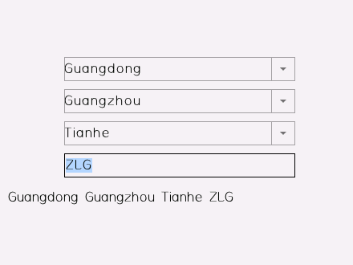

## 14. 高级用法

### 14.1 特殊属性绑定

在前面的介绍中，数据绑定都是以 text 属性和 value 属性为例的。实际上，数据绑定可以作用于控件的任意属性。比如，可以绑定 enable 属性来决定控件是否可用，绑定 visible 属性来决定控件是否可见。在下面的几个例子中，我们来看看几种常见属性的绑定方法和应用场景。

#### 14.1.1 控件的显示和隐藏

在有的情况下，我们希望界面上某些控件隐藏起来，在另外一种情况下，我们又希望界面上这些控件能显示出来，这可以通过绑定 visible 属性来实现。

比如，在下面的例子中，其中一个 label 控件在 value 小于 50 时隐藏，另外一个 label 控件在 value 大于 50 时隐藏。视图的 XML 可以这样写：

```xml
<window v-model="temperature.js">
  <label x="center" y="middle:-40" w="50%" h="40" v-data:visible="{$value > 50}" text="Visible if value > 50"/>
  <label x="center" y="middle:-40" w="50%" h="40" v-data:visible="{$value < 50}" text="Visible if value < 50"/>
  <label x="center" y="middle" w="50%" h="40" v-data:text="{value}"/>
  <slider x="center" y="middle:40" w="80%" h="20" v-data:value="{value}"/>
</window>
```

这里"{$value > 50}"是嵌入的表达式，表达式的用法后面会详细介绍，这里的意思是 value 属性的值大于 50 时，该表达式为真，此时控件可见，否则控件不可见。

前面曾经提到，AWTK-MVVM 并不擅长处理动态界面，而 visible 的属性绑定，可以在一定程度上帮助我们实现界面的动态变化，请根据具体情况酌情使用。

这里，界面上多了两个控件，仍然使用了 temperature.js 作为 ViewModel, 而不需要对 temperature.js 进行任何修改。由此也可以看出， View 和 ViewModel 之间是一种松耦合。

Windows 的命令行下，读者可以运行 jsdemo17 来查看实际的效果。

```
bin\jsdemo17
```

#### 14.1.2 数据联动

AWTK-MVVM 非常擅长处理数据联动。数据联动是指一个控件的数据变化，会引起其它相关控件的变化。

填写收货地址就是一个典型的数据联动的例子：

* 选择"省/直辖市"时，"城市"要跟着变化，"区县"也要跟着变化，完整地址也要跟着变化。

* 选择"城市"时，"区县"要跟着变化，完整地址也要跟着变化。

* 选择"区县"时，完整地址要跟着变化。

* 输入"详细地址"时，完整地址要跟着变化。



如果采用传统方式来开发，不但要写一大堆代码去处理事件，更重要的是这些代码与界面耦合到一起，难以维护和自动测试。

现在我们来看看 AWTK-MVVM 如何实现数据联动：

视图的 XML 文件：

```xml
<window v-model="address.js"> 
  <combo_box x="center" y="middle:-80" w="60%" h="30" v-data:options="{province_list}" v-data:text="{province}"/>
  <combo_box x="center" y="middle:-40" w="60%" h="30" v-data:options="{city_list}" v-data:text="{city}"/>
  <combo_box x="center" y="middle" w="60%" h="30" v-data:options="{country_list}" v-data:text="{country}"/>
  <edit x="center" y="middle:40" w="60%" h="30" v-data:value="{detail, Trigger=Changing}" tips="detail address"/>
  <hscroll_label x="center" y="middle:80" w="90%" h="30" v-data:text="{address}"/>
</window>
```

这里把 combo\_box 属性 options 绑定到 ViewModel 相应的数据上，ViewModel 的数据变化时，会自动更新到界面上。比如城市列表绑定到 city\_list 数据上，只要 city\_list 变化，城市列表会自动更新。

ViewModel 的实现：

> 为简明起见，这里只使用了很少的 demo 数据。

```js
function Address() {
  this._province = '广东';
  this._city = '广州';
  this.country = '天河区';
  this.detail = '';

  this.data = {
    '北京': {
      '北京': ['东城区', '西城区', '朝阳区','丰台区','石景山区','海淀区','']
    }, 
    '上海': {
      '上海': ['黄浦区', '徐汇区','长宁区','静安区','普陀区','虹口区','杨浦区']
    }, 
    '广东': {
      '广州':['天河区','黄埔区','荔湾区','越秀区','海珠区'],
      '深圳':['罗湖区','福田区','南山区','宝安区','龙岗区']
    }
  };
}

Object.defineProperty(Address.prototype, 'province_list', {
  get: function () {
    return Object.keys(this.data).join(';');
  }
})

//根据当前的省/直辖市返回城市列表。
Object.defineProperty(Address.prototype, 'city_list', {
  get: function () {
    return Object.keys(this.data[this._province]).join(';');
  }
})

//根据当前的省/直辖市和城市返回区县列表。
Object.defineProperty(Address.prototype, 'country_list', {
  get: function () {
    return this.data[this._province][this._city].join(';');
  }
})

//地址由省/直辖市、城市、区县和详细地址合成。
Object.defineProperty(Address.prototype, 'address', {
  get: function () {
    return this._province + this._city + this.country + this.detail;
  }
})

//修改省/直辖市时，同时修改缺省的城市。
Object.defineProperty(Address.prototype, 'province', {
  get: function () {
    return this._province;
  },
  set: function (val) {
    this._province = val;
    this.city = this.city_list.split(';')[0]; 
  }
})

//修改城市时，同时修改缺省的区县。
Object.defineProperty(Address.prototype, 'city', {
  get: function () {
    return this._city;
  },
  set: function (val) {
    this._city = val;
    this.country = this.country_list.split(';')[0]; 
  }
})

function createAddress(req) {
  return new Address();
}
```

Windows 的命令行下，读者可以运行 demo15 来查看实际的效果。

```
bin\jsdemo15
```

#### 14.1.3 动态界面

我们在本章的开头，展示了用 visible 属性来实现一定程度的动态界面，但是如果有大量控件都需要通过 visible 来控制，XML 文件写起来就很繁琐。这时我们可以用 pages 控件对需要显示和隐藏的控件进行分组。

比如，我们有一个通信设置界面，通信有串口和 socket 两种方式，只能二选一。由于两者的参数截然不同，此时就可以把串口和 socket 的参数分别放到不同的 page 中，然后通过 type 进行切换。

* 串口界面：


* Socket 设置界面


视图的 XML 文件：

```xml
<window v-model="com_settings.js"> 
  <combo_box x="r:24" y="10" w="200" h="30" options="UART;SOCKET" v-data:value="{type}" readonly="true"/>
  <pages x="10" y="50" w="-20" h="-90" v-data:value="{type}">
    <view x="0" y="0" w="100%" h="100%" children_layout="default(c=1,h=25,m=0,s=5)">
      <row children_layout="default(c=0,r=1,m=0,s=5)">
        <label text="Device" w="80"/>
        <combo_box w="200" options="COM1;COM2;COM3" v-data:text="{device}" readonly="true"/>
      </row>
      <row children_layout="default(c=0,r=1,m=0,s=5)">
        <label text="Baud Rate" w="80"/>
        <combo_box w="200" options="9600;115200;" v-data:text="{baudrate}" readonly="true"/>
      </row>
      <row children_layout="default(c=0,r=1,m=0,s=5)">
        <label text="Parity" w="80"/>
        <combo_box w="200" options="none;odd;even" v-data:value="{parity}" readonly="true"/>
      </row>
    </view>
    <view x="0" y="0" w="100%" h="100%" children_layout="default(c=1,h=25,m=0,s=5)">
      <row children_layout="default(c=0,r=1,m=0,s=5)">
        <label text="IP" w="80"/>
        <edit w="200" v-data:text="{ip, Trigger=Changing}" max="15"/>
      </row>
      <row children_layout="default(c=0,r=1,m=0,s=5)">
        <label text="Port" w="80"/>
        <edit  w="200" input_type="uint" min="0" max="10000" auto_fix="true" v-data:text="{port, Trigger=Changing}"/>
      </row>
    </view>
  </pages>
  <label x="10" y="m" w="100%" h="30" v-data:text="{summary}" />

</window>

```

重点看看下面两行代码，combo\_box 和 pages 都绑定到 type 属性上，用户通过 combo\_box 选择不同的通信方式时，pages 会自动切换。通过 pages 的切换，就可以更灵活的实现动态界面。

```xml
  <combo_box x="r:24" y="10" w="200" h="30" options="UART;SOCKET" v-data:value="{type}" readonly="true"/>
  <pages x="10" y="50" w="-20" h="-90" v-data:value="{type}">
```

Model 实现非常简单，仅有几个数据成员。

```js
function ComSettings() {
  this.type = 0;

  this.ip = "192.168.1.1"
  this.port = "8088"

  this.device = "COM1"
  this.baudrate = "9600"
  this.parity = 0
}

Object.defineProperty(ComSettings.prototype, 'summary', {
  get: function () {
    var summary = '';

    if(this.type == 0) {
      var parity_name = ["None", "Odd", "Even"];
      summary = 'UART: ' + this.device + ' ' + this.baudrate + ' ' + parity_name[this.parity];
    } else {
      summary = "SOCKET: " + this.ip + ' ' + this.port;
    }

    return summary;
  }
})

function createComSettings(req) {
  return new ComSettings();
}

```

Windows 的命令行下，读者可以运行 demo16 来查看实际的效果。

```
bin\jsdemo16
```

### 14.2 嵌入表达式

AWTK-MVVM 允许在界面描述的 XML 文件中嵌入简单的表达式，合理的使用表达式可以简化 ViewModel、代替简单的数据转换器和数据检验器。在本章开头我们给出的例子就把 visible 属性绑定到表达式"$value > 50"上了。

```xml
<window v-model="temperature.js">
  <label x="center" y="middle:-40" w="50%" h="40" v-data:visible="{$value > 50}" text="Visible if value > 50"/>
  <label x="center" y="middle:-40" w="50%" h="40" v-data:visible="{$value < 50}" text="Visible if value < 50"/>
</window>
```

最新版本使用 fscript 脚本引擎，请参考 [fscript 脚本引擎](https://github.com/zlgopen/awtk/blob/master/docs/fscript.md) 获取更多信息。

> 注意：变量名不再需要$开头，但仍然保存对旧版的兼容。 

> 变量名代表 ViewModel  中的属性，中所有的属性均可以通过变量引用，比如 value 可以引用 ViewModel 中的 value 属性。

> 表达式可以有多条语句，语句之间用英文的分号分隔，其值以最后一个子表达式为准。

比如，下面这个表达式的值为最后一个子表达式，即：123

```
widget_set(window.inc.visible, if(value < 90, true, false));123
```

#### 14.2.4 MVVM 新增函数

除了 fscript 本身提供的函数外，MVVM 增加了下面的函数：

##### 14.2.4.1 tr 

> 翻译字符串。

* 原型

```
tr(str) => str
```

* str 字符串
* 返回值：翻译之后的字符串

##### 14.2.4.2 quit 

> 退出应用程序

* 原型

```
quit() => void
```

* 参数：无
* 返回值：无

##### 14.2.4.3 back 

> 关闭当前窗口

* 原型

```
back() => void
```

* 参数：无
* 返回值：无

##### 14.2.4.4 back_to_home 

> 退回到 home 窗口

* 原型

```
back_to_home() => void
```

* 参数：无
* 返回值：无

##### 14.2.4.5 navigator_to 

> 打开新窗口

* 原型

```
navigator_to(target) => void
```

* target 新窗口名称
* 返回值：无

##### 14.2.4.5 navigator_replace 

> 打开新窗口，并关闭当前窗口。

* 原型

```
navigator_replace(target) => void
```

* target 新窗口名称
* 返回值：无

##### 14.2.4.6 widget_get 

> 获取控件的属性。

* 原型

```
widget_get(prop) => value
```

* prop [控件名 . ] 属性名
* 返回值：属性值

示例：

获取当前控件的文本：
```
widget_get(text)
```

获取父控件的文本：
```
widget_get(parent.text)
```
> parent 特指父控件。

获取父控件的文本：
```
widget_get(parent.text)
```
> parent 特指父控件。

获取窗口中名为 abc 子控件的文本：
```
widget_get(window.abc.text)
```
> abc 无需是 window 的直系子控件。

获取父控件中名为 abc 子控件的文本：
```
widget_get(parent.abc.text)
```
> abc 无需是 parent 的直系子控件。

获取当控件中名为 abc 子控件的文本：
```
widget_get(abc.text)
```
> abc 无需是当前的直系子控件

##### 14.2.4.7 widget_set 

> 设置控件的属性。

* 原型

```
widget_set(prop, value) => bool
```

* prop [控件名 . ] 属性名
* value 属性的值

* 返回值：成功返回 true，失败返回 false

示例：

设置当前控件的文本：
```
widget_set(text, "test")
```

设置父控件的文本：
```
widget_set(parent.text, "test")
```
> parent 特指父控件。

设置父控件的文本：
```
widget_set(parent.text, "test")
```
> parent 特指父控件。

设置窗口中名为 abc 子控件的文本：
```
widget_set(window.abc.text, "test")
```
> abc 无需是 window 的直系子控件。

设置父控件中名为 abc 子控件的文本：
```
widget_set(parent.abc.text, "test")
```
> abc 无需是 parent 的直系子控件。

设置当控件中名为 abc 子控件的文本：
```
widget_set(abc.text, "test")
```
> abc 无需是当前的直系子控件

完整示例请参考 demo28：

```xml
<window v-model="temperature" children_layout="default(h=30,c=2,m=3,s=2,keep_invisible=true)">
	<slider name="slider1">
		<property name="v-data:value">
      <![CDATA[{value, 
        ToModel=
        widget_set(window.inc.visible, if(value < 90, true, false))
        widget_set(window.dec.visible, if(value > 10, true, false))
        value}
       ]]>
		</property>
	</slider>
	<label name="slider2">
		<property name="v-data:text">
			<![CDATA[{if(value < 50, "low", "high")}]]>
		</property>
	</label>
	<button name="inc" text="Inc" v-on:click="{fscript, args=widget_set(window.slider1.value, widget_get(window.slider1.value)+10)}" />
	<button name="dec" text="Dec" v-on:click="{fscript, args=widget_set(window.slider1.value, widget_get(window.slider1.value)-10)}" />
	<button text="Open" v-on:click="{fscript, args=navigator_to(temperature28)}" />
	<button text="Replace" v-on:click="{fscript, args=navigator_replace(temperature28)}" />
	<button text="Exec Open" v-on:click="{fscript, args=exec(navigate, temperature28)}" />
</window>
```

```xml
<window v-model="temperature" children_layout="default(h=30,c=1,m=3,s=2)">
  <label v-data:text='{string(number("123") + number("456"))}'/>
  <label v-data:text='{fformat("%2.2lf", value)}'/>
  <label v-data:text='{fformat("%2.2lf ℃", value)'/>
  <label v-data:text='{iformat("%d ℃", value)'/>
  <label v-data:text='{fformat("%2.2lf F", value * 1.8 + 32)}'/>
  <label v-data:text='{fformat("%2.2lf F", round(value * 1.8 + 32))}'/>
  <label v-data:text='{fformat(tr("current temperature %f"), value)+"℃"}'/>
  <label v-data:text='{string(value)+" ℃"}'/>
  <label v-data:text='{if(value > 60, "too height", if(value < 20, "too low", "normal"))}'
    v-data:style='{if(value >= 20 && value <= 60, "green", "red")}'
    />
  <label v-data:text="{value}"/>
  <slider v-data:value="{value}"/>
	<button text="Back" v-on:click="{fscript, args=back()}" />
	<button text="Home" v-on:click="{fscript, args=back_to_home()}" />
</window>
```

#### 14.2.6 表达式中的特殊字符

由于表达式中<>"等字符对于 XML 来说是特殊字符，需要转换成对应的实体 (entity)，但是转换之后表达式不太直观，此时可以把属性提出来，放在 property 标签中，并用 CDATA 把它的值包起来。如：

```xml
<window v-model="temperature.js">
  <label x="center" y="middle:-40" w="50%" h="40">
    <property name="v-data:text"><![CDATA[ {(value < 50) ? "low" : "high"} ]]></property>
    <property name="v-data:style"><![CDATA[ {(value < 50) ? "green" : "default" }]]></property>
  </label>
  <label x="center" y="middle" w="50%" h="40" v-data:text="{value}"/>
  <slider x="center" y="middle:40" w="80%" h="20" v-data:value="{value}"/>
</window>
```

> 嵌入表达式提供了一定的灵活性，但是表达式在 XML 中，没有办法参与单元测试，而且调试很困难，所以请不要在 XML 中嵌入复杂的表达式。

Windows 的命令行下，读者可以运行 demo18 来查看实际的效果。

```
bin\jsdemo18
```

### 14.3 ListView 的绑定

在前面的例子中，控件都是预先创建好的，控件都没创建当然没法绑定。列表视图是一种特殊的情况，列表项的个数通常是由数据动态决定的，比如联系人列表，联系人的数据在变化的，所以不可能在开发软件时就定下来。

在绑定列表视图时，需要根据数据动态生成列表项，设置属性 v-for-items 为"true"，那么该控件的子控件就会动态生成，第一个子控件为生成其它子控件的模板。

ViewModel 则必须是一个数组，在子控件中可以通过 item. 当前项的属性。

我们来看一个图书列表的示例：

### 14.3.1 视图

* name 表示书名。可以用 item.name 访问它。
* stock 表示库存数量。存数量大于 0 表示可以卖。可以用 item.stock 访问它。
* index 表示当前的索引序数。
* 列表项中的命令，其参数自动设置为当前的索引序数。

```xml
<window anim_hint="htranslate" v-model="books.js">
   <label x="0" y="0" w="100%" h="30" v-data:text="{items}"/>
   <list_view x="0"  y="30" w="100%" h="-80" item_height="40">
    <scroll_view name="column" x="0"  y="0" w="100%" h="100%" v-for-items="true">
      <list_item v-data:style="{item.style}" children_layout="default(rows=1,cols=0,s=4)">
        <label w="20" v-data:text="{index}"/>
        <label w="35%" v-data:text="{item.name}"/>
        <label w="40" v-data:text="{item.stock}"/>
        <column  w="128" children_layout="default(rows=1,cols=0,s=5,ym=5)">
          <button w="70" text="Remove" v-on:click="{remove}"/>
          <button w="50" text="Sale" v-on:click="{sale}"/>
        </column>
      </list_item>
    </scroll_view>
    <scroll_bar_m name="bar" x="right" y="0" w="6" h="100%" value="0"/>
  </list_view>
  <column  x="0" y="b" w="100%" h="40" children_layout="default(rows=1,cols=2,s=5,m=5)">
    <button text="Add" v-on:click="{add}"/>
    <button text="Clear" v-on:click="{clear}"/>
  </column>
</window>
```

下面这行代码让 label 控件显示序数。

```xml
  <label w="20" v-data:text="{index}"/>
``` 

下面这行代码让 label 控件显示书名。

```xml
  <label w="35%" v-data:text="{item.name}"/>
```        

下面这行代码让 label 控件显示库存。

```xml
  <label w="40" v-data:text="{item.stock}"/>
```

显示效果如下：


### 14.3.2 视图模型

绑定列表视图的 ViewModel 对象必须是一个数组，数组可以提供一些成员函数供视图绑定命令。这里就提供了 remove、clear、sale 和 add 四个命令。

```js
var gBooks = [];

gBooks.canRemove = function(index) {
  console.log(index);

  return index < gBooks.length;;
}

gBooks.remove = function(index) {
  gBooks.splice(index, 1);

  return RET_ITEMS_CHANGED;
}

gBooks.canSale = function(index) {
  return gBooks[index].stock > 0;
}

gBooks.sale = function(index) {
  gBooks[index].stock = gBooks[index].stock - 1;

  return RET_OBJECT_CHANGED;
}

gBooks.canClear= function(index) {
  return gBooks.length > 0;
}

gBooks.clear = function(index) {
  gBooks.length = 0;

  return RET_ITEMS_CHANGED;
}

gBooks.add = function() {
  var b = {
    name:"book" + Math.round(Math.random() * 1000),
    stock: Math.round(Math.random() * 100),
    style: gBooks.length%2 ? "odd" : "even"
  }

  gBooks.push(b);

  return RET_ITEMS_CHANGED;
}

function createBooks(req) {
  for(var i = 0; i < 100; i++) {
    gBooks.add();
  }
  return gBooks;
}
```

Windows 的命令行下，读者可以运行 demo13 来查看实际的效果。

```
bin\jsdemo13
```

### 14.4 外部设备的集成

在温度控制器中，当温度高于某个阀值时，打开蜂鸣器发出警报，此时蜂鸣器也是和用户交互的接口，是视图的一部分。但是蜂鸣器却不是一个 GUI 控件，没有办法像其它 GUI 控件那样，在 XML 中使用数据绑定规则。如何把蜂鸣器这类外部设备集成到 AWTK-MVVM 之中，享受和其它 GUI 控件同等的待遇呢？

答案自然是把这类外设包装成 Widget 组件。把蜂鸣器包装成 Widget 组件之后，就可以直接在 XML 文件中使用这些外设组件了。比如，在温度大于 50 时发出蜂鸣声，就可以在 XML 中这样写：

```xml
  <buzzer v-data:on="{$value > 50}"/>
```

我们还可以用 freq、volume 和 duration 属性，来指定蜂鸣器的频率、音量和持续时间：

```xml
  <buzzer v-data:on="{$value > 50}" freq="3000" volume="60" duration="3000"/>
```

这样一来，除编写 XML 中的绑定规则，不需要写其它代码，即可使用这些外设组件。这样做的好处有：

* 简单。可以在 XML 中直接引用外设。
* 重用。外设组件只需要开发一次，即可在各个项目中使用。
* 方便于可视化开发环境集成。由于外设包装成了 Widget 接口，具有其它 GUI 控件同等的待遇，直接 IDE 中拖拽和设置属性。

将外设直接包装成 Widget，此类 Widget 就会依赖于硬件，这会带来两个副作用：

* 在项目的早期，硬件还没有做好，应用程序就没办法运行。
* 即使硬件可用，但是应用程序不能在 PC 上模拟运行，开发效率会成倍下降。

把硬件抽象成接口，并提供软件实现，让应用程序能脱离硬件运行，是良好架构必备的特征之一。为此我们按下列方式来组织相关的类：


WidgetHardware 实现了 Widget 接口，用来将外设包装成一个 Widget，这样就不需要为每种外设编写一个 Widget 类了。

DeviceObject 是各种外设的抽象，蜂鸣器、LED、GPIO 和各种传感器实现了该接口，才能接入 AWTK-MVVM 框架中来。

WidgetHardware 不能直接创建 DeviceObject，否则 WidgetHareware 就和具体硬件耦合到一起了，所以引入 DeviceFactory 来隔离具体的硬件。

将外设接入 AWTK-MVVM 架构中，将外设包装成一个 DeviceObject 即可。下面我们来看看如何将外设包装成 device\_object。

#### 14.4.1 输出型的外设

将输出类型的外设包装成 device\_object 非常简单，只需要实现 set\_prop 函数即可，根据指定的属性执行对应的操作。

下面我们以蜂鸣器为例，基于软件实现一个蜂鸣器。蜂鸣器提供了音量、持续时间、频率和开关几个属性。

```c
  /**
   * @property {uint32_t} volume
   * @annotation ["set_prop","get_prop"]
   * 音量 (0-100)。
   */
  uint32_t volume;

  /**
   * @property {uint32_t} duration 
   * @annotation ["set_prop","get_prop"]
   * 持续时间 (ms)。
   */
  uint32_t duration;

  /**
   * @property {uint32_t} freq
   * @annotation ["set_prop","get_prop"]
   * 频率。
   */
  uint32_t freq;

  /**
   * @property {bool_t} on
   * @annotation ["set_prop","get_prop"]
   * 开启。
   */
  bool_t on;
```

软件实现的蜂鸣器只是把收到的属性打印出来，所以实现非常简单，也就几行代码。基于硬件实现，则在此调用硬件的函数。

```c
static ret_t buzzer_log_set_prop(object_t* obj, const char* name, const value_t* v) {
  buzzer_log_t* buzzer = BUZZER_LOG(obj);
  return_value_if_fail(obj != NULL && name != NULL && v != NULL, RET_BAD_PARAMS);

  if (v->type == VALUE_TYPE_STRING) {
    log_debug("buzzer: %s = %s\n", name, value_str(v));
  } else {
    log_debug("buzzer: %s = %d\n", name, value_int(v));
  }

  return RET_OK;
}

static const object_vtable_t s_buzzer_log_vtable = {.type = "buzzer_log",
                                                    .desc = "buzzer_log",
                                                    .size = sizeof(buzzer_log_t),
                                                    .set_prop = buzzer_log_set_prop};

object_t* buzzer_log_create(const char* args) {
  return object_create(&s_buzzer_log_vtable);
}
```

#### 14.4.2 输入型的外设

输入类型的外设的实现稍微复杂一点，主要原因就是开启一个定时器，在定时器中去读取当前的状态。下面我们温度传感器为例，看看如何用软件实现一个温度传感器，该温度传感器随机生成温度值。

温度传感器有以下温度和采用间隔时间两个属性：

```c
  /**
   * @property {double} value
   * @annotation ["get_prop"]
   * 最新的温度。
   */
  double value;

  /**
   * @property {int32_t} sample_interval
   * @annotation ["set_prop","get_prop"]
   * 采样时间间隔 (ms)。
   */
  int32_t sample_interval;
```

```c
static ret_t temperature_sensor_random_on_destroy(object_t* obj) {
  temperature_sensor_t* temperature_sensor = TEMPERATURE_SENSOR(obj);

  timer_remove(temperature_sensor->timer_id);
  temperature_sensor->timer_id = TK_INVALID_ID;

  return RET_OK;
}

static ret_t temperature_sensor_random_set_prop(object_t* obj, const char* name, const value_t* v) {
  temperature_sensor_t* temperature_sensor = TEMPERATURE_SENSOR(obj);
  return_value_if_fail(obj != NULL && name != NULL && v != NULL, RET_BAD_PARAMS);

  if (tk_str_eq(name, TEMPERATURE_SENSOR_PROP_SAMPLE_INTERVAL)) {
    int32_t interval = value_int(v);

    if (interval > 0) {
      timer_modify(temperature_sensor->timer_id, interval);
    } else {
      timer_modify(temperature_sensor->timer_id, 0xffffffff);
    }
    temperature_sensor->sample_interval = interval;

    return RET_OK;
  }

  return RET_NOT_FOUND;
}

static ret_t temperature_sensor_sample(object_t* obj) {
  event_t e = event_init(EVT_VALUE_CHANGED, obj);
  temperature_sensor_t* temperature_sensor = TEMPERATURE_SENSOR(obj);

  temperature_sensor->value = random() % 100;

  emitter_dispatch(EMITTER(obj), &e);

  return RET_REPEAT;
}

static ret_t temperature_sensor_on_timer(const timer_info_t* info) {
  temperature_sensor_sample(OBJECT(info->ctx));

  return RET_REPEAT;
}

static ret_t temperature_sensor_random_get_prop(object_t* obj, const char* name, value_t* v) {
  temperature_sensor_t* temperature_sensor = TEMPERATURE_SENSOR(obj);
  return_value_if_fail(obj != NULL && name != NULL && v != NULL, RET_BAD_PARAMS);

  if (tk_str_eq(name, TEMPERATURE_SENSOR_PROP_SAMPLE_INTERVAL)) {
    value_set_int(v, temperature_sensor->sample_interval);
    return RET_OK;
  } else if (tk_str_eq(name, TEMPERATURE_SENSOR_PROP_VALUE)) {
    value_set_int(v, temperature_sensor->value);
    return RET_OK;
  }

  return RET_NOT_FOUND;
}

static const object_vtable_t s_temperature_sensor_random_vtable = {
    .type = "temperature_sensor_random",
    .desc = "temperature_sensor_random",
    .size = sizeof(temperature_sensor_random_t),
    .is_collection = FALSE,
    .on_destroy = temperature_sensor_random_on_destroy,
    .get_prop = temperature_sensor_random_get_prop,
    .set_prop = temperature_sensor_random_set_prop};

object_t* temperature_sensor_random_create(const char* args) {
  object_t* obj = object_create(&s_temperature_sensor_random_vtable);
  temperature_sensor_t* temperature_sensor = TEMPERATURE_SENSOR(obj);
  return_value_if_fail(temperature_sensor != NULL, NULL);

  temperature_sensor_sample(obj);
  temperature_sensor->timer_id = timer_add(temperature_sensor_on_timer, obj, 5000);

  return obj;
}

```

对于硬件实现，在采样函数中，将生成随机温度的代码换成读取实际温度的代码即可。

```c
static ret_t temperature_sensor_sample(object_t* obj) {
  event_t e = event_init(EVT_VALUE_CHANGED, obj);
  temperature_sensor_t* temperature_sensor = TEMPERATURE_SENSOR(obj);

  temperature_sensor->value = random() % 100;

  emitter_dispatch(EMITTER(obj), &e);

  return RET_REPEAT;
}  
```

#### 14.4.3 注册控件和设备

工厂是一种依赖注入常见的方法。设备和 Widget 都是插件，把它们注册到工厂中，框架才能在需要的时候创建它们。应用程序在初始化时，根据当前的平台注册软件模拟的设备或者真实的硬件设备，在有硬件外设时就使用硬件外设，在没有硬件外设时就用软件模拟的外设，应用程序的其它部分完全不用关心当前运行的平台。

```c
ret_t hardware_init(void) {
  device_factory_init();
#ifdef AWORKS_OS
  /*register hardware device here */
#else
  device_factory_register(BUZZER_TYPE, buzzer_log_create);
  device_factory_register(TEMPERATURE_SENSOR_TYPE, temperature_sensor_random_create);
#endif/*AWORKS_OS*/

  widget_factory_register(widget_factory(), BUZZER_TYPE, widget_buzzer_create);
  widget_factory_register(widget_factory(), TEMPERATURE_SENSOR_TYPE,
                          widget_temperature_sensor_create);

  return RET_OK;
}

```

Windows 的命令行下，读者可以运行 demo16 来查看实际的效果。

```
bin\demo16
```

### 14.5 组合 View Model

有时我们需要访问多个 view model，此时可以把这些 view model 组合起来。

#### 14.5.1 用法

组合 view model 非常简单，将多个 view model 的类型，用“+”联机起来即可。

比如下面的例子把 temperature, humidity 和 app_conf 三个 view model 组合到一起。

```
v-model="temperature+humidity+app_conf"
```

完整的 xml 如下：

```xml
<window v-model="temperature+humidity+app_conf" children_layout="default(h=30,c=1,m=5,s=5)">
  <label v-data:text="{temp}"/>
  <slider v-data:value="{temp, Trigger=Changing}"/>
  
  <label v-data:text="{humi}"/>
  <slider v-data:value="{humi, Trigger=Changing}"/>

  <label v-data:text="{led.lightness}"/>
  <slider v-data:value="{led.lightness, Trigger=Changing}"/>

  <button text="Save" floating="true" self_layout="default(x=20, y=b:10, w=80, h=30)" 
    v-on:click="{save}"/>
  <button text="Reload" floating="true" self_layout="default(x=c, y=b:10, w=80, h=30)" 
    v-on:click="{reload}"/>
  <button text="Close" floating="true" self_layout="default(x=r:20, y=b:10, w=80, h=30)" 
        v-on:click="{nothing, QuitApp=true}"/>
</window>
```

在这个例子中：

* 属性 temp 取自于 temperature

* 属性 humi 取自于 humidity

* 属性 led.lightness 取自于 app_conf

* 命令 save/reload 取自于 app_conf 

#### 14.5.2 注意事项

* 如果出现同名的属性和命令，优先使用前面的 view model。所以当用到 app\_conf 时，要放到最后，因为 app\_conf 任何属性都是支持的。

* 不支持 view modal array。

> 完整例子请参考：demo27

### 14.6 嵌套 View Model

有时我们需要按树形结构组织多个 view model，访问数据时，先从当前的 view model 去找，如果找不到，就去上一级 view model 找，直到找到数据或到达顶层为止。

#### 14.6.1 用法

比如下面这个例子：

```xml
<window anim_hint="htranslate">
	<view v-model="temperature" w="100%" h="100%" children_layout="default(r=2, c=1, m=10)">
		<view>
			<label text="1" x="center" y="middle" w="50%" h="40" v-data:text="{temp}" />
			<slider value="1" x="center" y="middle:40" w="80%" h="20" v-data:value="{temp, Trigger=Changing}" />
		</view>
		<view v-model="humidity">
			<label text="1" x="center" y="middle:-40" w="50%" h="40" v-data:text="{temp}" />
			<label text="1" x="center" y="middle" w="50%" h="40" v-data:text="{humi}" />
			<slider value="1" x="center" y="middle:40" w="80%" h="20" v-data:value="{humi, Trigger=Changing}" />
		</view>
	</view>
	<button text="Close" floating="true" x="right:10" y="bottom:4" w="60" h="30" v-on:click="{nothing, CloseWindow=True, QuitApp=true}" />
</window>
```

在 humidity 这个 view model 里，是没有 temp 这个数据的，所以它就会到上一级的 temperature 里去找。

```xml
		<view v-model="humidity">
			<label text="1" x="center" y="middle:-40" w="50%" h="40" v-data:text="{temp}" />
			<label text="1" x="center" y="middle" w="50%" h="40" v-data:text="{humi}" />
			<slider value="1" x="center" y="middle:40" w="80%" h="20" v-data:value="{humi, Trigger=Changing}" />
		</view>
``` 

> 完整例子请参考：demo31

### 14.7 在多个窗口之间共享一个 View Model。

有时需要在多个窗口之间共享一个 view model，其实很简单，弄一个全局变量保存 view model 的指针。

但是要注意 view model 的生命周期管理，在第一次创建时真正创建，以后每次把引用计数加 1，返回该对象即可。

* 方法一

> 销毁后要把全局变量置为空，否则可能出现野指针的问题。

示例：

```c
static view_model_t* s_view_model_temp_share = NULL;

static ret_t temperature_view_model_on_destroy(void* ctx, event_t* e) {
  s_view_model_temp_share = NULL;

  return RET_OK;
}

static view_model_t* temperature_view_model_create_share(navigator_request_t* req) {
  if (s_view_model_temp_share == NULL) {
    s_view_model_temp_share = temperature_view_model_create(req);
    emitter_on(OBJECT(s_view_model_temp_share), EVT_DESTROY, temperature_view_model_on_destroy,
               NULL);
  } else {
    OBJECT_REF(s_view_model_temp_share);
  }

  return s_view_model_temp_share;
}

ret_t application_init(void) {
  view_model_factory_register("temperature", temperature_view_model_create_share);

  return navigator_to("home_page");
}
```

* 方法二

> 在第一次创建后，把引用计数加 1，可以保证该对象不会被释放。记得在应用程序退出时，要释放该对象。

示例：

```c
static view_model_t* s_view_model_temp_share = NULL;

static view_model_t* temperature_view_model_create_share(navigator_request_t* req) {
  if (s_view_model_temp_share == NULL) {
    s_view_model_temp_share = temperature_view_model_create(req);
    OBJECT_REF(s_view_model_temp_share);
  } else {
    OBJECT_REF(s_view_model_temp_share);
  }

  return s_view_model_temp_share;
}

ret_t application_init(void) {
  view_model_factory_register("temperature", temperature_view_model_create_share);

  return navigator_to("home_page");
}

ret_t application_deinit(void) {
  
  ...
  OBJECT_UNREF(s_view_model_temp_share);
  ...
  return RET_OK;
}
```
