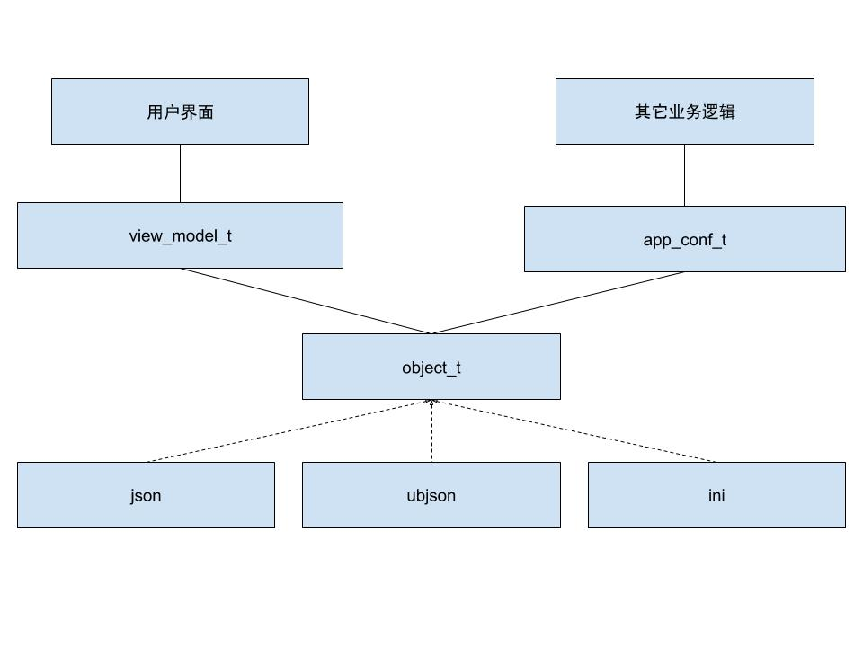
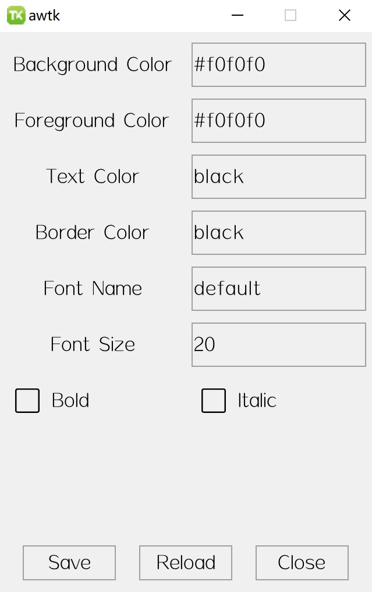
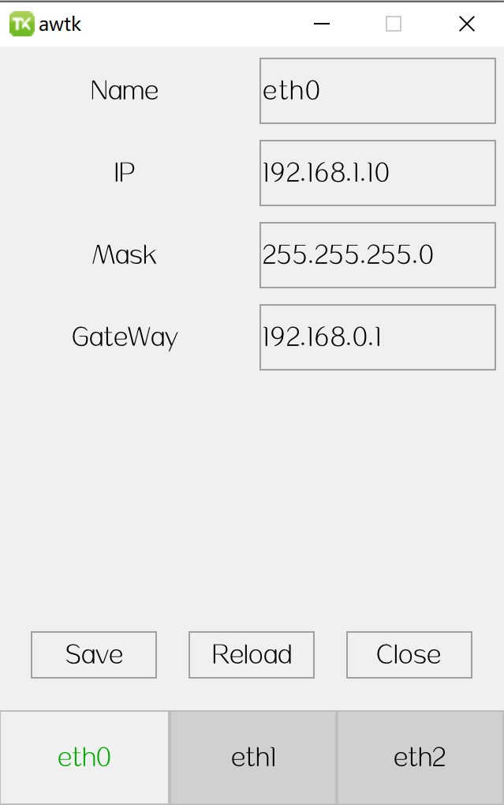
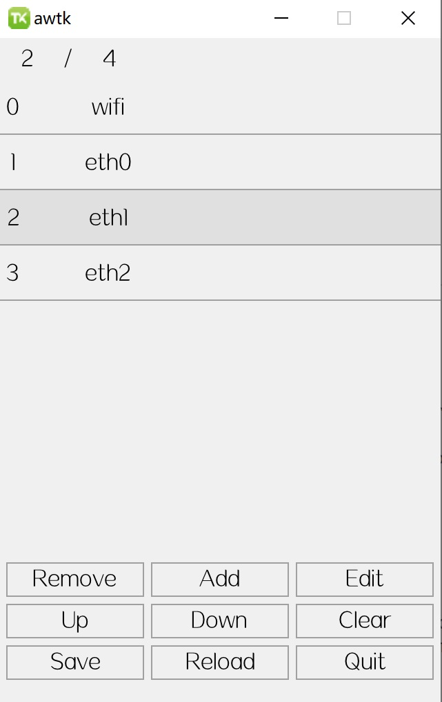

## 15. 配置类界面

对于配置类的界面，我们提供了一些辅助服务，让开发者在开发配置类界面时，一般情况下无需编写代码（或少量代码），即可完成对配置的修改、生效和保存。

相关组件



### 15.1 设计配置数据的结构

设计配置数据的结构，这包括两个方面的内容：

#### 15.1.1 选择文件格式

  配置文件有很多种格式，目前我们支持了 INI/JSON/UBJSON 三种格式，以后会根据需要添加新的格式，或者对接底层平台提供的接口。考虑灵活性、可扩展性和可读性等因素，推荐使用 JSON 格式的配置文件，在后面的例子中，也以 JSON 格式为例。
  
#### 15.1.2 确定文件结构

接下来要确定文件的结构，确定每一级的名称，确定每个值的格式。确定文件结构之后，后面才能编写绑定规则。

如：

```json
{
    "color" : {
        "bg" : "#f0f0f0",
        "fg" : "#f0f0f0",
        "text" : "black",
        "border" : "black"
    },
    "font" : {
        "name" : "default",
        "size" : "20",
        "bold" : true,
        "italic" : true
    }
}
```

### 15.2 基本用法

配置文件通常是树形结构的，我们用类似路径的方式，来访问其中的数据。

#### 15.2.1 多级路径用点分隔

比如上面的例子中：

* color.bg 路径可以用来访问（读/写/删）背景颜色。

* color.fg 路径可以用来访问（读/写/删）前景颜色。

* font.name 路径可以用来访问（读/写/删）字体的名称。

#### 15.2.2 通过索引访问配置

索引用英文的中括号括起来，表示同级之中的第几项（从 0 开始）。

比如上面的例子中：

* color.[0] 路径可以用来访问（读/写/删）背景颜色。

* color.[1] 路径可以用来访问（读/写/删）前景颜色。

* [1].name 路径可以用来访问（读/写/删）字体的名称。

#### 15.2.3 编写绑定规则

绑定规则基本上与之前我们用过的一样，只是 ViewModel 中属性的名称换成配置项的访问路径。

下面这个绑定规则将编辑器与配置中的背景颜色关联起来。

```
    <edit text="#f0f0f0" v-data:value="{color.bg}"/>
```

下面这个绑定规则将编辑器与配置中的前景颜色关联起来。

```    
    <edit text="#f0f0f0" v-data:value="{color.fg}"/
```

#### 15.2.4 指定模型

模型的名称固定为：app_conf

```xml
<window v-model="app_conf">
```

我们给上面的 JSON 文件编写一个界面：

如下：



它的 xml 文件如下 (app_conf.xml)：

```xml
<window v-model="app_conf">
  <view w="100%" h="-40" children_layout="default(c=2,h=40,s=10,m=5)">
    <label text="Background Color" />
    <edit text="#f0f0f0" v-data:value="{color.bg}"/>
    <label text="Foreground Color" />
    <edit text="#f0f0f0" v-data:value="{color.fg}"/>
    <label text="Text Color" />
    <edit text="black" v-data:value="{color.text}"/>
    <label text="Border Color" />
    <edit text="black" v-data:value="{color.border}"/>
    <label text="Font Name" />
    <edit text="default" v-data:value="{font.name}"/>
    <label text="Font Size" />
    <edit text="20" v-data:value="{font.size}"/>
    <check_button text="Bold" v-data:value="{font.bold}"/>
    <check_button text="Italic" v-data:value="{font.italic}"/>
  </view>

  <button text="Save" floating="true" self_layout="default(x=20, y=b:10, w=80, h=30)" 
    v-on:click="{save}"/>
  <button text="Reload" floating="true" self_layout="default(x=c, y=b:10, w=80, h=30)" 
    v-on:click="{reload}"/>
  <button text="Close" floating="true" self_layout="default(x=r:20, y=b:10, w=80, h=30)" 
        v-on:click="{nothing, QuitApp=true}"/>
</window>
```

主函数入口：

```c
ret_t application_init() {
  app_conf_init_json("demo21");

  return navigator_to("app_conf");
}
```

> 这里 demo21 是应用程序的名称，也是配置文件的名称。完整代码请参考 demo21。

### 15.3 sub_view_model

有时配置数据格式比较复杂，需要多层路径才能访问指定的配置，如果每次都需写完整的路径，实施起来比较繁琐，也不便于维护。此时可以使用 sub\_view\_model。

还是上面同样的配置，为了便于阅读，这里再拷贝一份：

```json
{
    "color" : {
        "bg" : "#f0f0f0",
        "fg" : "#f0f0f0",
        "text" : "black",
        "border" : "black"
    },
    "font" : {
        "name" : "default",
        "size" : "20",
        "bold" : true,
        "italic" : true
    }
}
```

> 创建 sub\_view\_model 时，英文冒号后面指定配置路径的前缀。

比如下面的例子，以 font 下的配置创建一个 sub\_view\_model。

```
v-model="sub_view_model:font"
```

```json
    {
        "name" : "default",
        "size" : "20",
        "bold" : true,
        "italic" : true
    }
```

在编写绑定规则时，我们就不需要写 font 这一部分路径，直接指定 font 下的键值就可以了：

```
  <edit text="default" v-data:value="{name}"/>
```

完整示例：

```xml
<window v-model="app_conf">
  <tab_control x="0" y="0" w="100%" h="100%" >
    <pages x="0" y="0" w="100%" h="-60" style="at_top">
      <view w="100%" h="100%" children_layout="default(c=2,h=40,s=10,m=5)" v-model="sub_view_model:font">
        <label text="Name" />
        <edit text="default" v-data:value="{name}"/>
        <label text="Size" />
        <edit text="20" v-data:value="{size}"/>
        <check_button text="Bold" v-data:value="{bold}"/>
        <check_button text="Italic" v-data:value="{italic}"/>
      </view>
      <view w="100%" h="100%" children_layout="default(c=2,h=40,s=10,m=5)" v-model="sub_view_model:color">
        <label text="Background Color" />
        <edit text="#f0f0f0" v-data:value="{bg}"/>
        <label text="Foreground Color" />
        <edit text="#f0f0f0" v-data:value="{color.fg}"/>
        <label text="Text Color" />
        <edit text="black" v-data:value="{text}"/>
        <label text="Border Color" />
        <edit text="black" v-data:value="{border}"/>
      </view>
    </pages>
    <tab_button_group x="0" y="bottom" w="100%" h="60" >
      <tab_button text="Font" value="true"/>
      <tab_button text="Color"/>
    </tab_button_group>
  </tab_control>

  <button text="Save" floating="true" self_layout="default(x=20, y=b:80, w=80, h=30)" v-on:click="{save}"/>
  <button text="Reload" floating="true" self_layout="default(x=c, y=b:80, w=80, h=30)" v-on:click="{reload}"/>
  <button text="Close" floating="true" self_layout="default(x=r:20, y=b:80, w=80, h=30)" v-on:click="{nothing, QuitApp=true}"/>
</window>
```

> 完整代码请参考 demo22。

### 15.4 sub_view_model_array

有时候，一组结构相同的配置，我们可能希望用列表或标签控件来展示，每个列表项为一个配置，或每个标签为一组配置。此时可以用 sub\_view\_model\_array。

> 创建 sub\_view\_model\_arrat 时，英文冒号后面指定配置路径的前缀。

```
v-model="sub_view_model_array:network"
```

比如下面这个配置：

```json
{
    "network": [
        {
            "name": "eth0",
            "ip": "192.168.1.10",
            "mask": "255.255.255.0",
            "gateway": "192.168.0.1"
        },
        {
            "name": "eth1",
            "ip": "192.168.2.20",
            "mask": "255.255.255.0",
            "gateway": "192.168.2.1"
        },
        {
            "name": "eth2",
            "ip": "192.168.3.30",
            "mask": "255.255.255.0",
            "gateway": "192.168.3.1"
        }
    ]
}
```

我们用下面的 tab control 界面来展示：



```xml
<window v-model="app_conf">
  <tab_control x="0" y="0" w="100%" h="100%" v-model="sub_view_model_array:network">
    <pages x="0" y="0" w="100%" h="-60" style="at_top" v-for-items="true"> 
      <view w="100%" h="100%" children_layout="default(c=2,h=40,s=10,m=5)">
        <label text="Name" />
        <edit text="default" v-data:value="{item.name}" readonly="true"/>
        <label text="IP" />
        <edit text="" v-data:value="{item.ip}"/>
        <label text="Mask" />
        <edit text="" v-data:value="{item.mask}"/>
        <label text="GateWay" />
        <edit text="" v-data:value="{item.gateway}"/>
      </view>
    </pages>

    <tab_button_group x="0" y="bottom" w="100%" h="60" v-for-items="true"> 
      <tab_button v-data:text="{item.name}"/>
    </tab_button_group>
  </tab_control>
  <button text="Save" floating="true" self_layout="default(x=20, y=b:80, w=80, h=30)" v-on:click="{save}"/>
  <button text="Reload" floating="true" self_layout="default(x=c, y=b:80, w=80, h=30)" v-on:click="{reload}"/>
  <button text="Close" floating="true" self_layout="default(x=r:20, y=b:80, w=80, h=30)" v-on:click="{nothing, QuitApp=true}"/>
</window>
```

因为用了 v-for-items，界面只需做一份就可以，其它的自动产生。

> 完整实例请参考 demo23

### 15.5 动态配置

有时候配置的内容并不是预先定义好的，而是可以由用户增加的。我们提供了一些基本的命令，帮助用户对配置进行增删改查。

先看个例子：

数据还是前面类似的数据，只是允许用户进行增加和删除。

```json
{
    "network" : [
        {
            "name" : "wifi",
            "ip" : "192.168.1.123",
            "mask" : "255.255.255.0",
            "gateway" : "192.168.1.1"
        },
        {
            "name" : "eth0",
            "ip" : "192.168.1.100",
            "mask" : "255.255.255.0",
            "gateway" : "192.168.1.1"
        },
        {
            "name" : "eth2",
            "ip" : "192.168.1.100",
            "mask" : "255.255.255.0",
            "gateway" : "192.168.1.1"
        },
        {
            "name" : "eth1",
            "ip" : "192.168.1.100",
            "mask" : "255.255.255.0",
            "gateway" : "192.168.1.1"
        }
    ]
}
```



同样需要创建 sub\_view\_model\_array:

```xml
  <view  x="0" y="0" w="100%" h="100%" v-model="sub_view_model_array:network">
```

下面介绍一下例子中出现的各个按钮对应的命令：

#### 15.5.1 remove

用于删除当前选中的项目。

```
    <button text="Remove" v-on:click="{remove}"/>
```

#### 15.5.2 add

用于增加一个新的项。

```
    <button text="Add" v-on:click="{add}"/>
```

此时会打开新建界面，界面 xml 的名称为 sub\_view\_model\_array 后面配置路径前缀+"_add"，在这个例子中：

```
v-model="sub_view_model_array:network"
```

对应的 ui 文件名为 network\_add.xml，它提供了新建 network 需要的界面，v-model 仍然为"app\_conf"，但是无需创建 sub view model，app\_conf 的配置路径前缀自动设置为新建项。

```
<window v-model="app_conf">
  <view w="100%" h="100%" children_layout="default(c=2,h=40,s=10,m=5)">
    <label text="Name" />
    <edit text="default" text="ethx" v-data:value="{name}"/>
    <label text="IP" />
    <edit text="192.168.1.100" v-data:value="{ip}"/>
    <label text="Mask" />
    <edit text="255.255.255.0" v-data:value="{mask}"/>
    <label text="GateWay" />
    <edit text="192.168.1.1" v-data:value="{gateway}"/>
  </view>
  <button text="Save" floating="true" self_layout="default(x=20, y=b:80, w=80, h=30)" v-on:click="{save, CloseWindow=true}"/>
  <button text="Close" floating="true" self_layout="default(x=r:20, y=b:80, w=80, h=30)" v-on:click="{reload, CloseWindow=true}"/>
</window>
```

* 保存退出。

```xml
  <button text="OK" floating="true" self_layout="default(x=20, y=b:80, w=80, h=30)" v-on:click="{save, CloseWindow=true}"/>
```

* 取消退出。

```xml
  <button text="Cancel" floating="true" self_layout="default(x=r:20, y=b:80, w=80, h=30)" v-on:click="{reload, CloseWindow=true}"/>
```
  
#### 15.5.3 edit

用于编辑当前选中的项。

```
  <button text="Edit" v-on:click="{edit}"/>
```

和 add 类似，此时会打开编辑界面，界面 xml 的名称为 sub\_view\_model\_array 后面配置路径前缀+"_edit"，在这个例子中：

```
v-model="sub_view_model_array:network"
```

对应的 ui 文件名为 network\_edit.xml，它提供了编辑 network 需要的界面，v-model 仍然为"app\_conf"，但是无需创建 sub view model，app\_conf 的配置路径前缀自动设置为当前的项。

```xml
<window v-model="app_conf">
  <view w="100%" h="100%" children_layout="default(c=2,h=40,s=10,m=5)">
    <label text="Name" />
    <edit text="default" v-data:value="{name}" readonly="true"/>
    <label text="IP" />
    <edit text="" v-data:value="{ip}"/>
    <label text="Mask" />
    <edit text="" v-data:value="{mask}"/>
    <label text="GateWay" />
    <edit text="" v-data:value="{gateway}"/>
  </view>
  <button text="OK" floating="true" self_layout="default(x=20, y=b:80, w=80, h=30)" v-on:click="{save, CloseWindow=true}"/>
  <button text="Cancel" floating="true" self_layout="default(x=r:20, y=b:80, w=80, h=30)" v-on:click="{reload, CloseWindow=true}"/>
</window>
```

* 保存退出。

```xml
  <button text="OK" floating="true" self_layout="default(x=20, y=b:80, w=80, h=30)" v-on:click="{save, CloseWindow=true}"/>
```

* 取消退出。

```xml
  <button text="Cancel" floating="true" self_layout="default(x=r:20, y=b:80, w=80, h=30)" v-on:click="{reload, CloseWindow=true}"/>
```

#### 15.5.4 move_up

将当前项上移。

```xml
    <button text="Up" v-on:click="{move_up}"/>
```

#### 15.5.5 move_down

将当前项下移。

```xml
    <button text="Down" v-on:click="{move_down}"/>
```

#### 15.5.6 clear

清除全部项目。如果需要撤销，可以执行 reload 命令，如果要永久保存，可以执行 save 命令。

```xml
    <button text="Clear" v-on:click="{clear}"/>
```

#### 15.5.7 save

持久保存。

```xml
    <button text="Save" v-on:click="{save}"/>
```

#### 15.5.8 reload

丢弃修改，重新加载配置。

```xml
    <button text="Reload" v-on:click="{reload}"/>
```

### 15.6 让配置生效

配置并不是单纯的一段数据，修改配置之后，往往还需要执行一些动作，也就是让配置生效。让配置生效有以下几种方式：

#### 15.6.1 变化后生效

注册 app conf 的 prop changed 事件，在事件的回调函数中，让配置生效即可。

```c
  emitter_on(EMITTER(app_conf_get_instance()), EVT_PROP_CHANGED, on_app_conf_events, NULL);
```

#### 15.6.2 实时生效

比如在编辑器的输入过程中和 slider 的拖动过程中，让配置实时生效。这个变化后生效类似，不过需要指定 Trigger=Changing。

如：

```xml
<slider x="center" y="middle:40" w="80%" h="20" v-data:value="{value, Trigger=Changing}"/>
```

#### 15.6.3 保存后生效

有时需要同时让一组属性生效，而单个属性变化时马上生效会有问题。此时我们可以在保存配置时让其生效：

```c
  emitter_on(EMITTER(app_conf_get_instance()), EVT_CMD_EXECED, on_app_conf_events, NULL)
```

完整示例请参考：demo26

## 15.7 关于 schema

schema 是用来描述配置的元数据，比如配置项功能描述和取值范围等。之前考虑整合 schema，主要是想用 schema 来生成 ViewModel 和数据有效性检查。后来发现不需要生成代码，直接用 view\_model\_object\_wrapper 更简单方便。

不用 schema 做数据有效性检查的原因有两个：

 * schema 只适合简单的情况，复杂的情况难以描述。schema 可以描述某个配置的最大值最小值和可选的取值，但很难描述一个配置项的依赖关系，也就是配置项的有效性取决于其它一些配置。另外有些配置是动态的，关联 schema 和这些配置也是件困难的事。

 * MVVM 可以从两个方面检查数据的有效，完全可以满足有效性检查的需求。一是 AWTK 的控件自带的检查机制，可以设置最大值、最小值和可选的取值。二是 MVVM 的 validator 可以各种支持各种复杂有效性检查。