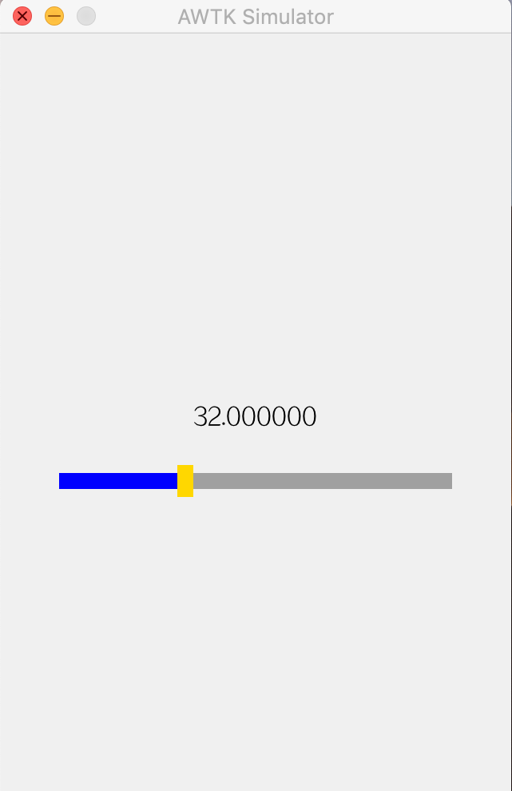

## 第 9 章 用 C 语言实现 Model

### 9.1 介绍

用 AWTK-MVVM 开发应用程序时，开发者的主要工作是编写  Model 的代码，而 ViewModel 则由代码产生器自动生成。

> 在版本 1.0 中，我们提供了一个代码生成器，该代码生成器根据提供的 json 文件，自动生成 Model 和 ViewModel 的代码的框架代码。根据《程序员修炼之道：从小工到专家》的描述，这是一个被动代码生成器，我们需要理解生成的代码，并在上面去修改，添加需要的功能。它有一个明显的副作用：Model 变化时需要手工更新 ViewModel。

> 在版本 2.0 中，我们提供了一个全新的代码生成器，这是一个主动代码产生器，开发者无需理解生成的代码，也不需要修改生成的代码，生成的代码完全是中间的代码，每次都根据 Model 重新生成。Model 的变化自动更新到 ViewModel 里。

在编写 Model 的代码时，我们需要按照固定的规则来编写注释，这些注释的规则在 AWTK 本身及相关项目中广泛使用。在深入介绍编写 Model 的方法之前，我们先看一个简单的例子。

> 请参考 awtk-mvvm 的 demos/demo1

在这个例子中，View 中有一个 label 控件和一个 slider 控件，slider 控件用于修改温度，label 控件用于显示温度，slider 修改的值自动更新到 label 上。

* 界面效果



* Model 的代码

```c
/**
 * @class temperature_t
 *
 * @annotation ["model"]
 * 温度控制器。
 *
 */
typedef struct _temperature_t {
  /** 
   * @property {double} value
   * @annotation ["readable", "writable"]
   * 值。
   */
  double value;
} temperature_t;

```

* View 的代码

```xml
<window v-model="temperature">
  <label x="center" y="middle" w="50%" h="40" v-data:text="{value}"/>
  <slider x="center" y="middle:40" w="80%" h="20" v-data:value="{value}"/>
</window>
```

> * v-data:text="{value}" 的意思是将控件的 text 属性绑定到 Model 的 value 属性上。
> * v-data:value="{value}" 的意思是将控件 value 属性绑定到 Model 的 value 属性上。

> 绑定规则在后面章节中有详细介绍。

* ViewModel 的代码（自动生成）

```c

/*This file is generated by code generator*/

#include "tkc/mem.h"
#include "tkc/utils.h"
#include "mvvm/base/utils.h"
#include "temperature_view_model.h"

static ret_t temperature_view_model_set_prop(object_t* obj, const char* name, const value_t* v) {
  temperature_t* atemperature = ((temperature_view_model_t*)(obj))->atemperature;

  if (tk_str_ieq("value", name)) {
    atemperature->value = value_double(v);

    return RET_OK;
  }

  return RET_NOT_FOUND;
}

static ret_t temperature_view_model_get_prop(object_t* obj, const char* name, value_t* v) {
  temperature_t* atemperature = ((temperature_view_model_t*)(obj))->atemperature;

  if (tk_str_ieq("value", name)) {
    value_set_double(v, atemperature->value);
    return RET_OK;
  }

  return RET_NOT_FOUND;
}

static bool_t temperature_view_model_can_exec(object_t* obj, const char* name, const char* args) {
  return FALSE;
}

static ret_t temperature_view_model_exec(object_t* obj, const char* name, const char* args) {
  return RET_NOT_FOUND;
}

static ret_t temperature_view_model_on_destroy(object_t* obj) {
  temperature_view_model_t* vm = (temperature_view_model_t*)(obj);
  return_value_if_fail(vm != NULL, RET_BAD_PARAMS);

  TKMEM_FREE(vm->atemperature);

  return view_model_deinit(VIEW_MODEL(obj));
}

static const object_vtable_t s_temperature_view_model_vtable = {"temperature_view_model_t",
                                                                "temperature_view_model_t",
                                                                sizeof(temperature_view_model_t),
                                                                FALSE,
                                                                temperature_view_model_on_destroy,
                                                                NULL,
                                                                temperature_view_model_get_prop,
                                                                temperature_view_model_set_prop,
                                                                NULL,
                                                                NULL,
                                                                temperature_view_model_can_exec,
                                                                temperature_view_model_exec};

view_model_t* temperature_view_model_create_with(temperature_t* atemperature) {
  object_t* obj = object_create(&s_temperature_view_model_vtable);
  view_model_t* vm = view_model_init(VIEW_MODEL(obj));
  temperature_view_model_t* temperature_view_model = (temperature_view_model_t*)(vm);

  return_value_if_fail(vm != NULL, NULL);

  temperature_view_model->atemperature = atemperature;

  return vm;
}

ret_t temperature_view_model_attach(view_model_t* vm, temperature_t* atemperature) {
  temperature_view_model_t* temperature_view_model = (temperature_view_model_t*)(vm);
  return_value_if_fail(vm != NULL, RET_BAD_PARAMS);

  temperature_view_model->atemperature = atemperature;

  return RET_OK;
}

view_model_t* temperature_view_model_create(navigator_request_t* req) {
  temperature_t* atemperature = TKMEM_ZALLOC(temperature_t);
  return_value_if_fail(atemperature != NULL, NULL);

  return temperature_view_model_create_with(atemperature);
}
```

> 在这个例子中，我们可以看到 ViewModel 的代码是很长的，幸好我们不需要理解和修改这些代码。当然作为一个优秀的程序员，找一个例子仔细研读一下，也是很好的习惯。

* 注册 ViewModel

```c
ret_t application_init() {
  view_model_factory_register("temperature", temperature_view_model_create);

  return navigator_to("temperature1");
}
```

> ViewModel 注册到系统，AWTK-MVVM 框架才能根据 View 的需要创建 ViewModel。

### 9.2 编写 Model

在编写 Model 时，和传统的 (面向对象的 C) 编程类似，只是需要遵循一些注释规则和命名规则。为类、类的属性和类的函数编写注释，再用工具提取这些注释，这些注释有具有多种用途：

  * 用于自动生成文档。
  * 用于自动生成 ViewModel 的代码。 
  * 用于 Designer 简化绑定规则的编写。

接下来，我们来学习一下 Model 的注释规则和命名规则，注释规则和命名规则沿用了 AWTK 本身的注释规则和命名规则。这里的注释规则和流行的 doxygen、javadoc 和 jsdoc 类似，主要是增加了一些特殊的 annotation。

#### 9.2.1 类

##### 9.2.1.1 类的基本用法

在 AWTK-MVVM 中采用 OOC (面向对象的 C) 的方式编写 Model，在 C 语言中，用结构来模拟类。

* 结构名用小写字母加"\_"的方式命名，并以"\_t"结尾。
* 注释中用@class 关键字表示这是一个类。
* 注释中用@annotation 关键字的"model"进一步标识 这是一个 Model。

如：

```c
/**
 * @class temperature_t
 *
 * @annotation ["model"]
 * 温度控制器。
 *
 */
typedef struct _temperature_t {
...
} temperature_t;
```

@annotation 还有其它几个取值：

* cpp 标识这是一个 C++实现的 Model。
* collection 标识这是一个另外一个对象的集合，后面跟对象的类型。

如：

```
* @annotation ["model", "cpp", "collection:Book"]
```

##### 9.2.1.2 构造函数

Model 的构造函数有 4 种：

* 无构造函数。当不提供构造函数时，通过TKMEM_ZALLOC分配内存。

* 通过单例函数获取对象。单例函数名与类名[去_t]相同。比如temperture_t的单例函数为：

```c
/**
 * @method temperature
 * 获取temperature对象。
 *
 * @annotation ["constructor"]
 * @return {temperature_t*} 返回temperature对象。
 */
temperature_t* temperature(void);
```

 * 无参数的构造函数。比如temperture_t的构造函数为：

```c
/**
 * @method temperature_create
 * 创建temperature对象。
 *
 * @annotation ["constructor"]
 * @return {temperature_t*} 返回temperature对象。
 */
temperature_t* temperature_create(void);
```

 * 带参数的构造函数。当需要从请求获取初始化参数时或需要返回结果给调用者时，可以提供一个带参数的构造函数。比如temperture_t的构造函数为：

```c
/**
 * @method temperature_create
 * 创建temperature对象。
 *
 * @param {navigator_request_t*} req 请求对象。
 * @annotation ["constructor"]
 * @return {temperature_t*} 返回temperature对象。
 */
temperature_t* temperature_create(navigator_request_t* req);
```

#### 9.2.2 属性

##### 9.2.2.1 属性基本用法

在 C 语言中，用结构的成员来模拟属性。

* 属性用小写字母加"_"的方式命名。
* 注释中用@property 关键字表示这是一个属性。
* 注释中用@annotation 关键字的"readable"标识该属性可以读取，"writable"标识该属性可以修改。

如：

```c
  /**
   * @property {double} value
   * @annotation ["readable", "writable"]
   * 值。
   */
  double value;
```

##### 9.2.2.2 setter 方法

如果希望用函数去修改指定属性，可以为属性提供一个 setter 方法，setter 方法的命名规则为：

**类名[去_t] + "\_set\_" + 属性名**

比如，为类 temperature 的 value 属性提供一个 setter 方法，可以按如下方式写：

```c
/**
 * @method temperature_set_value
 * 设置温度。
 *
 * @param {temperature_t*} temperature temperature 对象。
 * @param {double} value 温度。
 *
 * @return {ret_t} 返回 RET_OK 表示成功，否则表示失败。
 */
ret_t temperature_set_value(temperature_t* temperature, double value);
```

##### 9.2.2.3 getter 方法

如果希望用函数去获取指定属性，可以为属性提供一个 getter 方法，getter 方法的命名规则为：

**类名[去_t] + "\_get\_" + 属性名**

比如，为类 temperature 的 value 属性提供一个 getter 方法，可以按如下方式写：

```c
/**
 * @method temperature_get_value
 * 获取温度。
 *
 * @param {temperature_t*} temperature temperature 对象。
 *
 * @return {double} 返回温度。
 */
double temperature_get_value(temperature_t* temperature);
```
##### 9.2.2.4 合成属性

有的属性并不是结构的成员，而是由其它属性合成的。此时除了需要提供一个 getter 方法外，还需要在 annotation 中指定"fake"标识。如：

```c
  /**
   * @property {uint32_t} items
   * @annotation ["fake", "readable"]
   * 总数量。
   */
...

/**
 * @method book_store_get_items
 * 获取总数。
 *
 * @param {book_store_t*} book_store book_store 对象。
 *
 * @return {uint32_t} 返回总数。
 */
uint32_t book_store_get_items(book_store_t* book_store);
```

##### 9.2.2.5 属性的类型

属性目前支持如下数据类型：

* int8_t
* int16_t
* int32_t
* int64_t
* uint8_t
* uint16_t
* uint32_t
* uint64_t
* bool_t
* float_t
* float
* double
* int 
* long
* time_t
* str_t
* char*
* string (仅适用于 C++)

#### 9.2.3 命令

##### 9.2.3.1 命令的基本规则

* 命令的命名规则：**类名[去_t] + 命令名**
* 注释中的@method 关键字标识这是一个成员函数。 
* 注释中@annotation 关键字的"command"标识这是一个命令。

如类 temperature 的命令 apply 这样定义：

```c
/**
 * @method temperature_apply
 * 使用新设置的值生效。
 *
 * @annotation ["command"]
 * @param {temperature_t*} temperature temperature 对象。
 *
 * @return {ret_t} 返回 RET_OBJECT_CHANGED 表示模型有变化，View 需要刷新；返回其它表示失败。
 */
ret_t temperature_apply(temperature_t* temperature);
```

##### 9.2.3.2 命令的可用性检查

如果一个命令在有的情况下是不可用的，此时需要提供一个额外的函数，用于检查改命令是否可用。

其命名规则为：**类名[去_t] + "\_can\_" + 命令名**

比如，上面的 apply 命令对应的检查函数为：

```c
/**
 * @method temperature_can_apply
 * 检查 apply 命令是否可以执行。
 *
 * @param {temperature_t*} temperature temperature 对象。
 *
 * @return {bool_t} 返回 FALSE 表示不能执行，否则表示可以执行。
 */
bool_t temperature_can_apply(temperature_t* temperature);
```

##### 9.2.3.3 命令的别名

如果在 View 中指定的命令名与函数名不一致，可以在 annotaion 中为其指定一个别名。比如给 apply 命令指定一个别名 save，可以这样写：

```c
/**
 * @method temperature_apply
 * 使用新设置的值生效。
 *
 * @annotation ["command:save"]
 * @param {temperature_t*} temperature temperature 对象。
 *
 * @return {ret_t} 返回 RET_OBJECT_CHANGED 表示模型有变化，View 需要刷新；返回其它表示失败。
 */
ret_t temperature_apply(temperature_t* temperature);
```

##### 9.2.3.3 命令的返回值

  * RET_OK 表示正常执行，界面不需要刷新。
  * RET\_OBJECT\_CHANGED 表示模型变化，需要 View 刷新。
  * RET\_ITEMS\_CHANGED 表示模型变化，需要 View 重新生成 ListView。
  * 其它表示失败。

##### 9.2.3.4 命令的参数

命令可以没有参数(除了对象本身)，也可以有一个参数。

* 没有参数。如：

```c
/**
 * @method temperature_apply
 * 使用新设置的值生效。
 *
 * @annotation ["command"]
 * @param {temperature_t*} temperature temperature对象。
 *
 * @return {ret_t} 返回RET_OBJECT_CHANGED表示模型有变化，View需要刷新；返回其它表示失败。
 */
ret_t temperature_apply(temperature_t* temperature);
```

* 有一个参数。参数可以是字符串、浮点数和整数。如：

```c
/**
 * @method calculator_add_char
 * 追加一个字符。
 *
 * @annotation ["command"]
 * @param {calculator_t*} calculator calculator对象。
 * @param {const char*} args 参数。
 *
 * @return {ret_t}
 * 返回RET_OK表示成功；返回RET_OBJECT_CHANGED表示模型有变化，View需要刷新；返回其它表示失败。
 */
ret_t calculator_add_char(calculator_t* calculator, const char* args);
```

* 对于集合类的命令。如果有参数，参数只能是索引。如：

```c
/**
 * @method book_store_remove
 * 删除指定序数的book。
 *
 * @annotation ["command"]
 * @param {book_store_t*} book_store book_store对象。
 * @param {uint32_t} index 序数。
 *
 * @return {ret_t} 返回RET_ITEMS_CHANGED表示模型有变化，View需要刷新；返回其它表示失败。
 */
ret_t book_store_remove(book_store_t* book_store, uint32_t index);
```

### 9.3 代码生成器

代码生成器使用 js 开发，需要安装 nodejs。

* 注释提取工具

```
node $AWTK_ROOT/awtk/tools/idl_gen/index.js idl.json .
```

* ViewModel 代码生成器

```
node $AWTK_ROOT/awtk-mvvm/tools/view_model_gen/gen_vm.js idl.json
```

* ViewModelArray 代码生成器

```
node $AWTK_ROOT/awtk-mvvm/tools/view_model_gen/gen_vm_array.js idl.json
```

> AWTK_ROOT 请换成实际的路径，也可以使用相对路径。如 demos/demo13/gen.sh 中，是这样写的：

```
rm *view_model.*
node ../../../awtk/tools/idl_gen/index.js idl.json .
node ../../tools/view_model_gen/gen_vm.js idl.json
node ../../tools/view_model_gen/gen_vm_array.js idl.json
```
