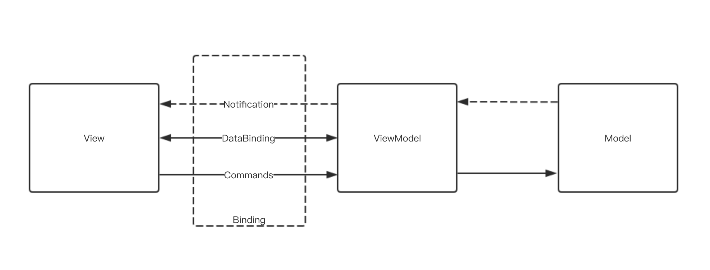

MVVM(Model-View-ViewModel)介绍

一、分离用户界面和业务逻辑

在开发应用程序时，要把用户界面和业务逻辑分离开来，这是每个程序员都知道的常识。分离用户界面和业务逻辑有几个重要的好处：

1. 有利于隔离变化。用户界面是最容易变化的，易用性的改进，外观的美化和需求的变化，首先冲击的就是用户界面。如果用户界面和业务逻辑耦合到一起，界面上一点微小的改动都会导致一系列代码的修改，这不但会增加开发的成本和周期，而且这种改进也是很无趣的，让程序员的幸福感直线下降。

2. 有利于自动测试。代码中的BUG，越早被发现，修改的成本越低，而单元测试是在早期发现BUG的重要手段。单元测试是自动化的，前期编写测试代码的投入，会因为后期节省测试的时间而获得回报。单元测试代码可以不断积累，为软件构建一道坚固的防火墙，让整个系统越来越稳定。分离用户界面和业务逻辑是提高代码可测试性的重要手段，让编写单元测试程序成为可能。

3. 有利于分工合作。用户界面和业务逻辑的耦合，会让用户界面的修改很困难，程序员就会抵触用户界面的改动，让设计师和程序员之间的矛盾加大。分离用户界面和业务逻辑后，设计师的工作成果可以平滑的输出给程序员，让程序员和设计师一起过上共同幸福的生活。

二、如何分离用户界面和业务逻辑

分离用户界面和业务逻辑，MVVM是目前最常用的模式。MVVM并非凭空出现，而是由MVC和MVP一路演化而来的，每次演化都是为了解决之前没有解决的问题。

**MVC模式。**MVC是Model-View-Controller简称，它首次把系统分成Model，View和Controller这三部分，明确的把用户界面和业务逻辑分离开来：

* Model 模型。简单的说，模型就是业务逻辑。我们经常说面向对象的设计和建模，所建立的模型就是这里的Model，是对现实世界中业务逻辑的抽象。面向对象的建模，就是要找到业务逻辑中有哪些类以及这些类之间的关系。类描述了对象的属性和行为，类是设计时的概念，对象是运行时的概念。对象通常就是业务实体，Model包含一个或多个业务实体。很多人(包括国内一些知名的专家)认为模型就是数据，这是对面向对象的设计没有理解透彻导致的，对象是即有数据又有行为的，光有数据没有行为，就没法让对象之间协作，共同完成业务逻辑。

* View 用户界面。这个是大家都知道的，就是用户与软件交互的界面，对于GUI应用程序来讲，就是窗口和对话框，以及上面的各种控件。View应该说是为用户提供了一个界面，让用户可以观察和操作模型。

* Controller 控制器。控制器负责解释来自用户通过键盘/鼠标等设备的输入，并通知模型和视图做出相应的改变。在GUI应用程序中，直白的说，其实就是控件的事件处理函数，它与界面相关和模型都相关。

MVC模式解决分离用户界面和业务逻辑的问题，但是还有一个重要的问题没有解决：

* 控制器是界面相关的，仍然没有办法为之编写单元测试程序。

**MVP模式。** 为了解决上面的问题，MVP模式应运而生。MVP是Model-View-Presenter简称，Controller变成了Presenter只是表面现象，最重要的是对View进行了抽象，Presenter不再访问具体的View，而是访问View的接口，View的接口是抽象的，可以有不同的实现，所以可以方便的Mock出一个View，让编写Presenter的单元测试程序成为可能。注意，这里View的接口并不是通用的，每个View都有一个独立的接口，有一个真正的实现和一个Mock的实现。

从理论上讲，MVP已经很完备了，它很好的分离的界面和实现，也可以为Presenter编写单元测试程序了。但是从工程角度来看，MVP却有一个非常致命的缺陷：要编写大量无聊的代码！

为了方便说明，我们以一个编辑图书信息例子，看看要写哪些无聊的代码。这个例子非常简单，却要写不少无聊的代码：

* 1.初始化的时候，要为控件注册事件处理函数，比如为『保存』按钮注册事件处理函数。

* 2.初始化的时候，要把图书信息，如书名、作者和出版社等信息从模型中取出来，一个一个的设置到视图的控件中去，在这个过程中，可能需要对数据格式进行转换，比如出版日期，在模型中是一个整数，在视图上表现为一个字符串，这就需要转换。

* 3.在编辑结束时，要从视图中把图书信息，如书名、作者和出版社等信息一个一个的取出来，再保存到模型中去。在这个过程中，可能需要对数据格式进行转换，比如前面的出版日期，要把视图中的字符串转换回模型中的整数。

* 4.View都有一个接口定义，有一个真正的实现和一个Mock的实现。

这些代码很简单却很无聊，在每个有界面的模块中，都遵循同样的规律，却又完全不同，不得不重新编写。

**MVVM模式。**把这些规律找出来进行抽象，通过一些规则在视图和模型建立联系，也就是数据绑定和命令绑定，就形成了MVVM模式。在MVVM中：

* 强制分离用户界面和业务逻辑。在MVC和MVP中，不能强制分离用户界面和业务逻辑，程序员的一念之间，就导致用户界面和业务逻辑混在一起。MVVM中不需要编写界面相关的代码，自然没有办法让用户界面和业务逻辑耦合到一起。

* 界面描述文件和程序代码之间具有更松的耦合。通常用XML或RC文件来描述界面，在MVC和MVP中，在界面上增加一个控件或删除一个控件，都会导致相应的代码需要修改。而在MVVM中，采用了面向意图的编程，界面上表现的只是一种意图，至于在程序中，谁去实现，怎么实现，甚至有没有实现，界面都是不关心的，所以界面和代码之间值的耦合是很松的。

* 不需要学习GUI的API。通过数据绑定和命令绑定建立视图和模型之间的联系。用声明式的规则取代命令式的代码，不需要写界面相关的代码，所以不需要学习GUI的API，无论是采用Qt还是EmWin，都用同样的方式开发。

MVVM是Model-View-ViewModel简称，Model还是前面所说的Model，View还是前面那个View，ViewModel和Controller/Presenter的关系却不大。在MVVM中，Controller和Presenter所做的界面相关的代码由MVVM框架做好了，应用程序开发者只需要编写绑定规则即可。ViewModel不是Controller，也不是Presenter，ViewModel是View还是Model？按MVVM的发明者John Gossman的话说，ViewModel是View眼中的Model。放大镜下的虫子还是虫子，所以View眼中的Model还是Model。ViewModel和Model并不相同，之所以要引入ViewModel，主要原因有：

* Model中的数据有时并不适合直接显示在View上。比如出版日期，在Model中是整数，直接显示出来，用户就看不懂，需要转换成人类可以理解的字符串。

* Model中的一个数据项可能以多种形式呈现在View上。比如出版日期，除了显示出版日期外，也可能把最近出版的书，显示一个新书标志。

* View中的输入数据和Model中的存储数据格式有时可能不同。比如出版日期，View上输入的格式和Model里存储的格式就不一样。

* View需要ViewModel提供数据校验规则来判断View上的输入是否合法。

* 有些数据是有依赖关系的。比如在输入收货地址时，选择省份时，城市列表跟着变化。

* 有些状态不属于业务逻辑，但是需要保存下来。如为了支持撤销操作，需要保存命令历史记录。

* 在C/C++等静态语言中，没有办法通过函数的名称去调用对象的成员函数，也没有办法通过属性的名称去访问对象的成员变量。ViewModel需要提供一种机制来实现这些功能，否则绑定规则就没法实现。

