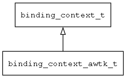

## binding\_context\_awtk\_t
### 概述


binding_context_awtk
----------------------------------
### 函数
<p id="binding_context_awtk_t_methods">

| 函数名称 | 说明 | 
| -------- | ------------ | 
| <a href="#binding_context_awtk_t_binding_context_awtk_create">binding\_context\_awtk\_create</a> | 创建binding_context对象。 |
| <a href="#binding_context_awtk_t_mvvm_awtk_deinit">mvvm\_awtk\_deinit</a> | ~初始化MVVM awtk |
| <a href="#binding_context_awtk_t_mvvm_awtk_init">mvvm\_awtk\_init</a> | 初始化MVVM awtk |
| <a href="#binding_context_awtk_t_mvvm_awtk_is_quited">mvvm\_awtk\_is\_quited</a> | 是否已经退出。 |
#### binding\_context\_awtk\_create 函数
-----------------------

* 函数功能：

> <p id="binding_context_awtk_t_binding_context_awtk_create">创建binding_context对象。

* 函数原型：

```
binding_context_t* binding_context_awtk_create (binding_context_t* parent, const char* vmodel, navigator_request_t* req, widget_t* widget);
```

* 参数说明：

| 参数 | 类型 | 说明 |
| -------- | ----- | --------- |
| 返回值 | binding\_context\_t* | 返回binding\_context对象。 |
| parent | binding\_context\_t* | 父的binding\_context对象。 |
| vmodel | const char* | ViewModel的名称。 |
| req | navigator\_request\_t* | 请求参数。 |
| widget | widget\_t* | 控件对象。 |
#### mvvm\_awtk\_deinit 函数
-----------------------

* 函数功能：

> <p id="binding_context_awtk_t_mvvm_awtk_deinit">~初始化MVVM awtk

* 函数原型：

```
ret_t mvvm_awtk_deinit ();
```

* 参数说明：

| 参数 | 类型 | 说明 |
| -------- | ----- | --------- |
| 返回值 | ret\_t | 返回RET\_OK表示成功，否则表示失败。 |
#### mvvm\_awtk\_init 函数
-----------------------

* 函数功能：

> <p id="binding_context_awtk_t_mvvm_awtk_init">初始化MVVM awtk

* 函数原型：

```
ret_t mvvm_awtk_init ();
```

* 参数说明：

| 参数 | 类型 | 说明 |
| -------- | ----- | --------- |
| 返回值 | ret\_t | 返回RET\_OK表示成功，否则表示失败。 |
#### mvvm\_awtk\_is\_quited 函数
-----------------------

* 函数功能：

> <p id="binding_context_awtk_t_mvvm_awtk_is_quited">是否已经退出。

* 函数原型：

```
bool_t mvvm_awtk_is_quited ();
```

* 参数说明：

| 参数 | 类型 | 说明 |
| -------- | ----- | --------- |
| 返回值 | bool\_t | 返回TRUE表示已经退出，否则表示没有退出。 |
