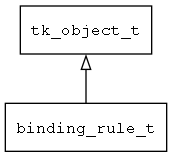

## binding\_rule\_t
### 概述

绑定规则基类。
----------------------------------
### 属性

| 属性名称 | 类型 | 说明 | 
| -------- | ----- | ------------ | 
| <a href="#binding_rule_t_binding_context">binding\_context</a> | binding\_context\_t* | 绑定的上下文。 |
| <a href="#binding_rule_t_parent">parent</a> | binding\_rule\_t* | 上一级的绑定规则。 |
| <a href="#binding_rule_t_widget">widget</a> | void* | 绑定的控件。 |
#### binding\_context 属性
-----------------------
> 
绑定的上下文。

* 类型：binding\_context\_t*

| 特性 | 是否支持 |
| -------- | ----- |
| 可直接读取 | 是 |
| 可直接修改 | 否 |
#### parent 属性
-----------------------
> 
上一级的绑定规则。

* 类型：binding\_rule\_t*

| 特性 | 是否支持 |
| -------- | ----- |
| 可直接读取 | 是 |
| 可直接修改 | 否 |
#### widget 属性
-----------------------
> 
绑定的控件。

* 类型：void*

| 特性 | 是否支持 |
| -------- | ----- |
| 可直接读取 | 是 |
| 可直接修改 | 否 |
