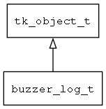

## buzzer\_log\_t
### 概述



----------------------------------
### 函数
<p id="buzzer_log_t_methods">

| 函数名称 | 说明 | 
| -------- | ------------ | 
| <a href="#buzzer_log_t_buzzer_log_create">buzzer\_log\_create</a> | 创建buzzer对象。 |
#### buzzer\_log\_create 函数
-----------------------

* 函数功能：

> <p id="buzzer_log_t_buzzer_log_create">创建buzzer对象。

* 函数原型：

```
tk_object_t* buzzer_log_create ();
```

* 参数说明：

| 参数 | 类型 | 说明 |
| -------- | ----- | --------- |
| 返回值 | tk\_object\_t* | 返回object对象。 |
