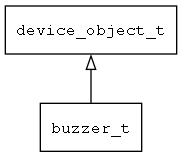

## buzzer\_t
### 概述

蜂鸣器。
----------------------------------
### 属性

| 属性名称 | 类型 | 说明 | 
| -------- | ----- | ------------ | 
| <a href="#buzzer_t_duration">duration</a> | uint32\_t | 持续时间(ms)。 |
| <a href="#buzzer_t_freq">freq</a> | uint32\_t | 频率。 |
| <a href="#buzzer_t_on">on</a> | bool\_t | 开启。 |
| <a href="#buzzer_t_volume">volume</a> | uint32\_t | 音量(0-100)。 |
#### duration 属性
-----------------------
> 
持续时间(ms)。

* 类型：uint32\_t

| 特性 | 是否支持 |
| -------- | ----- |
| 可直接读取 | 否 |
| 可直接修改 | 否 |
| 可在XML中设置 | 是 |
| 可通过widget\_get\_prop读取 | 是 |
| 可通过widget\_set\_prop修改 | 是 |
#### freq 属性
-----------------------
> 
频率。

* 类型：uint32\_t

| 特性 | 是否支持 |
| -------- | ----- |
| 可直接读取 | 否 |
| 可直接修改 | 否 |
| 可在XML中设置 | 是 |
| 可通过widget\_get\_prop读取 | 是 |
| 可通过widget\_set\_prop修改 | 是 |
#### on 属性
-----------------------
> 
开启。

* 类型：bool\_t

| 特性 | 是否支持 |
| -------- | ----- |
| 可直接读取 | 否 |
| 可直接修改 | 否 |
| 可在XML中设置 | 是 |
| 可通过widget\_get\_prop读取 | 是 |
| 可通过widget\_set\_prop修改 | 是 |
#### volume 属性
-----------------------
> 
音量(0-100)。

* 类型：uint32\_t

| 特性 | 是否支持 |
| -------- | ----- |
| 可直接读取 | 否 |
| 可直接修改 | 否 |
| 可在XML中设置 | 是 |
| 可通过widget\_get\_prop读取 | 是 |
| 可通过widget\_set\_prop修改 | 是 |
