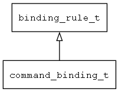

## command\_binding\_t
### 概述


命令绑定规则。
----------------------------------
### 函数
<p id="command_binding_t_methods">

| 函数名称 | 说明 | 
| -------- | ------------ | 
| <a href="#command_binding_t_binding_rule_is_command_binding">binding\_rule\_is\_command\_binding</a> | 判断当前规则是否为命令绑定规则。 |
| <a href="#command_binding_t_command_binding_can_exec">command\_binding\_can\_exec</a> | 检查当前的命令是否可以执行。 |
| <a href="#command_binding_t_command_binding_cast">command\_binding\_cast</a> | 转换为command_binding对象。 |
| <a href="#command_binding_t_command_binding_create">command\_binding\_create</a> | 创建数据绑定对象。 |
| <a href="#command_binding_t_command_binding_exec">command\_binding\_exec</a> | 执行当前的命令。 |
### 属性
<p id="command_binding_t_properties">

| 属性名称 | 类型 | 说明 | 
| -------- | ----- | ------------ | 
| <a href="#command_binding_t_args">args</a> | char* | 命令参数。 |
| <a href="#command_binding_t_auto_disable">auto\_disable</a> | bool\_t | 是否根据can_exec自动禁用控件(缺省为TRUE)。 |
| <a href="#command_binding_t_close_window">close\_window</a> | bool\_t | 执行命令之后，是否关闭当前窗口。 |
| <a href="#command_binding_t_command">command</a> | char* | 命令名称。 |
| <a href="#command_binding_t_event">event</a> | char* | 事件名称。 |
| <a href="#command_binding_t_is_continue">is\_continue</a> | bool\_t | 执行命令之后，是否继续处理该事件。 |
| <a href="#command_binding_t_key_filter">key\_filter</a> | char* | 按键过滤(主要用于按键事件，相当于快捷键)。 |
| <a href="#command_binding_t_quit_app">quit\_app</a> | bool\_t | 执行命令之后，是否退出应用程序。 |
| <a href="#command_binding_t_update_model">update\_model</a> | bool\_t | 执行命令之前，是否更新数据到模型。 |
#### binding\_rule\_is\_command\_binding 函数
-----------------------

* 函数功能：

> <p id="command_binding_t_binding_rule_is_command_binding">判断当前规则是否为命令绑定规则。

* 函数原型：

```
bool_t binding_rule_is_command_binding (binding_rule_t* rule);
```

* 参数说明：

| 参数 | 类型 | 说明 |
| -------- | ----- | --------- |
| 返回值 | bool\_t | 返回TRUE表示是，否则表示不是。 |
| rule | binding\_rule\_t* | 绑定规则对象。 |
#### command\_binding\_can\_exec 函数
-----------------------

* 函数功能：

> <p id="command_binding_t_command_binding_can_exec">检查当前的命令是否可以执行。

* 函数原型：

```
bool_t command_binding_can_exec (command_binding_t* rule);
```

* 参数说明：

| 参数 | 类型 | 说明 |
| -------- | ----- | --------- |
| 返回值 | bool\_t | 返回TRUE表示可以执行，否则表示不可以执行。 |
| rule | command\_binding\_t* | 绑定规则对象。 |
#### command\_binding\_cast 函数
-----------------------

* 函数功能：

> <p id="command_binding_t_command_binding_cast">转换为command_binding对象。

* 函数原型：

```
data_binding_t* command_binding_cast (void* rule);
```

* 参数说明：

| 参数 | 类型 | 说明 |
| -------- | ----- | --------- |
| 返回值 | data\_binding\_t* | 返回绑定规则对象。 |
| rule | void* | 绑定规则对象。 |
#### command\_binding\_create 函数
-----------------------

* 函数功能：

> <p id="command_binding_t_command_binding_create">创建数据绑定对象。

* 函数原型：

```
binding_rule_t* command_binding_create ();
```

* 参数说明：

| 参数 | 类型 | 说明 |
| -------- | ----- | --------- |
| 返回值 | binding\_rule\_t* | 返回数据绑定对象。 |
#### command\_binding\_exec 函数
-----------------------

* 函数功能：

> <p id="command_binding_t_command_binding_exec">执行当前的命令。

* 函数原型：

```
ret_t command_binding_exec (command_binding_t* rule);
```

* 参数说明：

| 参数 | 类型 | 说明 |
| -------- | ----- | --------- |
| 返回值 | ret\_t | 返回RET\_OK表示成功，否则表示失败。 |
| rule | command\_binding\_t* | 绑定规则对象。 |
#### args 属性
-----------------------
> <p id="command_binding_t_args">命令参数。

* 类型：char*

| 特性 | 是否支持 |
| -------- | ----- |
| 可直接读取 | 是 |
| 可直接修改 | 否 |
#### auto\_disable 属性
-----------------------
> <p id="command_binding_t_auto_disable">是否根据can_exec自动禁用控件(缺省为TRUE)。

* 类型：bool\_t

| 特性 | 是否支持 |
| -------- | ----- |
| 可直接读取 | 是 |
| 可直接修改 | 否 |
#### close\_window 属性
-----------------------
> <p id="command_binding_t_close_window">执行命令之后，是否关闭当前窗口。

* 类型：bool\_t

| 特性 | 是否支持 |
| -------- | ----- |
| 可直接读取 | 是 |
| 可直接修改 | 否 |
#### command 属性
-----------------------
> <p id="command_binding_t_command">命令名称。

* 类型：char*

| 特性 | 是否支持 |
| -------- | ----- |
| 可直接读取 | 是 |
| 可直接修改 | 否 |
#### event 属性
-----------------------
> <p id="command_binding_t_event">事件名称。

* 类型：char*

| 特性 | 是否支持 |
| -------- | ----- |
| 可直接读取 | 是 |
| 可直接修改 | 否 |
#### is\_continue 属性
-----------------------
> <p id="command_binding_t_is_continue">执行命令之后，是否继续处理该事件。

* 类型：bool\_t

| 特性 | 是否支持 |
| -------- | ----- |
| 可直接读取 | 是 |
| 可直接修改 | 否 |
#### key\_filter 属性
-----------------------
> <p id="command_binding_t_key_filter">按键过滤(主要用于按键事件，相当于快捷键)。

* 类型：char*

| 特性 | 是否支持 |
| -------- | ----- |
| 可直接读取 | 是 |
| 可直接修改 | 否 |
#### quit\_app 属性
-----------------------
> <p id="command_binding_t_quit_app">执行命令之后，是否退出应用程序。

* 类型：bool\_t

| 特性 | 是否支持 |
| -------- | ----- |
| 可直接读取 | 是 |
| 可直接修改 | 否 |
#### update\_model 属性
-----------------------
> <p id="command_binding_t_update_model">执行命令之前，是否更新数据到模型。

* 类型：bool\_t

| 特性 | 是否支持 |
| -------- | ----- |
| 可直接读取 | 是 |
| 可直接修改 | 否 |
