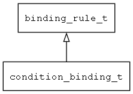

## condition\_binding\_t
### 概述


条件渲染的绑定规则。
----------------------------------
### 函数
<p id="condition_binding_t_methods">

| 函数名称 | 说明 | 
| -------- | ------------ | 
| <a href="#condition_binding_t_binding_rule_is_condition_binding">binding\_rule\_is\_condition\_binding</a> | 判断当前规则是否为条件渲染规则。 |
| <a href="#condition_binding_t_condition_binding_cast">condition\_binding\_cast</a> | 转换为condition_binding对象。 |
| <a href="#condition_binding_t_condition_binding_create">condition\_binding\_create</a> | 创建列表渲染绑定对象。 |
### 属性
<p id="condition_binding_t_properties">

| 属性名称 | 类型 | 说明 | 
| -------- | ----- | ------------ | 
| <a href="#condition_binding_t_current_expr">current\_expr</a> | char* | 当前为true的条件表达式。 |
| <a href="#condition_binding_t_static_widget_before_next_dynamic_binding">static\_widget\_before\_next\_dynamic\_binding</a> | uint32\_t | 到下一条动态渲染规则之间非动态渲染的控件的数量。 |
| <a href="#condition_binding_t_widget_data_pos">widget\_data\_pos</a> | uint32\_t | 动态渲染的界面描述数据的位置。 |
| <a href="#condition_binding_t_widget_data_size">widget\_data\_size</a> | uint32\_t | 动态渲染的界面描述数据的长度。 |
#### binding\_rule\_is\_condition\_binding 函数
-----------------------

* 函数功能：

> <p id="condition_binding_t_binding_rule_is_condition_binding">判断当前规则是否为条件渲染规则。

* 函数原型：

```
bool_t binding_rule_is_condition_binding (binding_rule_t* rule);
```

* 参数说明：

| 参数 | 类型 | 说明 |
| -------- | ----- | --------- |
| 返回值 | bool\_t | 返回TRUE表示是，否则表示不是。 |
| rule | binding\_rule\_t* | 绑定规则对象。 |
#### condition\_binding\_cast 函数
-----------------------

* 函数功能：

> <p id="condition_binding_t_condition_binding_cast">转换为condition_binding对象。

* 函数原型：

```
data_binding_t* condition_binding_cast (void* rule);
```

* 参数说明：

| 参数 | 类型 | 说明 |
| -------- | ----- | --------- |
| 返回值 | data\_binding\_t* | 返回绑定规则对象。 |
| rule | void* | 绑定规则对象。 |
#### condition\_binding\_create 函数
-----------------------

* 函数功能：

> <p id="condition_binding_t_condition_binding_create">创建列表渲染绑定对象。

* 函数原型：

```
binding_rule_t* condition_binding_create ();
```

* 参数说明：

| 参数 | 类型 | 说明 |
| -------- | ----- | --------- |
| 返回值 | binding\_rule\_t* | 返回列表渲染绑定对象。 |
#### current\_expr 属性
-----------------------
> <p id="condition_binding_t_current_expr">当前为true的条件表达式。

* 类型：char*

| 特性 | 是否支持 |
| -------- | ----- |
| 可直接读取 | 是 |
| 可直接修改 | 否 |
#### static\_widget\_before\_next\_dynamic\_binding 属性
-----------------------
> <p id="condition_binding_t_static_widget_before_next_dynamic_binding">到下一条动态渲染规则之间非动态渲染的控件的数量。

* 类型：uint32\_t

| 特性 | 是否支持 |
| -------- | ----- |
| 可直接读取 | 是 |
| 可直接修改 | 否 |
#### widget\_data\_pos 属性
-----------------------
> <p id="condition_binding_t_widget_data_pos">动态渲染的界面描述数据的位置。

* 类型：uint32\_t

| 特性 | 是否支持 |
| -------- | ----- |
| 可直接读取 | 是 |
| 可直接修改 | 否 |
#### widget\_data\_size 属性
-----------------------
> <p id="condition_binding_t_widget_data_size">动态渲染的界面描述数据的长度。

* 类型：uint32\_t

| 特性 | 是否支持 |
| -------- | ----- |
| 可直接读取 | 是 |
| 可直接修改 | 否 |
