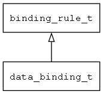

## data\_binding\_t
### 概述


数据绑定规则。
----------------------------------
### 函数
<p id="data_binding_t_methods">

| 函数名称 | 说明 | 
| -------- | ------------ | 
| <a href="#data_binding_t_binding_rule_is_data_binding">binding\_rule\_is\_data\_binding</a> | 判断当前规则是否为数据绑定规则。 |
| <a href="#data_binding_t_data_binding_cast">data\_binding\_cast</a> | 转换为data_binding对象。 |
| <a href="#data_binding_t_data_binding_create">data\_binding\_create</a> | 创建数据绑定对象。 |
| <a href="#data_binding_t_data_binding_get_prop">data\_binding\_get\_prop</a> | 从模型中获取属性值。 |
| <a href="#data_binding_t_data_binding_set_prop">data\_binding\_set\_prop</a> | 设置属性值到模型。 |
### 属性
<p id="data_binding_t_properties">

| 属性名称 | 类型 | 说明 | 
| -------- | ----- | ------------ | 
| <a href="#data_binding_t_converter">converter</a> | char* | 格式转换器的名称。 |
| <a href="#data_binding_t_converter_args">converter\_args</a> | char* | 格式转换器的参数。 |
| <a href="#data_binding_t_mode">mode</a> | binding\_mode\_t | 绑定模式。 |
| <a href="#data_binding_t_path">path</a> | char* | 模型中的数据名称。 |
| <a href="#data_binding_t_prop">prop</a> | char* | 控件的属性。 |
| <a href="#data_binding_t_to_model">to\_model</a> | char* | 转换成模型需要的格式。 |
| <a href="#data_binding_t_to_view">to\_view</a> | char* | 转换成视图需要的格式。 |
| <a href="#data_binding_t_trigger;">trigger;</a> | update\_model\_trigger\_t | 触发更新模型的时机。 |
| <a href="#data_binding_t_validator">validator</a> | char* | 数据校验器的名称。 |
#### binding\_rule\_is\_data\_binding 函数
-----------------------

* 函数功能：

> <p id="data_binding_t_binding_rule_is_data_binding">判断当前规则是否为数据绑定规则。

* 函数原型：

```
bool_t binding_rule_is_data_binding (binding_rule_t* rule);
```

* 参数说明：

| 参数 | 类型 | 说明 |
| -------- | ----- | --------- |
| 返回值 | bool\_t | 返回TRUE表示是，否则表示不是。 |
| rule | binding\_rule\_t* | 绑定规则对象。 |
#### data\_binding\_cast 函数
-----------------------

* 函数功能：

> <p id="data_binding_t_data_binding_cast">转换为data_binding对象。

* 函数原型：

```
data_binding_t* data_binding_cast (void* rule);
```

* 参数说明：

| 参数 | 类型 | 说明 |
| -------- | ----- | --------- |
| 返回值 | data\_binding\_t* | 返回绑定规则对象。 |
| rule | void* | 绑定规则对象。 |
#### data\_binding\_create 函数
-----------------------

* 函数功能：

> <p id="data_binding_t_data_binding_create">创建数据绑定对象。

* 函数原型：

```
binding_rule_t* data_binding_create ();
```

* 参数说明：

| 参数 | 类型 | 说明 |
| -------- | ----- | --------- |
| 返回值 | binding\_rule\_t* | 返回数据绑定对象。 |
#### data\_binding\_get\_prop 函数
-----------------------

* 函数功能：

> <p id="data_binding_t_data_binding_get_prop">从模型中获取属性值。

* 函数原型：

```
ret_t data_binding_get_prop (data_binding_t* rule, value_t* v);
```

* 参数说明：

| 参数 | 类型 | 说明 |
| -------- | ----- | --------- |
| 返回值 | ret\_t | 返回RET\_OK表示成功，否则表示失败。 |
| rule | data\_binding\_t* | 绑定规则对象。 |
| v | value\_t* | 值对象。 |
#### data\_binding\_set\_prop 函数
-----------------------

* 函数功能：

> <p id="data_binding_t_data_binding_set_prop">设置属性值到模型。

* 函数原型：

```
ret_t data_binding_set_prop (data_binding_t* rule, const value_t* v);
```

* 参数说明：

| 参数 | 类型 | 说明 |
| -------- | ----- | --------- |
| 返回值 | ret\_t | 返回RET\_OK表示成功，否则表示失败。 |
| rule | data\_binding\_t* | 绑定规则对象。 |
| v | const value\_t* | 值对象。 |
#### converter 属性
-----------------------
> <p id="data_binding_t_converter">格式转换器的名称。

* 类型：char*

| 特性 | 是否支持 |
| -------- | ----- |
| 可直接读取 | 是 |
| 可直接修改 | 否 |
#### converter\_args 属性
-----------------------
> <p id="data_binding_t_converter_args">格式转换器的参数。

* 类型：char*

| 特性 | 是否支持 |
| -------- | ----- |
| 可直接读取 | 是 |
| 可直接修改 | 否 |
#### mode 属性
-----------------------
> <p id="data_binding_t_mode">绑定模式。

* 类型：binding\_mode\_t

| 特性 | 是否支持 |
| -------- | ----- |
| 可直接读取 | 是 |
| 可直接修改 | 否 |
#### path 属性
-----------------------
> <p id="data_binding_t_path">模型中的数据名称。

* 类型：char*

| 特性 | 是否支持 |
| -------- | ----- |
| 可直接读取 | 是 |
| 可直接修改 | 否 |
#### prop 属性
-----------------------
> <p id="data_binding_t_prop">控件的属性。

* 类型：char*

| 特性 | 是否支持 |
| -------- | ----- |
| 可直接读取 | 是 |
| 可直接修改 | 否 |
#### to\_model 属性
-----------------------
> <p id="data_binding_t_to_model">转换成模型需要的格式。

* 类型：char*

| 特性 | 是否支持 |
| -------- | ----- |
| 可直接读取 | 是 |
| 可直接修改 | 否 |
#### to\_view 属性
-----------------------
> <p id="data_binding_t_to_view">转换成视图需要的格式。

* 类型：char*

| 特性 | 是否支持 |
| -------- | ----- |
| 可直接读取 | 是 |
| 可直接修改 | 否 |
#### trigger; 属性
-----------------------
> <p id="data_binding_t_trigger;">触发更新模型的时机。

* 类型：update\_model\_trigger\_t

| 特性 | 是否支持 |
| -------- | ----- |
| 可直接读取 | 是 |
| 可直接修改 | 否 |
#### validator 属性
-----------------------
> <p id="data_binding_t_validator">数据校验器的名称。

* 类型：char*

| 特性 | 是否支持 |
| -------- | ----- |
| 可直接读取 | 是 |
| 可直接修改 | 否 |
