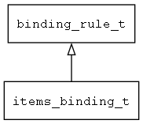

## items\_binding\_t
### 概述


列表渲染的绑定规则。
----------------------------------
### 函数
<p id="items_binding_t_methods">

| 函数名称 | 说明 | 
| -------- | ------------ | 
| <a href="#items_binding_t_binding_rule_is_items_binding">binding\_rule\_is\_items\_binding</a> | 判断当前规则是否为列表渲染规则。 |
| <a href="#items_binding_t_items_binding_cast">items\_binding\_cast</a> | 转换为items_binding对象。 |
| <a href="#items_binding_t_items_binding_create">items\_binding\_create</a> | 创建列表渲染绑定对象。 |
| <a href="#items_binding_t_mvvm_base_deinit">mvvm\_base\_deinit</a> | ~初始化MVVM base |
| <a href="#items_binding_t_mvvm_base_init">mvvm\_base\_init</a> | 初始化MVVM base |
### 属性
<p id="items_binding_t_properties">

| 属性名称 | 类型 | 说明 | 
| -------- | ----- | ------------ | 
| <a href="#items_binding_t_bound;">bound;</a> | bool\_t | 规则是否完成绑定。 |
| <a href="#items_binding_t_cursor;">cursor;</a> | uint32\_t | 当前的数组cursor。 |
| <a href="#items_binding_t_fixed_widget_count">fixed\_widget\_count</a> | uint32\_t | 渲染时固定创建的控件数量, -1表示不固定 |
| <a href="#items_binding_t_id_name">id\_name</a> | char* | 被迭代的数组元素的键值的别名。 |
| <a href="#items_binding_t_index_name">index\_name</a> | char* | 被迭代的数组元素的索引的别名。 |
| <a href="#items_binding_t_item_name">item\_name</a> | char* | 被迭代的数组元素的别名。 |
| <a href="#items_binding_t_items_count">items\_count</a> | uint32\_t | 最近一次渲染时源数组的元素数量。 |
| <a href="#items_binding_t_items_name">items\_name</a> | char* | 源数组的变量名称。 |
| <a href="#items_binding_t_rebind_idle_id">rebind\_idle\_id</a> | uint32\_t | Rebind的idle的id |
| <a href="#items_binding_t_start_index">start\_index</a> | uint32\_t | 渲染的第0个控件对应的item索引 |
| <a href="#items_binding_t_static_widget_before_next_dynamic_binding">static\_widget\_before\_next\_dynamic\_binding</a> | uint32\_t | 到下一条动态渲染规则之间非动态渲染的控件的数量。 |
| <a href="#items_binding_t_widget_data_pos">widget\_data\_pos</a> | uint32\_t | 动态渲染的界面描述数据的位置。 |
| <a href="#items_binding_t_widget_data_size">widget\_data\_size</a> | uint32\_t | 动态渲染的界面描述数据的长度。 |
#### binding\_rule\_is\_items\_binding 函数
-----------------------

* 函数功能：

> <p id="items_binding_t_binding_rule_is_items_binding">判断当前规则是否为列表渲染规则。

* 函数原型：

```
bool_t binding_rule_is_items_binding (binding_rule_t* rule);
```

* 参数说明：

| 参数 | 类型 | 说明 |
| -------- | ----- | --------- |
| 返回值 | bool\_t | 返回TRUE表示是，否则表示不是。 |
| rule | binding\_rule\_t* | 绑定规则对象。 |
#### items\_binding\_cast 函数
-----------------------

* 函数功能：

> <p id="items_binding_t_items_binding_cast">转换为items_binding对象。

* 函数原型：

```
data_binding_t* items_binding_cast (void* rule);
```

* 参数说明：

| 参数 | 类型 | 说明 |
| -------- | ----- | --------- |
| 返回值 | data\_binding\_t* | 返回绑定规则对象。 |
| rule | void* | 绑定规则对象。 |
#### items\_binding\_create 函数
-----------------------

* 函数功能：

> <p id="items_binding_t_items_binding_create">创建列表渲染绑定对象。

* 函数原型：

```
binding_rule_t* items_binding_create ();
```

* 参数说明：

| 参数 | 类型 | 说明 |
| -------- | ----- | --------- |
| 返回值 | binding\_rule\_t* | 返回列表渲染绑定对象。 |
#### mvvm\_base\_deinit 函数
-----------------------

* 函数功能：

> <p id="items_binding_t_mvvm_base_deinit">~初始化MVVM base

* 函数原型：

```
ret_t mvvm_base_deinit ();
```

* 参数说明：

| 参数 | 类型 | 说明 |
| -------- | ----- | --------- |
| 返回值 | ret\_t | 返回RET\_OK表示成功，否则表示失败。 |
#### mvvm\_base\_init 函数
-----------------------

* 函数功能：

> <p id="items_binding_t_mvvm_base_init">初始化MVVM base

* 函数原型：

```
ret_t mvvm_base_init ();
```

* 参数说明：

| 参数 | 类型 | 说明 |
| -------- | ----- | --------- |
| 返回值 | ret\_t | 返回RET\_OK表示成功，否则表示失败。 |
#### bound; 属性
-----------------------
> <p id="items_binding_t_bound;">规则是否完成绑定。

* 类型：bool\_t

| 特性 | 是否支持 |
| -------- | ----- |
| 可直接读取 | 是 |
| 可直接修改 | 否 |
#### cursor; 属性
-----------------------
> <p id="items_binding_t_cursor;">当前的数组cursor。

* 类型：uint32\_t

| 特性 | 是否支持 |
| -------- | ----- |
| 可直接读取 | 是 |
| 可直接修改 | 否 |
#### fixed\_widget\_count 属性
-----------------------
> <p id="items_binding_t_fixed_widget_count">渲染时固定创建的控件数量, -1表示不固定

* 类型：uint32\_t

| 特性 | 是否支持 |
| -------- | ----- |
| 可直接读取 | 是 |
| 可直接修改 | 否 |
#### id\_name 属性
-----------------------
> <p id="items_binding_t_id_name">被迭代的数组元素的键值的别名。

* 类型：char*

| 特性 | 是否支持 |
| -------- | ----- |
| 可直接读取 | 是 |
| 可直接修改 | 否 |
#### index\_name 属性
-----------------------
> <p id="items_binding_t_index_name">被迭代的数组元素的索引的别名。

* 类型：char*

| 特性 | 是否支持 |
| -------- | ----- |
| 可直接读取 | 是 |
| 可直接修改 | 否 |
#### item\_name 属性
-----------------------
> <p id="items_binding_t_item_name">被迭代的数组元素的别名。

* 类型：char*

| 特性 | 是否支持 |
| -------- | ----- |
| 可直接读取 | 是 |
| 可直接修改 | 否 |
#### items\_count 属性
-----------------------
> <p id="items_binding_t_items_count">最近一次渲染时源数组的元素数量。

* 类型：uint32\_t

| 特性 | 是否支持 |
| -------- | ----- |
| 可直接读取 | 是 |
| 可直接修改 | 否 |
#### items\_name 属性
-----------------------
> <p id="items_binding_t_items_name">源数组的变量名称。

* 类型：char*

| 特性 | 是否支持 |
| -------- | ----- |
| 可直接读取 | 是 |
| 可直接修改 | 否 |
#### rebind\_idle\_id 属性
-----------------------
> <p id="items_binding_t_rebind_idle_id">Rebind的idle的id

* 类型：uint32\_t

| 特性 | 是否支持 |
| -------- | ----- |
| 可直接读取 | 是 |
| 可直接修改 | 否 |
#### start\_index 属性
-----------------------
> <p id="items_binding_t_start_index">渲染的第0个控件对应的item索引

* 类型：uint32\_t

| 特性 | 是否支持 |
| -------- | ----- |
| 可直接读取 | 是 |
| 可直接修改 | 否 |
#### static\_widget\_before\_next\_dynamic\_binding 属性
-----------------------
> <p id="items_binding_t_static_widget_before_next_dynamic_binding">到下一条动态渲染规则之间非动态渲染的控件的数量。

* 类型：uint32\_t

| 特性 | 是否支持 |
| -------- | ----- |
| 可直接读取 | 是 |
| 可直接修改 | 否 |
#### widget\_data\_pos 属性
-----------------------
> <p id="items_binding_t_widget_data_pos">动态渲染的界面描述数据的位置。

* 类型：uint32\_t

| 特性 | 是否支持 |
| -------- | ----- |
| 可直接读取 | 是 |
| 可直接修改 | 否 |
#### widget\_data\_size 属性
-----------------------
> <p id="items_binding_t_widget_data_size">动态渲染的界面描述数据的长度。

* 类型：uint32\_t

| 特性 | 是否支持 |
| -------- | ----- |
| 可直接读取 | 是 |
| 可直接修改 | 否 |
