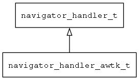

## navigator\_handler\_awtk\_t
### 概述


基于AWTK实现的导航处理器，负责打开指定的窗口。
----------------------------------
### 函数
<p id="navigator_handler_awtk_t_methods">

| 函数名称 | 说明 | 
| -------- | ------------ | 
| <a href="#navigator_handler_awtk_t_navigator_handler_awtk_create">navigator\_handler\_awtk\_create</a> | 创建navigator_handler对象(主要给脚本和DLL使用)。 |
#### navigator\_handler\_awtk\_create 函数
-----------------------

* 函数功能：

> <p id="navigator_handler_awtk_t_navigator_handler_awtk_create">创建navigator_handler对象(主要给脚本和DLL使用)。

* 函数原型：

```
navigator_handler_t* navigator_handler_awtk_create ();
```

* 参数说明：

| 参数 | 类型 | 说明 |
| -------- | ----- | --------- |
| 返回值 | navigator\_handler\_t* | 返回navigator\_handler对象。 |
