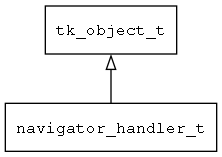

## navigator\_handler\_t
### 概述


处理导航请求。
----------------------------------
### 函数
<p id="navigator_handler_t_methods">

| 函数名称 | 说明 | 
| -------- | ------------ | 
| <a href="#navigator_handler_t_navigator_handler_create">navigator\_handler\_create</a> | 创建handler对象。 |
| <a href="#navigator_handler_t_navigator_handler_on_request">navigator\_handler\_on\_request</a> | 调用本函数处理请求。 |
#### navigator\_handler\_create 函数
-----------------------

* 函数功能：

> <p id="navigator_handler_t_navigator_handler_create">创建handler对象。

* 函数原型：

```
ret_t navigator_handler_create (const char* target, navigator_handler_on_request_t on_request);
```

* 参数说明：

| 参数 | 类型 | 说明 |
| -------- | ----- | --------- |
| 返回值 | ret\_t | 返回handler对象。 |
| target | const char* | 目标窗口的名称。 |
| on\_request | navigator\_handler\_on\_request\_t | 用于非模态窗口返回结果的回调函数。 |
#### navigator\_handler\_on\_request 函数
-----------------------

* 函数功能：

> <p id="navigator_handler_t_navigator_handler_on_request">调用本函数处理请求。

* 函数原型：

```
ret_t navigator_handler_on_request (navigator_handler_t* handler, navigator_request_t* req);
```

* 参数说明：

| 参数 | 类型 | 说明 |
| -------- | ----- | --------- |
| 返回值 | ret\_t | 返回RET\_OK表示成功，否则表示失败。 |
| handler | navigator\_handler\_t* | handler对象。 |
| req | navigator\_request\_t* | 处理请求。 |
