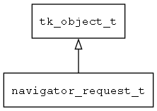

## navigator\_request\_t
### 概述


导航请求。
如果需要传递参数或自定义请求时，才需要本类，否则直接使用navigator的API即可。
----------------------------------
### 函数
<p id="navigator_request_t_methods">

| 函数名称 | 说明 | 
| -------- | ------------ | 
| <a href="#navigator_request_t_navigator_request_create">navigator\_request\_create</a> | 创建request对象。 |
| <a href="#navigator_request_t_navigator_request_on_result">navigator\_request\_on\_result</a> | navigator hander调用本函数返回结果。 |
| <a href="#navigator_request_t_navigator_request_set_args">navigator\_request\_set\_args</a> | 设置导航请求的参数。 |
### 属性
<p id="navigator_request_t_properties">

| 属性名称 | 类型 | 说明 | 
| -------- | ----- | ------------ | 
| <a href="#navigator_request_t_on_result">on\_result</a> | navigator\_request\_on\_result\_t | 用于异步请求返回结果。 |
| <a href="#navigator_request_t_parent_view_model">parent\_view\_model</a> | tk\_object\_t* | 父view_model。 |
| <a href="#navigator_request_t_result">result</a> | value\_t | 用于同步请求返回结果。 |
| <a href="#navigator_request_t_user_data">user\_data</a> | void* | 用户自定义数据。 |
#### navigator\_request\_create 函数
-----------------------

* 函数功能：

> <p id="navigator_request_t_navigator_request_create">创建request对象。
> 请求信息可以是普通字符串，比如"abc"表示参数target为"abc"；
> 也可以是"string?"前缀的形式，比如"string?arg1=xx&arg2=xx"表示参数arg1为"xx"、参数arg2为"xx"。
> 请求信息中的参数无顺序要求，可选参数请参阅navigator_request_argument_type_t

* 函数原型：

```
navigator_request_t* navigator_request_create (const char* args, navigator_request_on_result_t on_result);
```

* 参数说明：

| 参数 | 类型 | 说明 |
| -------- | ----- | --------- |
| 返回值 | navigator\_request\_t* | 返回request对象。 |
| args | const char* | 请求的参数 |
| on\_result | navigator\_request\_on\_result\_t | 用于非模态窗口返回结果的回调函数。 |
#### navigator\_request\_on\_result 函数
-----------------------

* 函数功能：

> <p id="navigator_request_t_navigator_request_on_result">navigator hander调用本函数返回结果。

* 函数原型：

```
ret_t navigator_request_on_result (navigator_request_t* req, const value_t* result);
```

* 参数说明：

| 参数 | 类型 | 说明 |
| -------- | ----- | --------- |
| 返回值 | ret\_t | 返回RET\_OK表示成功，否则表示失败。 |
| req | navigator\_request\_t* | request对象。 |
| result | const value\_t* | 结果。 |
#### navigator\_request\_set\_args 函数
-----------------------

* 函数功能：

> <p id="navigator_request_t_navigator_request_set_args">设置导航请求的参数。

* 函数原型：

```
ret_t navigator_request_set_args (navigator_request_t* req, tk_object_t* args);
```

* 参数说明：

| 参数 | 类型 | 说明 |
| -------- | ----- | --------- |
| 返回值 | ret\_t | 返回RET\_OK表示成功，否则表示失败。 |
| req | navigator\_request\_t* | request对象。 |
| args | tk\_object\_t* | 导航请求的参数。 |
#### on\_result 属性
-----------------------
> <p id="navigator_request_t_on_result">用于异步请求返回结果。

* 类型：navigator\_request\_on\_result\_t

| 特性 | 是否支持 |
| -------- | ----- |
| 可直接读取 | 是 |
| 可直接修改 | 否 |
#### parent\_view\_model 属性
-----------------------
> <p id="navigator_request_t_parent_view_model">父view_model。

* 类型：tk\_object\_t*

| 特性 | 是否支持 |
| -------- | ----- |
| 可直接读取 | 是 |
| 可直接修改 | 否 |
#### result 属性
-----------------------
> <p id="navigator_request_t_result">用于同步请求返回结果。

* 类型：value\_t

| 特性 | 是否支持 |
| -------- | ----- |
| 可直接读取 | 是 |
| 可直接修改 | 否 |
#### user\_data 属性
-----------------------
> <p id="navigator_request_t_user_data">用户自定义数据。

* 类型：void*

| 特性 | 是否支持 |
| -------- | ----- |
| 可直接读取 | 是 |
| 可直接修改 | 否 |
