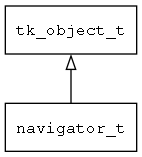

## navigator\_t
### 概述


导航器。负责窗口导航。
----------------------------------
### 函数
<p id="navigator_t_methods">

| 函数名称 | 说明 | 
| -------- | ------------ | 
| <a href="#navigator_t_navigator">navigator</a> | 获取缺省的navigator对象。 |
| <a href="#navigator_t_navigator_back">navigator\_back</a> | 关闭当前窗口，回到前一窗口。 |
| <a href="#navigator_t_navigator_back_to_home">navigator\_back\_to\_home</a> | 回到主屏。 |
| <a href="#navigator_t_navigator_close">navigator\_close</a> | 关闭指定窗口。 |
| <a href="#navigator_t_navigator_confirm">navigator\_confirm</a> | 显示确认信息。 |
| <a href="#navigator_t_navigator_count_view_models">navigator\_count\_view\_models</a> | 获取指定的ViewModel实例的个数。 |
| <a href="#navigator_t_navigator_create">navigator\_create</a> | 创建navigator对象。 |
| <a href="#navigator_t_navigator_get_locale">navigator\_get\_locale</a> | 获取当前的本地化信息（国家和语言）。 |
| <a href="#navigator_t_navigator_get_theme">navigator\_get\_theme</a> | 获取当前的主题。 |
| <a href="#navigator_t_navigator_get_view_models">navigator\_get\_view\_models</a> | 获取指定的ViewModel实例。 |
| <a href="#navigator_t_navigator_handle_request">navigator\_handle\_request</a> | 处理打开窗口的请求。 |
| <a href="#navigator_t_navigator_has_handler">navigator\_has\_handler</a> | 检查是否存在指定名称的请求处理器。 |
| <a href="#navigator_t_navigator_info">navigator\_info</a> | 显示信息。 |
| <a href="#navigator_t_navigator_notify_view_items_changed">navigator\_notify\_view\_items\_changed</a> | 触发指定的View实例的items改变事件。 |
| <a href="#navigator_t_navigator_notify_view_props_changed">navigator\_notify\_view\_props\_changed</a> | 触发指定的View实例的props改变事件。 |
| <a href="#navigator_t_navigator_pick_color">navigator\_pick\_color</a> | 选择颜色。 |
| <a href="#navigator_t_navigator_pick_dir">navigator\_pick\_dir</a> | 选择目录。 |
| <a href="#navigator_t_navigator_pick_file">navigator\_pick\_file</a> | 选择文件。 |
| <a href="#navigator_t_navigator_register_handler">navigator\_register\_handler</a> | 注册请求处理器。 |
| <a href="#navigator_t_navigator_replace">navigator\_replace</a> | 请求打开指定的窗口，并关闭当前窗口。 |
| <a href="#navigator_t_navigator_request_close">navigator\_request\_close</a> | 请求关闭关闭指定窗口。 |
| <a href="#navigator_t_navigator_set">navigator\_set</a> | 设置缺省navigator对象。 |
| <a href="#navigator_t_navigator_set_locale">navigator\_set\_locale</a> | 设置本地化信息（国家和语言）。 |
| <a href="#navigator_t_navigator_set_screen_saver_time">navigator\_set\_screen\_saver\_time</a> | 设置屏保时间。 |
| <a href="#navigator_t_navigator_set_theme">navigator\_set\_theme</a> | 设置指定的主题。 |
| <a href="#navigator_t_navigator_switch_to">navigator\_switch\_to</a> | 如果目标窗口已经存在，直接切换到该窗口，否则打开新窗口。 |
| <a href="#navigator_t_navigator_to">navigator\_to</a> | 发送指定的请求。 |
| <a href="#navigator_t_navigator_to_by_object">navigator\_to\_by\_object</a> | 发送指定的请求。 |
| <a href="#navigator_t_navigator_to_ex">navigator\_to\_ex</a> | 发送指定的请求，并可传递参数和返回结果。 |
| <a href="#navigator_t_navigator_to_with_key_value">navigator\_to\_with\_key\_value</a> | 请求打开指定的窗口。 |
| <a href="#navigator_t_navigator_to_with_model">navigator\_to\_with\_model</a> | 请求打开指定的窗口。 |
| <a href="#navigator_t_navigator_toast">navigator\_toast</a> | 显示toast信息。 |
| <a href="#navigator_t_navigator_unregister_handler">navigator\_unregister\_handler</a> | 注销请求处理器。 |
| <a href="#navigator_t_navigator_warn">navigator\_warn</a> | 显示警告信息。 |
| <a href="#navigator_t_str_random">str\_random</a> | 生产一个随机字符串。 |
#### navigator 函数
-----------------------

* 函数功能：

> <p id="navigator_t_navigator">获取缺省的navigator对象。

* 函数原型：

```
ret_t navigator ();
```

* 参数说明：

| 参数 | 类型 | 说明 |
| -------- | ----- | --------- |
| 返回值 | ret\_t | 返回navigator对象。 |
#### navigator\_back 函数
-----------------------

* 函数功能：

> <p id="navigator_t_navigator_back">关闭当前窗口，回到前一窗口。

* 函数原型：

```
ret_t navigator_back ();
```

* 参数说明：

| 参数 | 类型 | 说明 |
| -------- | ----- | --------- |
| 返回值 | ret\_t | 返回RET\_OK表示成功，否则表示失败。 |
#### navigator\_back\_to\_home 函数
-----------------------

* 函数功能：

> <p id="navigator_t_navigator_back_to_home">回到主屏。

* 函数原型：

```
ret_t navigator_back_to_home ();
```

* 参数说明：

| 参数 | 类型 | 说明 |
| -------- | ----- | --------- |
| 返回值 | ret\_t | 返回RET\_OK表示成功，否则表示失败。 |
#### navigator\_close 函数
-----------------------

* 函数功能：

> <p id="navigator_t_navigator_close">关闭指定窗口。

* 函数原型：

```
ret_t navigator_close (const char* target);
```

* 参数说明：

| 参数 | 类型 | 说明 |
| -------- | ----- | --------- |
| 返回值 | ret\_t | 返回RET\_OK表示成功，否则表示失败。 |
| target | const char* | 目标窗口的名称。 |
#### navigator\_confirm 函数
-----------------------

* 函数功能：

> <p id="navigator_t_navigator_confirm">显示确认信息。

* 函数原型：

```
ret_t navigator_confirm (const char* title, const char* content);
```

* 参数说明：

| 参数 | 类型 | 说明 |
| -------- | ----- | --------- |
| 返回值 | ret\_t | 返回RET\_OK表示成功，否则表示失败。 |
| title | const char* | 标题。 |
| content | const char* | 内容。 |
#### navigator\_count\_view\_models 函数
-----------------------

* 函数功能：

> <p id="navigator_t_navigator_count_view_models">获取指定的ViewModel实例的个数。
> target为NULL时，表示当前全部的ViewModel实例；
> target为空字符串时，表示最上面的窗口绑定的全部ViewModel实例；
> target也可以为具体的路径，比如：
> 1."window.widget"：表示name属性为"window"的窗体中name属性为"widget"的子控件上绑定的ViewModel实例。
> 2."window.[0]"：表示name属性为"window"的窗体的第0个子控件上绑定的ViewModel实例。
> 注意：使用数字作为界面路径索引时必须用中括号括起来。

* 函数原型：

```
ret_t navigator_count_view_models (const char* target);
```

* 参数说明：

| 参数 | 类型 | 说明 |
| -------- | ----- | --------- |
| 返回值 | ret\_t | 返回实例的个数。 |
| target | const char* | 与ViewModel实例绑定的控件的路径。 |
#### navigator\_create 函数
-----------------------

* 函数功能：

> <p id="navigator_t_navigator_create">创建navigator对象。

* 函数原型：

```
ret_t navigator_create ();
```

* 参数说明：

| 参数 | 类型 | 说明 |
| -------- | ----- | --------- |
| 返回值 | ret\_t | 返回navigator对象。 |
#### navigator\_get\_locale 函数
-----------------------

* 函数功能：

> <p id="navigator_t_navigator_get_locale">获取当前的本地化信息（国家和语言）。


返回本地化信息对象，其中属性"language"表示语言，属性"country"表示国家或地区。

* 函数原型：

```
tk_object_t* navigator_get_locale (const char* target);
```

* 参数说明：

| 参数 | 类型 | 说明 |
| -------- | ----- | --------- |
| 返回值 | tk\_object\_t* |  |
| target | const char* | 控件的路径，固定为NULL。 |
#### navigator\_get\_theme 函数
-----------------------

* 函数功能：

> <p id="navigator_t_navigator_get_theme">获取当前的主题。

* 函数原型：

```
const char* navigator_get_theme (const char* target);
```

* 参数说明：

| 参数 | 类型 | 说明 |
| -------- | ----- | --------- |
| 返回值 | const char* | 返回主题名称。 |
| target | const char* | 控件的路径，固定为NULL。 |
#### navigator\_get\_view\_models 函数
-----------------------

* 函数功能：

> <p id="navigator_t_navigator_get_view_models">获取指定的ViewModel实例。
> target为NULL时，表示当前全部的ViewModel实例；
> target为空字符串时，表示最上面的窗口绑定的全部ViewModel实例；
> target也可以为具体的路径，比如：
> 1."window.widget"：表示name属性为"window"的窗体中name属性为"widget"的子控件上绑定的ViewModel实例。
> 2."window.[0]"：表示name属性为"window"的窗体的第0个子控件上绑定的ViewModel实例。
> 注意：使用数字作为界面路径索引时必须用中括号括起来。

* 函数原型：

```
ret_t navigator_get_view_models (const char* target, darray_t* result);
```

* 参数说明：

| 参数 | 类型 | 说明 |
| -------- | ----- | --------- |
| 返回值 | ret\_t | 返回RET\_OK表示成功，否则表示失败。 |
| target | const char* | 与ViewModel实例绑定的控件的路径。 |
| result | darray\_t* | 返回ViewModel实例。 |
#### navigator\_handle\_request 函数
-----------------------

* 函数功能：

> <p id="navigator_t_navigator_handle_request">处理打开窗口的请求。

* 函数原型：

```
ret_t navigator_handle_request (navigator_t* nav, navigator_request_t* req);
```

* 参数说明：

| 参数 | 类型 | 说明 |
| -------- | ----- | --------- |
| 返回值 | ret\_t | 返回RET\_OK表示成功，否则表示失败。 |
| nav | navigator\_t* | navigator对象。 |
| req | navigator\_request\_t* | request对象。 |
#### navigator\_has\_handler 函数
-----------------------

* 函数功能：

> <p id="navigator_t_navigator_has_handler">检查是否存在指定名称的请求处理器。

* 函数原型：

```
ret_t navigator_has_handler (navigator_t* nav, const char* target);
```

* 参数说明：

| 参数 | 类型 | 说明 |
| -------- | ----- | --------- |
| 返回值 | ret\_t | 返回TRUE表示存在，否则表示不存在。 |
| nav | navigator\_t* | navigator对象。 |
| target | const char* | 目标窗口的名称。 |
#### navigator\_info 函数
-----------------------

* 函数功能：

> <p id="navigator_t_navigator_info">显示信息。

* 函数原型：

```
ret_t navigator_info (const char* title, const char* content);
```

* 参数说明：

| 参数 | 类型 | 说明 |
| -------- | ----- | --------- |
| 返回值 | ret\_t | 返回RET\_OK表示成功，否则表示失败。 |
| title | const char* | 标题。 |
| content | const char* | 内容。 |
#### navigator\_notify\_view\_items\_changed 函数
-----------------------

* 函数功能：

> <p id="navigator_t_navigator_notify_view_items_changed">触发指定的View实例的items改变事件。
> target为NULL时，表示当前全部的ViewModel实例；
> target为空字符串时，表示最上面的窗口绑定的全部ViewModel实例；
> target也可以为具体的路径，比如：
> 1."window.widget"：表示name属性为"window"的窗体中name属性为"widget"的子控件上绑定的ViewModel实例。
> 2."window.[0]"：表示name属性为"window"的窗体的第0个子控件上绑定的ViewModel实例。
> 注意：使用数字作为界面路径索引时必须用中括号括起来。

* 函数原型：

```
ret_t navigator_notify_view_items_changed (tk_object_t* items, const char* target);
```

* 参数说明：

| 参数 | 类型 | 说明 |
| -------- | ----- | --------- |
| 返回值 | ret\_t | 返回RET\_OK表示成功，否则表示失败。 |
| items | tk\_object\_t* | 发生变化的items对象。 |
| target | const char* | 与ViewModel实例绑定的控件的路径。 |
#### navigator\_notify\_view\_props\_changed 函数
-----------------------

* 函数功能：

> <p id="navigator_t_navigator_notify_view_props_changed">触发指定的View实例的props改变事件。
> target为NULL时，表示当前全部的ViewModel实例；
> target为空字符串时，表示最上面的窗口绑定的全部ViewModel实例；
> target也可以为具体的路径，比如：
> 1."window.widget"：表示name属性为"window"的窗体中name属性为"widget"的子控件上绑定的ViewModel实例。
> 2."window.[0]"：表示name属性为"window"的窗体的第0个子控件上绑定的ViewModel实例。
> 注意：使用数字作为界面路径索引时必须用中括号括起来。

* 函数原型：

```
ret_t navigator_notify_view_props_changed (const char* target);
```

* 参数说明：

| 参数 | 类型 | 说明 |
| -------- | ----- | --------- |
| 返回值 | ret\_t | 返回RET\_OK表示成功，否则表示失败。 |
| target | const char* | 与ViewModel实例绑定的控件的路径。 |
#### navigator\_pick\_color 函数
-----------------------

* 函数功能：

> <p id="navigator_t_navigator_pick_color">选择颜色。

* 函数原型：

```
ret_t navigator_pick_color (const char* title, str_t* result);
```

* 参数说明：

| 参数 | 类型 | 说明 |
| -------- | ----- | --------- |
| 返回值 | ret\_t | 返回RET\_OK表示成功，否则表示失败。 |
| title | const char* | 标题。 |
| result | str\_t* | 用于传递缺省值和返回结果。 |
#### navigator\_pick\_dir 函数
-----------------------

* 函数功能：

> <p id="navigator_t_navigator_pick_dir">选择目录。

* 函数原型：

```
ret_t navigator_pick_dir (const char* title, str_t* result);
```

* 参数说明：

| 参数 | 类型 | 说明 |
| -------- | ----- | --------- |
| 返回值 | ret\_t | 返回RET\_OK表示成功，否则表示失败。 |
| title | const char* | 标题。 |
| result | str\_t* | 用于传递缺省值和返回结果。 |
#### navigator\_pick\_file 函数
-----------------------

* 函数功能：

> <p id="navigator_t_navigator_pick_file">选择文件。

* 函数原型：

```
ret_t navigator_pick_file (const char* title, const char* filter, bool_t for_save, str_t* result);
```

* 参数说明：

| 参数 | 类型 | 说明 |
| -------- | ----- | --------- |
| 返回值 | ret\_t | 返回RET\_OK表示成功，否则表示失败。 |
| title | const char* | 标题。 |
| filter | const char* | 文件过滤(如：.txt.html), NULL表示不过滤。 |
| for\_save | bool\_t | TRUE表示用于保存，FALSE表示用于打开。 |
| result | str\_t* | 用于传递缺省值和返回结果。 |
#### navigator\_register\_handler 函数
-----------------------

* 函数功能：

> <p id="navigator_t_navigator_register_handler">注册请求处理器。

* 函数原型：

```
ret_t navigator_register_handler (navigator_t* nav, const char* target, navigator_handler_t* handler);
```

* 参数说明：

| 参数 | 类型 | 说明 |
| -------- | ----- | --------- |
| 返回值 | ret\_t | 返回RET\_OK表示成功，否则表示失败。 |
| nav | navigator\_t* | navigator对象。 |
| target | const char* | 目标窗口的名称。 |
| handler | navigator\_handler\_t* | 但请求打开target窗口时，执行本handler。 |
#### navigator\_replace 函数
-----------------------

* 函数功能：

> <p id="navigator_t_navigator_replace">请求打开指定的窗口，并关闭当前窗口。

* 函数原型：

```
ret_t navigator_replace (const char* target);
```

* 参数说明：

| 参数 | 类型 | 说明 |
| -------- | ----- | --------- |
| 返回值 | ret\_t | 返回RET\_OK表示成功，否则表示失败。 |
| target | const char* | 目标窗口的名称。 |
#### navigator\_request\_close 函数
-----------------------

* 函数功能：

> <p id="navigator_t_navigator_request_close">请求关闭关闭指定窗口。

> 窗口是否被关闭，取决于窗口本身的处理逻辑。

* 函数原型：

```
ret_t navigator_request_close (const char* target);
```

* 参数说明：

| 参数 | 类型 | 说明 |
| -------- | ----- | --------- |
| 返回值 | ret\_t | 返回RET\_OK表示成功，否则表示失败。 |
| target | const char* | 目标窗口的名称。 |
#### navigator\_set 函数
-----------------------

* 函数功能：

> <p id="navigator_t_navigator_set">设置缺省navigator对象。

* 函数原型：

```
ret_t navigator_set (navigator_t* nav);
```

* 参数说明：

| 参数 | 类型 | 说明 |
| -------- | ----- | --------- |
| 返回值 | ret\_t | 返回RET\_OK表示成功，否则表示失败。 |
| nav | navigator\_t* | navigator对象。 |
#### navigator\_set\_locale 函数
-----------------------

* 函数功能：

> <p id="navigator_t_navigator_set_locale">设置本地化信息（国家和语言）。

* 函数原型：

```
ret_t navigator_set_locale (const char* language, const char* country, const char* target);
```

* 参数说明：

| 参数 | 类型 | 说明 |
| -------- | ----- | --------- |
| 返回值 | ret\_t | 返回RET\_OK表示成功，否则表示失败。 |
| language | const char* | 语言。 |
| country | const char* | 国家或地区。 |
| target | const char* | 控件的路径，固定为NULL。 |
#### navigator\_set\_screen\_saver\_time 函数
-----------------------

* 函数功能：

> <p id="navigator_t_navigator_set_screen_saver_time">设置屏保时间。

* 函数原型：

```
ret_t navigator_set_screen_saver_time (uint32_t time);
```

* 参数说明：

| 参数 | 类型 | 说明 |
| -------- | ----- | --------- |
| 返回值 | ret\_t | 返回RET\_OK表示成功，否则表示失败。 |
| time | uint32\_t | 屏保时间(单位毫秒), 为0关闭屏保。 |
#### navigator\_set\_theme 函数
-----------------------

* 函数功能：

> <p id="navigator_t_navigator_set_theme">设置指定的主题。

* 函数原型：

```
ret_t navigator_set_theme (const char* theme, const char* target);
```

* 参数说明：

| 参数 | 类型 | 说明 |
| -------- | ----- | --------- |
| 返回值 | ret\_t | 返回RET\_OK表示成功，否则表示失败。 |
| theme | const char* | 主题。 |
| target | const char* | 控件的路径，固定为NULL。 |
#### navigator\_switch\_to 函数
-----------------------

* 函数功能：

> <p id="navigator_t_navigator_switch_to">如果目标窗口已经存在，直接切换到该窗口，否则打开新窗口。

* 函数原型：

```
ret_t navigator_switch_to (const char* target, bool_t close_current);
```

* 参数说明：

| 参数 | 类型 | 说明 |
| -------- | ----- | --------- |
| 返回值 | ret\_t | 返回RET\_OK表示成功，否则表示失败。 |
| target | const char* | 目标窗口的名称。 |
| close\_current | bool\_t | 是否关闭当前窗口。 |
#### navigator\_to 函数
-----------------------

* 函数功能：

> <p id="navigator_t_navigator_to">发送指定的请求。
发送请求时可以用"string?"为前缀、用"&"分隔的格式传递参数。
比如，"string?arg1=xx&arg2=yy"表示有两个参数，参数arg1的值为"xx"，参数arg2的值为"yy",
如果没有用上述格式指定参数，则默认为target参数的值。

* 函数原型：

```
ret_t navigator_to (const char* args);
```

* 参数说明：

| 参数 | 类型 | 说明 |
| -------- | ----- | --------- |
| 返回值 | ret\_t | 返回RET\_OK表示成功，否则表示失败。 |
| args | const char* | 发送请求时要传递的参数。 |
#### navigator\_to\_by\_object 函数
-----------------------

* 函数功能：

> <p id="navigator_t_navigator_to_by_object">发送指定的请求。

* 函数原型：

```
ret_t navigator_to_by_object (const char* args);
```

* 参数说明：

| 参数 | 类型 | 说明 |
| -------- | ----- | --------- |
| 返回值 | ret\_t | 返回RET\_OK表示成功，否则表示失败。 |
| args | const char* | 发送请求时要传递的参数。 |
#### navigator\_to\_ex 函数
-----------------------

* 函数功能：

> <p id="navigator_t_navigator_to_ex">发送指定的请求，并可传递参数和返回结果。

* 函数原型：

```
ret_t navigator_to_ex (navigator_request_t* req);
```

* 参数说明：

| 参数 | 类型 | 说明 |
| -------- | ----- | --------- |
| 返回值 | ret\_t | 返回RET\_OK表示成功，否则表示失败。 |
| req | navigator\_request\_t* | request对象。 |
#### navigator\_to\_with\_key\_value 函数
-----------------------

* 函数功能：

> <p id="navigator_t_navigator_to_with_key_value">请求打开指定的窗口。

* 函数原型：

```
ret_t navigator_to_with_key_value (const char* target, const char* key, const char* value);
```

* 参数说明：

| 参数 | 类型 | 说明 |
| -------- | ----- | --------- |
| 返回值 | ret\_t | 返回RET\_OK表示成功，否则表示失败。 |
| target | const char* | 目标窗口的名称。 |
| key | const char* | 参数名。 |
| value | const char* | 参数值。 |
#### navigator\_to\_with\_model 函数
-----------------------

* 函数功能：

> <p id="navigator_t_navigator_to_with_model">请求打开指定的窗口。

* 函数原型：

```
ret_t navigator_to_with_model (const char* target, tk_object_t* model, const char* prefix);
```

* 参数说明：

| 参数 | 类型 | 说明 |
| -------- | ----- | --------- |
| 返回值 | ret\_t | 返回RET\_OK表示成功，否则表示失败。 |
| target | const char* | 目标窗口的名称。 |
| model | tk\_object\_t* | 模型。 |
| prefix | const char* | 路径前缀。 |
#### navigator\_toast 函数
-----------------------

* 函数功能：

> <p id="navigator_t_navigator_toast">显示toast信息。

* 函数原型：

```
ret_t navigator_toast (const char* content, uint32_t timeout);
```

* 参数说明：

| 参数 | 类型 | 说明 |
| -------- | ----- | --------- |
| 返回值 | ret\_t | 返回RET\_OK表示成功，否则表示失败。 |
| content | const char* | 信息内容。 |
| timeout | uint32\_t | 显示时间。 |
#### navigator\_unregister\_handler 函数
-----------------------

* 函数功能：

> <p id="navigator_t_navigator_unregister_handler">注销请求处理器。

* 函数原型：

```
ret_t navigator_unregister_handler (navigator_t* nav, const char* target);
```

* 参数说明：

| 参数 | 类型 | 说明 |
| -------- | ----- | --------- |
| 返回值 | ret\_t | 返回RET\_OK表示成功，否则表示失败。 |
| nav | navigator\_t* | navigator对象。 |
| target | const char* | 目标窗口的名称。 |
#### navigator\_warn 函数
-----------------------

* 函数功能：

> <p id="navigator_t_navigator_warn">显示警告信息。

* 函数原型：

```
ret_t navigator_warn (const char* title, const char* content);
```

* 参数说明：

| 参数 | 类型 | 说明 |
| -------- | ----- | --------- |
| 返回值 | ret\_t | 返回RET\_OK表示成功，否则表示失败。 |
| title | const char* | 标题。 |
| content | const char* | 内容。 |
#### str\_random 函数
-----------------------

* 函数功能：

> <p id="navigator_t_str_random">生产一个随机字符串。

* 函数原型：

```
ret_t str_random (str_t* str, const char* , uint32_t max);
```

* 参数说明：

| 参数 | 类型 | 说明 |
| -------- | ----- | --------- |
| 返回值 | ret\_t | 返回RET\_OK表示成功，否则表示失败。 |
| str | str\_t* | str对象。 |
|  | const char* | 。 |
| max | uint32\_t | 最大长度。 |
