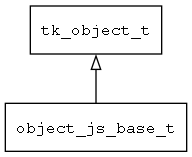

## object\_js\_base\_t
### 概述

将object_js相关的公共行为进行抽象，以便重用。
----------------------------------
### 属性

| 属性名称 | 类型 | 说明 | 
| -------- | ----- | ------------ | 
| <a href="#object_js_base_t_jsobj">jsobj</a> | jsvalue\_t | jerry script object对象。 |
#### jsobj 属性
-----------------------
> 
jerry script object对象。

* 类型：jsvalue\_t

| 特性 | 是否支持 |
| -------- | ----- |
| 可直接读取 | 是 |
| 可直接修改 | 否 |
