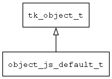

## object\_js\_default\_t
### 概述


将通用的jerry script object包装成tkc形式的object。
----------------------------------
### 函数
<p id="object_js_default_t_methods">

| 函数名称 | 说明 | 
| -------- | ------------ | 
| <a href="#object_js_default_t_object_is_object_js_default">object\_is\_object\_js\_default</a> | 检查是否为jerry script object对象。 |
| <a href="#object_js_default_t_object_js_default_create">object\_js\_default\_create</a> | 创建jerry script object对象。 |
#### object\_is\_object\_js\_default 函数
-----------------------

* 函数功能：

> <p id="object_js_default_t_object_is_object_js_default">检查是否为jerry script object对象。

* 函数原型：

```
bool_t object_is_object_js_default (jsvalue_t obj);
```

* 参数说明：

| 参数 | 类型 | 说明 |
| -------- | ----- | --------- |
| 返回值 | bool\_t | 返回TRUE表示是jerry script object，否则不是。 |
| obj | jsvalue\_t | object对象。 |
#### object\_js\_default\_create 函数
-----------------------

* 函数功能：

> <p id="object_js_default_t_object_js_default_create">创建jerry script object对象。

* 函数原型：

```
tk_object_t* object_js_default_create (jsvalue_t jsobj, bool_t free_handle);
```

* 参数说明：

| 参数 | 类型 | 说明 |
| -------- | ----- | --------- |
| 返回值 | tk\_object\_t* | 返回object对象。 |
| jsobj | jsvalue\_t | jerryscript对象。 |
| free\_handle | bool\_t | object销毁的同时释放jerryscript对象。 |
