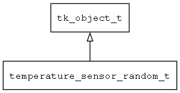

## temperature\_sensor\_random\_t
### 概述


模拟的温度传感器，随机生成0-100之间的温度。
----------------------------------
### 函数
<p id="temperature_sensor_random_t_methods">

| 函数名称 | 说明 | 
| -------- | ------------ | 
| <a href="#temperature_sensor_random_t_temperature_sensor_random_create">temperature\_sensor\_random\_create</a> | 创建temperature_sensor对象。 |
#### temperature\_sensor\_random\_create 函数
-----------------------

* 函数功能：

> <p id="temperature_sensor_random_t_temperature_sensor_random_create">创建temperature_sensor对象。

* 函数原型：

```
tk_object_t* temperature_sensor_random_create ();
```

* 参数说明：

| 参数 | 类型 | 说明 |
| -------- | ----- | --------- |
| 返回值 | tk\_object\_t* | 返回object对象。 |
