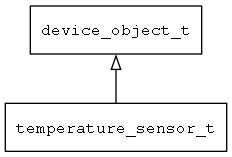

## temperature\_sensor\_t
### 概述


温度传感器。
----------------------------------
### 函数
<p id="temperature_sensor_t_methods">

| 函数名称 | 说明 | 
| -------- | ------------ | 
| <a href="#temperature_sensor_t_jerry_script_eval_buff">jerry\_script\_eval\_buff</a> | annotation ["global"] |
| <a href="#temperature_sensor_t_jerry_value_check">jerry\_value\_check</a> | annotation ["global"] |
| <a href="#temperature_sensor_t_jerryscript_awtk_deinit">jerryscript\_awtk\_deinit</a> | 初始化jerryscript awtk related stuff。 |
| <a href="#temperature_sensor_t_jerryscript_awtk_init">jerryscript\_awtk\_init</a> | 初始化jerryscript awtk related stuff。 |
| <a href="#temperature_sensor_t_js_view_model_get_native_ptr">js\_view\_model\_get\_native\_ptr</a> | annotation ["global"] |
| <a href="#temperature_sensor_t_jsvalue_from_navigator_request">jsvalue\_from\_navigator\_request</a> | annotation ["global"] |
| <a href="#temperature_sensor_t_jsvalue_to_navigator_request">jsvalue\_to\_navigator\_request</a> | annotation ["global"] |
| <a href="#temperature_sensor_t_mvvm_iotjs_deinit">mvvm\_iotjs\_deinit</a> | 释放 MVVM iotjs。 |
| <a href="#temperature_sensor_t_mvvm_iotjs_init">mvvm\_iotjs\_init</a> | 初始化 MVVM iotjs。 |
| <a href="#temperature_sensor_t_mvvm_jerryscript_deinit">mvvm\_jerryscript\_deinit</a> | ~初始化MVVM jerryscript。 |
| <a href="#temperature_sensor_t_mvvm_jerryscript_init">mvvm\_jerryscript\_init</a> | 初始化MVVM jerryscript。 |
| <a href="#temperature_sensor_t_mvvm_jerryscript_run">mvvm\_jerryscript\_run</a> | 执行js代码。 |
### 属性
<p id="temperature_sensor_t_properties">

| 属性名称 | 类型 | 说明 | 
| -------- | ----- | ------------ | 
| <a href="#temperature_sensor_t_sample_interval">sample\_interval</a> | int32\_t | 采样时间间隔(ms)。 |
| <a href="#temperature_sensor_t_value">value</a> | double | 最新的温度。 |
#### jerryscript\_awtk\_deinit 函数
-----------------------

* 函数功能：

> <p id="temperature_sensor_t_jerryscript_awtk_deinit">初始化jerryscript awtk related stuff。

* 函数原型：

```
ret_t jerryscript_awtk_deinit ();
```

* 参数说明：

| 参数 | 类型 | 说明 |
| -------- | ----- | --------- |
| 返回值 | ret\_t | 返回RET\_OK表示成功，否则表示失败。 |
#### jerryscript\_awtk\_init 函数
-----------------------

* 函数功能：

> <p id="temperature_sensor_t_jerryscript_awtk_init">初始化jerryscript awtk related stuff。

* 函数原型：

```
ret_t jerryscript_awtk_init ();
```

* 参数说明：

| 参数 | 类型 | 说明 |
| -------- | ----- | --------- |
| 返回值 | ret\_t | 返回RET\_OK表示成功，否则表示失败。 |
#### mvvm\_iotjs\_deinit 函数
-----------------------

* 函数功能：

> <p id="temperature_sensor_t_mvvm_iotjs_deinit">释放 MVVM iotjs。

* 函数原型：

```
ret_t mvvm_iotjs_deinit ();
```

* 参数说明：

| 参数 | 类型 | 说明 |
| -------- | ----- | --------- |
| 返回值 | ret\_t | 返回RET\_OK表示成功，否则表示失败。 |
#### mvvm\_iotjs\_init 函数
-----------------------

* 函数功能：

> <p id="temperature_sensor_t_mvvm_iotjs_init">初始化 MVVM iotjs。

* 函数原型：

```
ret_t mvvm_iotjs_init ();
```

* 参数说明：

| 参数 | 类型 | 说明 |
| -------- | ----- | --------- |
| 返回值 | ret\_t | 返回RET\_OK表示成功，否则表示失败。 |
#### mvvm\_jerryscript\_deinit 函数
-----------------------

* 函数功能：

> <p id="temperature_sensor_t_mvvm_jerryscript_deinit">~初始化MVVM jerryscript。

* 函数原型：

```
ret_t mvvm_jerryscript_deinit ();
```

* 参数说明：

| 参数 | 类型 | 说明 |
| -------- | ----- | --------- |
| 返回值 | ret\_t | 返回RET\_OK表示成功，否则表示失败。 |
#### mvvm\_jerryscript\_init 函数
-----------------------

* 函数功能：

> <p id="temperature_sensor_t_mvvm_jerryscript_init">初始化MVVM jerryscript。

* 函数原型：

```
ret_t mvvm_jerryscript_init ();
```

* 参数说明：

| 参数 | 类型 | 说明 |
| -------- | ----- | --------- |
| 返回值 | ret\_t | 返回RET\_OK表示成功，否则表示失败。 |
#### mvvm\_jerryscript\_run 函数
-----------------------

* 函数功能：

> <p id="temperature_sensor_t_mvvm_jerryscript_run">执行js代码。

* 函数原型：

```
ret_t mvvm_jerryscript_run (const char* filename);
```

* 参数说明：

| 参数 | 类型 | 说明 |
| -------- | ----- | --------- |
| 返回值 | ret\_t | 返回RET\_OK表示成功，否则表示失败。 |
| filename | const char* | 文件名。 |
#### sample\_interval 属性
-----------------------
> <p id="temperature_sensor_t_sample_interval">采样时间间隔(ms)。

* 类型：int32\_t

| 特性 | 是否支持 |
| -------- | ----- |
| 可直接读取 | 否 |
| 可直接修改 | 否 |
| 可在XML中设置 | 是 |
| 可通过widget\_get\_prop读取 | 是 |
| 可通过widget\_set\_prop修改 | 是 |
#### value 属性
-----------------------
> <p id="temperature_sensor_t_value">最新的温度。

* 类型：double

| 特性 | 是否支持 |
| -------- | ----- |
| 可直接读取 | 否 |
| 可直接修改 | 否 |
| 可通过widget\_get\_prop读取 | 是 |
