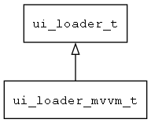

## ui\_loader\_mvvm\_t
### 概述


支持MVVM绑定的UI加载器。
----------------------------------
### 函数
<p id="ui_loader_mvvm_t_methods">

| 函数名称 | 说明 | 
| -------- | ------------ | 
| <a href="#ui_loader_mvvm_t_ui_loader_mvvm">ui\_loader\_mvvm</a> | 获取支持MVVM绑定的UI加载器对象。 |
| <a href="#ui_loader_mvvm_t_ui_loader_mvvm_cast">ui\_loader\_mvvm\_cast</a> | 转换为ui_loader_mvvm对象。 |
| <a href="#ui_loader_mvvm_t_ui_loader_mvvm_load_widget">ui\_loader\_mvvm\_load\_widget</a> | 加载导航请求指定的控件。 |
| <a href="#ui_loader_mvvm_t_ui_loader_mvvm_load_widget_with_parent">ui\_loader\_mvvm\_load\_widget\_with\_parent</a> | 加载导航请求指定的控件，并指定父控件对象。 |
| <a href="#ui_loader_mvvm_t_ui_loader_mvvm_reload_widget">ui\_loader\_mvvm\_reload\_widget</a> | 重新加载动态渲染规则指定的控件。 |
### 属性
<p id="ui_loader_mvvm_t_properties">

| 属性名称 | 类型 | 说明 | 
| -------- | ----- | ------------ | 
| <a href="#ui_loader_mvvm_t_binding_context">binding\_context</a> | void* | 当前的绑定上下文。 |
| <a href="#ui_loader_mvvm_t_navigator_request">navigator\_request</a> | navigator\_request\_t* | 导航请求。 |
| <a href="#ui_loader_mvvm_t_rule">rule</a> | binding\_rule\_t* | 当前的动态规则。 |
| <a href="#ui_loader_mvvm_t_ui">ui</a> | asset\_info\_t* | 界面描述数据。 |
#### ui\_loader\_mvvm 函数
-----------------------

* 函数功能：

> <p id="ui_loader_mvvm_t_ui_loader_mvvm">获取支持MVVM绑定的UI加载器对象。

* 函数原型：

```
ui_loader_t* ui_loader_mvvm ();
```

* 参数说明：

| 参数 | 类型 | 说明 |
| -------- | ----- | --------- |
| 返回值 | ui\_loader\_t* | 返回UI加载器对象。 |
#### ui\_loader\_mvvm\_cast 函数
-----------------------

* 函数功能：

> <p id="ui_loader_mvvm_t_ui_loader_mvvm_cast">转换为ui_loader_mvvm对象。

* 函数原型：

```
ui_loader_mvvm_t* ui_loader_mvvm_cast (ui_loader_t* loader);
```

* 参数说明：

| 参数 | 类型 | 说明 |
| -------- | ----- | --------- |
| 返回值 | ui\_loader\_mvvm\_t* | ui\_loader\_mvvm对象。 |
| loader | ui\_loader\_t* | ui\_loader对象。 |
#### ui\_loader\_mvvm\_load\_widget 函数
-----------------------

* 函数功能：

> <p id="ui_loader_mvvm_t_ui_loader_mvvm_load_widget">加载导航请求指定的控件。

* 函数原型：

```
widget_t* ui_loader_mvvm_load_widget (navigator_request_t* req);
```

* 参数说明：

| 参数 | 类型 | 说明 |
| -------- | ----- | --------- |
| 返回值 | widget\_t* | 控件对象。 |
| req | navigator\_request\_t* | 导航请求。 |
#### ui\_loader\_mvvm\_load\_widget\_with\_parent 函数
-----------------------

* 函数功能：

> <p id="ui_loader_mvvm_t_ui_loader_mvvm_load_widget_with_parent">加载导航请求指定的控件，并指定父控件对象。

* 函数原型：

```
widget_t* ui_loader_mvvm_load_widget_with_parent (navigator_request_t* req, widget_t* parent);
```

* 参数说明：

| 参数 | 类型 | 说明 |
| -------- | ----- | --------- |
| 返回值 | widget\_t* | 控件对象。 |
| req | navigator\_request\_t* | 导航请求。 |
| parent | widget\_t* | 父控件对象。 |
#### ui\_loader\_mvvm\_reload\_widget 函数
-----------------------

* 函数功能：

> <p id="ui_loader_mvvm_t_ui_loader_mvvm_reload_widget">重新加载动态渲染规则指定的控件。

* 函数原型：

```
ret_t ui_loader_mvvm_reload_widget (binding_rule_t* rule);
```

* 参数说明：

| 参数 | 类型 | 说明 |
| -------- | ----- | --------- |
| 返回值 | ret\_t | 返回RET\_OK表示成功，否则表示失败。 |
| rule | binding\_rule\_t* | 动态渲染规则。 |
#### binding\_context 属性
-----------------------
> <p id="ui_loader_mvvm_t_binding_context">当前的绑定上下文。

* 类型：void*

| 特性 | 是否支持 |
| -------- | ----- |
| 可直接读取 | 是 |
| 可直接修改 | 否 |
#### navigator\_request 属性
-----------------------
> <p id="ui_loader_mvvm_t_navigator_request">导航请求。

* 类型：navigator\_request\_t*

| 特性 | 是否支持 |
| -------- | ----- |
| 可直接读取 | 是 |
| 可直接修改 | 否 |
#### rule 属性
-----------------------
> <p id="ui_loader_mvvm_t_rule">当前的动态规则。

* 类型：binding\_rule\_t*

| 特性 | 是否支持 |
| -------- | ----- |
| 可直接读取 | 是 |
| 可直接修改 | 否 |
#### ui 属性
-----------------------
> <p id="ui_loader_mvvm_t_ui">界面描述数据。

* 类型：asset\_info\_t*

| 特性 | 是否支持 |
| -------- | ----- |
| 可直接读取 | 是 |
| 可直接修改 | 否 |
