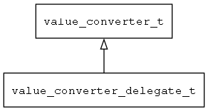

## value\_converter\_delegate\_t
### 概述


把两个转换函数包装成value_converter_t接口。
----------------------------------
### 函数
<p id="value_converter_delegate_t_methods">

| 函数名称 | 说明 | 
| -------- | ------------ | 
| <a href="#value_converter_delegate_t_value_converter_delegate_create">value\_converter\_delegate\_create</a> |  |
#### value\_converter\_delegate\_create 函数
-----------------------

* 函数功能：

> <p id="value_converter_delegate_t_value_converter_delegate_create">

* 函数原型：

```
value_converter_t* value_converter_delegate_create (value_convert_t to_model, value_convert_t to_view);
```

* 参数说明：

| 参数 | 类型 | 说明 |
| -------- | ----- | --------- |
| 返回值 | value\_converter\_t* | 返回value\_converter对象。 |
| to\_model | value\_convert\_t | 到模型的转换函数。 |
| to\_view | value\_convert\_t | 到视图的转换函数。 |
