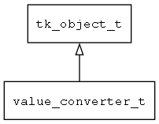

## value\_converter\_t
### 概述


值转换器。

如果数据在View上显示的格式和在Model中保存的格式不一样，value_converter负责在两者之间转换。
----------------------------------
### 函数
<p id="value_converter_t_methods">

| 函数名称 | 说明 | 
| -------- | ------------ | 
| <a href="#value_converter_t_value_converter_create">value\_converter\_create</a> | 创建指定名称的值转换器。 |
| <a href="#value_converter_t_value_converter_create_with_args">value\_converter\_create\_with\_args</a> | 创建指定名称的值转换器和绑定其参数。 |
| <a href="#value_converter_t_value_converter_deinit">value\_converter\_deinit</a> | 释放值转换器的全局对象。 |
| <a href="#value_converter_t_value_converter_init">value\_converter\_init</a> | 初始化值转换器的全局对象。 |
| <a href="#value_converter_t_value_converter_register">value\_converter\_register</a> | 注册值转换器的创建函数。 |
| <a href="#value_converter_t_value_converter_register_generic">value\_converter\_register\_generic</a> | 注册值转换器的通用创建函数(主要给脚本语言使用)。 |
| <a href="#value_converter_t_value_converter_to_model">value\_converter\_to\_model</a> | 将value转换成适合model存储的格式。 |
| <a href="#value_converter_t_value_converter_to_view">value\_converter\_to\_view</a> | 将value转换成适合view显示的格式。 |
#### value\_converter\_create 函数
-----------------------

* 函数功能：

> <p id="value_converter_t_value_converter_create">创建指定名称的值转换器。

* 函数原型：

```
value_converter_t* value_converter_create (const char* name);
```

* 参数说明：

| 参数 | 类型 | 说明 |
| -------- | ----- | --------- |
| 返回值 | value\_converter\_t* | 返回value\_converter对象。 |
| name | const char* | 名称。 |
#### value\_converter\_create\_with\_args 函数
-----------------------

* 函数功能：

> <p id="value_converter_t_value_converter_create_with_args">创建指定名称的值转换器和绑定其参数。

* 函数原型：

```
value_converter_t* value_converter_create_with_args (const char* name, const char* args);
```

* 参数说明：

| 参数 | 类型 | 说明 |
| -------- | ----- | --------- |
| 返回值 | value\_converter\_t* | 返回value\_converter对象。 |
| name | const char* | 名称。 |
| args | const char* | 参数。 |
#### value\_converter\_deinit 函数
-----------------------

* 函数功能：

> <p id="value_converter_t_value_converter_deinit">释放值转换器的全局对象。

* 函数原型：

```
ret_t value_converter_deinit ();
```

* 参数说明：

| 参数 | 类型 | 说明 |
| -------- | ----- | --------- |
| 返回值 | ret\_t | 返回RET\_OK表示成功，否则表示失败。 |
#### value\_converter\_init 函数
-----------------------

* 函数功能：

> <p id="value_converter_t_value_converter_init">初始化值转换器的全局对象。

* 函数原型：

```
ret_t value_converter_init ();
```

* 参数说明：

| 参数 | 类型 | 说明 |
| -------- | ----- | --------- |
| 返回值 | ret\_t | 返回RET\_OK表示成功，否则表示失败。 |
#### value\_converter\_register 函数
-----------------------

* 函数功能：

> <p id="value_converter_t_value_converter_register">注册值转换器的创建函数。

* 函数原型：

```
ret_t value_converter_register (const char* name, tk_create_t create);
```

* 参数说明：

| 参数 | 类型 | 说明 |
| -------- | ----- | --------- |
| 返回值 | ret\_t | 返回RET\_OK表示成功，否则表示失败。 |
| name | const char* | 名称。 |
| create | tk\_create\_t | 创建函数。 |
#### value\_converter\_register\_generic 函数
-----------------------

* 函数功能：

> <p id="value_converter_t_value_converter_register_generic">注册值转换器的通用创建函数(主要给脚本语言使用)。

* 函数原型：

```
ret_t value_converter_register_generic (value_converter_create_t create);
```

* 参数说明：

| 参数 | 类型 | 说明 |
| -------- | ----- | --------- |
| 返回值 | ret\_t | 返回RET\_OK表示成功，否则表示失败。 |
| create | value\_converter\_create\_t | 创建函数。 |
#### value\_converter\_to\_model 函数
-----------------------

* 函数功能：

> <p id="value_converter_t_value_converter_to_model">将value转换成适合model存储的格式。

* 函数原型：

```
ret_t value_converter_to_model (value_converter_t* converter, value_t* from, value_t* to);
```

* 参数说明：

| 参数 | 类型 | 说明 |
| -------- | ----- | --------- |
| 返回值 | ret\_t | 返回RET\_OK表示成功，否则表示失败。 |
| converter | value\_converter\_t* | converter对象。 |
| from | value\_t* | 源value。 |
| to | value\_t* | 转换结果。 |
#### value\_converter\_to\_view 函数
-----------------------

* 函数功能：

> <p id="value_converter_t_value_converter_to_view">将value转换成适合view显示的格式。

* 函数原型：

```
ret_t value_converter_to_view (value_converter_t* converter, value_t* from, value_t* to);
```

* 参数说明：

| 参数 | 类型 | 说明 |
| -------- | ----- | --------- |
| 返回值 | ret\_t | 返回RET\_OK表示成功，否则表示失败。 |
| converter | value\_converter\_t* | converter对象。 |
| from | value\_t* | 源value。 |
| to | value\_t* | 转换结果。 |
