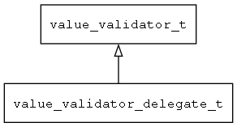

## value\_validator\_delegate\_t
### 概述


把有效性检查函数包装成value_validator_t接口。
----------------------------------
### 函数
<p id="value_validator_delegate_t_methods">

| 函数名称 | 说明 | 
| -------- | ------------ | 
| <a href="#value_validator_delegate_t_value_validator_delegate_create">value\_validator\_delegate\_create</a> | 创建value_validator对象。 |
#### value\_validator\_delegate\_create 函数
-----------------------

* 函数功能：

> <p id="value_validator_delegate_t_value_validator_delegate_create">创建value_validator对象。

* 函数原型：

```
value_validator_t* value_validator_delegate_create (value_is_valid_t is_valid, value_fix_t value_fix_t);
```

* 参数说明：

| 参数 | 类型 | 说明 |
| -------- | ----- | --------- |
| 返回值 | value\_validator\_t* | 返回value\_validator对象。 |
| is\_valid | value\_is\_valid\_t | 有效性检查函数。 |
| value\_fix\_t | value\_fix\_t | 修正函数。 |
