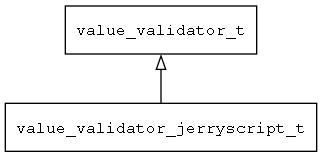

## value\_validator\_jerryscript\_t
### 概述


将jerryscript包装成值校验对象。

JS的全局对象ValueValidators，记录了所有的ValueValidator。
----------------------------------
### 函数
<p id="value_validator_jerryscript_t_methods">

| 函数名称 | 说明 | 
| -------- | ------------ | 
| <a href="#value_validator_jerryscript_t_value_validator_jerryscript_deinit">value\_validator\_jerryscript\_deinit</a> | ~初始化jerryscript value validator。 |
| <a href="#value_validator_jerryscript_t_value_validator_jerryscript_init">value\_validator\_jerryscript\_init</a> | 初始化jerryscript value validator，注册相应的工厂函数。 |
#### value\_validator\_jerryscript\_deinit 函数
-----------------------

* 函数功能：

> <p id="value_validator_jerryscript_t_value_validator_jerryscript_deinit">~初始化jerryscript value validator。

* 函数原型：

```
ret_t value_validator_jerryscript_deinit ();
```

* 参数说明：

| 参数 | 类型 | 说明 |
| -------- | ----- | --------- |
| 返回值 | ret\_t | 返回RET\_OK表示成功，否则表示失败。 |
#### value\_validator\_jerryscript\_init 函数
-----------------------

* 函数功能：

> <p id="value_validator_jerryscript_t_value_validator_jerryscript_init">初始化jerryscript value validator，注册相应的工厂函数。

* 函数原型：

```
ret_t value_validator_jerryscript_init ();
```

* 参数说明：

| 参数 | 类型 | 说明 |
| -------- | ----- | --------- |
| 返回值 | ret\_t | 返回RET\_OK表示成功，否则表示失败。 |
