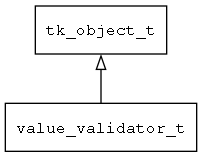

## value\_validator\_t
### 概述


值校验器。

用户在界面上输入的类型可能是无效的，value_validator负责将检查用户输入的有效性。
----------------------------------
### 函数
<p id="value_validator_t_methods">

| 函数名称 | 说明 | 
| -------- | ------------ | 
| <a href="#value_validator_t_value_validator_create">value\_validator\_create</a> | 创建指定名称的值校验器。 |
| <a href="#value_validator_t_value_validator_deinit">value\_validator\_deinit</a> | 释放值校验器的全局对象。 |
| <a href="#value_validator_t_value_validator_fix">value\_validator\_fix</a> | 将无效值修改为正确的值。 |
| <a href="#value_validator_t_value_validator_init">value\_validator\_init</a> | 初始化值校验器的全局对象。 |
| <a href="#value_validator_t_value_validator_is_valid">value\_validator\_is\_valid</a> | 检查值是否有效。 |
| <a href="#value_validator_t_value_validator_register">value\_validator\_register</a> | 注册值校验器的创建函数。 |
| <a href="#value_validator_t_value_validator_register_generic">value\_validator\_register\_generic</a> | 注册值转换器的通用创建函数(主要用于脚本语言)。 |
| <a href="#value_validator_t_value_validator_set_context">value\_validator\_set\_context</a> | 设置上下文对象。 |
#### value\_validator\_create 函数
-----------------------

* 函数功能：

> <p id="value_validator_t_value_validator_create">创建指定名称的值校验器。

* 函数原型：

```
value_validator_t* value_validator_create (const char* name);
```

* 参数说明：

| 参数 | 类型 | 说明 |
| -------- | ----- | --------- |
| 返回值 | value\_validator\_t* | 返回validator对象。 |
| name | const char* | 名称。 |
#### value\_validator\_deinit 函数
-----------------------

* 函数功能：

> <p id="value_validator_t_value_validator_deinit">释放值校验器的全局对象。

* 函数原型：

```
ret_t value_validator_deinit ();
```

* 参数说明：

| 参数 | 类型 | 说明 |
| -------- | ----- | --------- |
| 返回值 | ret\_t | 返回RET\_OK表示成功，否则表示失败。 |
#### value\_validator\_fix 函数
-----------------------

* 函数功能：

> <p id="value_validator_t_value_validator_fix">将无效值修改为正确的值。

* 函数原型：

```
ret_t value_validator_fix (value_validator_t* validator, value_t* value);
```

* 参数说明：

| 参数 | 类型 | 说明 |
| -------- | ----- | --------- |
| 返回值 | ret\_t | 返回RET\_OK表示成功，否则表示失败。 |
| validator | value\_validator\_t* | validator对象。 |
| value | value\_t* | 修正后的值。 |
#### value\_validator\_init 函数
-----------------------

* 函数功能：

> <p id="value_validator_t_value_validator_init">初始化值校验器的全局对象。

* 函数原型：

```
ret_t value_validator_init ();
```

* 参数说明：

| 参数 | 类型 | 说明 |
| -------- | ----- | --------- |
| 返回值 | ret\_t | 返回RET\_OK表示成功，否则表示失败。 |
#### value\_validator\_is\_valid 函数
-----------------------

* 函数功能：

> <p id="value_validator_t_value_validator_is_valid">检查值是否有效。

* 函数原型：

```
bool_t value_validator_is_valid (value_validator_t* validator, value_t* value, str_t* str);
```

* 参数说明：

| 参数 | 类型 | 说明 |
| -------- | ----- | --------- |
| 返回值 | bool\_t | 返回TRUE表示有效，否则表示无效。 |
| validator | value\_validator\_t* | validator对象。 |
| value | value\_t* | 待验证的值。 |
| str | str\_t* | 返回错误信息。 |
#### value\_validator\_register 函数
-----------------------

* 函数功能：

> <p id="value_validator_t_value_validator_register">注册值校验器的创建函数。

* 函数原型：

```
ret_t value_validator_register (const char* name, tk_create_t create);
```

* 参数说明：

| 参数 | 类型 | 说明 |
| -------- | ----- | --------- |
| 返回值 | ret\_t | 返回RET\_OK表示成功，否则表示失败。 |
| name | const char* | 名称。 |
| create | tk\_create\_t | 创建函数。 |
#### value\_validator\_register\_generic 函数
-----------------------

* 函数功能：

> <p id="value_validator_t_value_validator_register_generic">注册值转换器的通用创建函数(主要用于脚本语言)。

* 函数原型：

```
ret_t value_validator_register_generic (value_validator_create_t create);
```

* 参数说明：

| 参数 | 类型 | 说明 |
| -------- | ----- | --------- |
| 返回值 | ret\_t | 返回RET\_OK表示成功，否则表示失败。 |
| create | value\_validator\_create\_t | 创建函数。 |
#### value\_validator\_set\_context 函数
-----------------------

* 函数功能：

> <p id="value_validator_t_value_validator_set_context">设置上下文对象。

有时需要根据一个上下文，才能决定数据是否有效。

* 函数原型：

```
ret_t value_validator_set_context (value_validator_t* validator, tk_object_t* context);
```

* 参数说明：

| 参数 | 类型 | 说明 |
| -------- | ----- | --------- |
| 返回值 | ret\_t | 返回RET\_OK表示成功，否则表示失败。 |
| validator | value\_validator\_t* | validator对象。 |
| context | tk\_object\_t* | 上下文对象。 |
