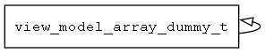

## view\_model\_array\_dummy\_t
### 概述


array view_model
----------------------------------
### 函数
<p id="view_model_array_dummy_t_methods">

| 函数名称 | 说明 | 
| -------- | ------------ | 
| <a href="#view_model_array_dummy_t_view_model_array_dummy_add">view\_model\_array\_dummy\_add</a> | 增加submodel。 |
| <a href="#view_model_array_dummy_t_view_model_array_dummy_clear">view\_model\_array\_dummy\_clear</a> | 清除全部submodel。 |
| <a href="#view_model_array_dummy_t_view_model_array_dummy_create">view\_model\_array\_dummy\_create</a> | 创建array模型对象。 |
| <a href="#view_model_array_dummy_t_view_model_array_dummy_get">view\_model\_array\_dummy\_get</a> | 获取指定的submodel。 |
| <a href="#view_model_array_dummy_t_view_model_array_dummy_remove">view\_model\_array\_dummy\_remove</a> | 删除指定的submodel。 |
| <a href="#view_model_array_dummy_t_view_model_array_dummy_size">view\_model\_array\_dummy\_size</a> | 获取submodel的个数。 |
#### view\_model\_array\_dummy\_add 函数
-----------------------

* 函数功能：

> <p id="view_model_array_dummy_t_view_model_array_dummy_add">增加submodel。

> 增加submodel的引用计数，并保存submodel的引用。

* 函数原型：

```
ret_t view_model_array_dummy_add (view_model_t* view_model, view_model_t* submodel);
```

* 参数说明：

| 参数 | 类型 | 说明 |
| -------- | ----- | --------- |
| 返回值 | ret\_t | 返回RET\_OK表示成功，否则表示失败。 |
| view\_model | view\_model\_t* | view\_model对象。 |
| submodel | view\_model\_t* | submodel对象。 |
#### view\_model\_array\_dummy\_clear 函数
-----------------------

* 函数功能：

> <p id="view_model_array_dummy_t_view_model_array_dummy_clear">清除全部submodel。

* 函数原型：

```
ret_t view_model_array_dummy_clear (view_model_t* view_model);
```

* 参数说明：

| 参数 | 类型 | 说明 |
| -------- | ----- | --------- |
| 返回值 | ret\_t | 返回RET\_OK表示成功，否则表示失败。 |
| view\_model | view\_model\_t* | view\_model对象。 |
#### view\_model\_array\_dummy\_create 函数
-----------------------

* 函数功能：

> <p id="view_model_array_dummy_t_view_model_array_dummy_create">创建array模型对象。

* 函数原型：

```
view_model_t* view_model_array_dummy_create (navigator_request_t* req);
```

* 参数说明：

| 参数 | 类型 | 说明 |
| -------- | ----- | --------- |
| 返回值 | view\_model\_t* | 返回view\_model对象。 |
| req | navigator\_request\_t* | 请求参数。 |
#### view\_model\_array\_dummy\_get 函数
-----------------------

* 函数功能：

> <p id="view_model_array_dummy_t_view_model_array_dummy_get">获取指定的submodel。

* 函数原型：

```
view_model_t view_model_array_dummy_get (view_model_t* view_model, uint32_t index);
```

* 参数说明：

| 参数 | 类型 | 说明 |
| -------- | ----- | --------- |
| 返回值 | view\_model\_t | 返回指定的submodel。 |
| view\_model | view\_model\_t* | view\_model对象。 |
| index | uint32\_t | submodel的索引。 |
#### view\_model\_array\_dummy\_remove 函数
-----------------------

* 函数功能：

> <p id="view_model_array_dummy_t_view_model_array_dummy_remove">删除指定的submodel。

* 函数原型：

```
ret_t view_model_array_dummy_remove (view_model_t* view_model, uint32_t index);
```

* 参数说明：

| 参数 | 类型 | 说明 |
| -------- | ----- | --------- |
| 返回值 | ret\_t | 返回RET\_OK表示成功，否则表示失败。 |
| view\_model | view\_model\_t* | view\_model对象。 |
| index | uint32\_t | submodel的索引。 |
#### view\_model\_array\_dummy\_size 函数
-----------------------

* 函数功能：

> <p id="view_model_array_dummy_t_view_model_array_dummy_size">获取submodel的个数。

* 函数原型：

```
int32_t view_model_array_dummy_size (view_model_t* view_model);
```

* 参数说明：

| 参数 | 类型 | 说明 |
| -------- | ----- | --------- |
| 返回值 | int32\_t | 返回submodel的个数。 |
| view\_model | view\_model\_t* | view\_model对象。 |
