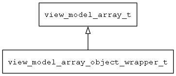

## view\_model\_array\_object\_wrapper\_t
### 概述


把object包装成view model array。
----------------------------------
### 函数
<p id="view_model_array_object_wrapper_t_methods">

| 函数名称 | 说明 | 
| -------- | ------------ | 
| <a href="#view_model_array_object_wrapper_t_view_model_array_object_wrapper_create">view\_model\_array\_object\_wrapper\_create</a> | 创建view_model对象。 |
| <a href="#view_model_array_object_wrapper_t_view_model_array_object_wrapper_create_ex">view\_model\_array\_object\_wrapper\_create\_ex</a> | 创建view_model对象。 |
#### view\_model\_array\_object\_wrapper\_create 函数
-----------------------

* 函数功能：

> <p id="view_model_array_object_wrapper_t_view_model_array_object_wrapper_create">创建view_model对象。

* 函数原型：

```
view_model_t* view_model_array_object_wrapper_create (tk_object_t* obj);
```

* 参数说明：

| 参数 | 类型 | 说明 |
| -------- | ----- | --------- |
| 返回值 | view\_model\_t* | 返回view\_model对象。 |
| obj | tk\_object\_t* | 待包装的对象。 |
#### view\_model\_array\_object\_wrapper\_create\_ex 函数
-----------------------

* 函数功能：

> <p id="view_model_array_object_wrapper_t_view_model_array_object_wrapper_create_ex">创建view_model对象。

* 函数原型：

```
view_model_t* view_model_array_object_wrapper_create_ex (tk_object_t* obj, const char* prop_prefix);
```

* 参数说明：

| 参数 | 类型 | 说明 |
| -------- | ----- | --------- |
| 返回值 | view\_model\_t* | 返回view\_model对象。 |
| obj | tk\_object\_t* | 待包装的对象。 |
| prop\_prefix | const char* | 属性路径的前缀(可以为NULL)。 |
