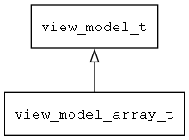

## view\_model\_array\_t
### 概述


array view_model
----------------------------------
### 函数
<p id="view_model_array_t_methods">

| 函数名称 | 说明 | 
| -------- | ------------ | 
| <a href="#view_model_array_t_view_model_array_default_can_exec">view\_model\_array\_default\_can\_exec</a> | can exec的默认实现。 |
| <a href="#view_model_array_t_view_model_array_default_exec">view\_model\_array\_default\_exec</a> | exec的默认实现。 |
| <a href="#view_model_array_t_view_model_array_default_get_prop">view\_model\_array\_default\_get\_prop</a> | get prop的默认实现。 |
| <a href="#view_model_array_t_view_model_array_default_set_prop">view\_model\_array\_default\_set\_prop</a> | set prop的默认实现。 |
| <a href="#view_model_array_t_view_model_array_deinit">view\_model\_array\_deinit</a> | ~初始化。 |
| <a href="#view_model_array_t_view_model_array_inc_cursor">view\_model\_array\_inc\_cursor</a> | 增加cursor的值。 |
| <a href="#view_model_array_t_view_model_array_init">view\_model\_array\_init</a> | 初始化。 |
| <a href="#view_model_array_t_view_model_array_notify_items_changed">view\_model\_array\_notify\_items\_changed</a> | 触发items改变事件。 |
| <a href="#view_model_array_t_view_model_array_set_cursor">view\_model\_array\_set\_cursor</a> | 设置cursor的值。 |
| <a href="#view_model_array_t_view_model_array_set_selected_index">view\_model\_array\_set\_selected\_index</a> | 选中指定项。 |
### 属性
<p id="view_model_array_t_properties">

| 属性名称 | 类型 | 说明 | 
| -------- | ----- | ------------ | 
| <a href="#view_model_array_t_cursor">cursor</a> | uint32\_t | 当前可以访问的submodel。 |
| <a href="#view_model_array_t_selected_index">selected\_index</a> | uint32\_t | 当前选择的项。 |
#### view\_model\_array\_default\_can\_exec 函数
-----------------------

* 函数功能：

> <p id="view_model_array_t_view_model_array_default_can_exec">can exec的默认实现。

* 函数原型：

```
bool_t view_model_array_default_can_exec (view_model_t* view_model, const char* name, const char* args);
```

* 参数说明：

| 参数 | 类型 | 说明 |
| -------- | ----- | --------- |
| 返回值 | bool\_t | 返回TRUE表示可以执行，否则表示不能执行。 |
| view\_model | view\_model\_t* | view\_model对象。 |
| name | const char* | 命令名。 |
| args | const char* | 命令参数。 |
#### view\_model\_array\_default\_exec 函数
-----------------------

* 函数功能：

> <p id="view_model_array_t_view_model_array_default_exec">exec的默认实现。

* 函数原型：

```
ret_t view_model_array_default_exec (view_model_t* view_model, const char* name, const char* args);
```

* 参数说明：

| 参数 | 类型 | 说明 |
| -------- | ----- | --------- |
| 返回值 | ret\_t | 返回RET\_OK表示成功，否则表示失败。 |
| view\_model | view\_model\_t* | view\_model对象。 |
| name | const char* | 命令名。 |
| args | const char* | 命令参数。 |
#### view\_model\_array\_default\_get\_prop 函数
-----------------------

* 函数功能：

> <p id="view_model_array_t_view_model_array_default_get_prop">get prop的默认实现。

* 函数原型：

```
ret_t view_model_array_default_get_prop (view_model_t* view_model, const char* name, value_t* v);
```

* 参数说明：

| 参数 | 类型 | 说明 |
| -------- | ----- | --------- |
| 返回值 | ret\_t | 返回RET\_OK表示成功，否则表示失败。 |
| view\_model | view\_model\_t* | view\_model对象。 |
| name | const char* | 属性名。 |
| v | value\_t* | 属性值。 |
#### view\_model\_array\_default\_set\_prop 函数
-----------------------

* 函数功能：

> <p id="view_model_array_t_view_model_array_default_set_prop">set prop的默认实现。

* 函数原型：

```
ret_t view_model_array_default_set_prop (view_model_t* view_model, const char* name, const value_t* v);
```

* 参数说明：

| 参数 | 类型 | 说明 |
| -------- | ----- | --------- |
| 返回值 | ret\_t | 返回RET\_OK表示成功，否则表示失败。 |
| view\_model | view\_model\_t* | view\_model对象。 |
| name | const char* | 属性名。 |
| v | const value\_t* | 属性值。 |
#### view\_model\_array\_deinit 函数
-----------------------

* 函数功能：

> <p id="view_model_array_t_view_model_array_deinit">~初始化。

* 函数原型：

```
ret_t view_model_array_deinit (view_model_t* view_model);
```

* 参数说明：

| 参数 | 类型 | 说明 |
| -------- | ----- | --------- |
| 返回值 | ret\_t | 返回RET\_OK表示成功，否则表示失败。 |
| view\_model | view\_model\_t* | view\_model对象。 |
#### view\_model\_array\_inc\_cursor 函数
-----------------------

* 函数功能：

> <p id="view_model_array_t_view_model_array_inc_cursor">增加cursor的值。

* 函数原型：

```
ret_t view_model_array_inc_cursor (view_model_t* view_model);
```

* 参数说明：

| 参数 | 类型 | 说明 |
| -------- | ----- | --------- |
| 返回值 | ret\_t | 返回RET\_OK表示成功，否则表示失败。 |
| view\_model | view\_model\_t* | view\_model对象。 |
#### view\_model\_array\_init 函数
-----------------------

* 函数功能：

> <p id="view_model_array_t_view_model_array_init">初始化。

* 函数原型：

```
view_model_t* view_model_array_init (view_model_t* view_model);
```

* 参数说明：

| 参数 | 类型 | 说明 |
| -------- | ----- | --------- |
| 返回值 | view\_model\_t* | 返回view\_model对象。 |
| view\_model | view\_model\_t* | view\_model对象。 |
#### view\_model\_array\_notify\_items\_changed 函数
-----------------------

* 函数功能：

> <p id="view_model_array_t_view_model_array_notify_items_changed">触发items改变事件。

* 函数原型：

```
ret_t view_model_array_notify_items_changed (view_model_t* view_model);
```

* 参数说明：

| 参数 | 类型 | 说明 |
| -------- | ----- | --------- |
| 返回值 | ret\_t | 返回RET\_OK表示成功，否则表示失败。 |
| view\_model | view\_model\_t* | view\_model对象。 |
#### view\_model\_array\_set\_cursor 函数
-----------------------

* 函数功能：

> <p id="view_model_array_t_view_model_array_set_cursor">设置cursor的值。

* 函数原型：

```
ret_t view_model_array_set_cursor (view_model_t* view_model, uint32_t cursor);
```

* 参数说明：

| 参数 | 类型 | 说明 |
| -------- | ----- | --------- |
| 返回值 | ret\_t | 返回RET\_OK表示成功，否则表示失败。 |
| view\_model | view\_model\_t* | view\_model对象。 |
| cursor | uint32\_t | 的值。 |
#### view\_model\_array\_set\_selected\_index 函数
-----------------------

* 函数功能：

> <p id="view_model_array_t_view_model_array_set_selected_index">选中指定项。

* 函数原型：

```
ret_t view_model_array_set_selected_index (view_model_t* view_model, uint32_t index);
```

* 参数说明：

| 参数 | 类型 | 说明 |
| -------- | ----- | --------- |
| 返回值 | ret\_t | 返回RET\_OK表示成功，否则表示失败。 |
| view\_model | view\_model\_t* | view\_model对象。 |
| index | uint32\_t | 选定项的序数。 |
#### cursor 属性
-----------------------
> <p id="view_model_array_t_cursor">当前可以访问的submodel。

* 类型：uint32\_t

| 特性 | 是否支持 |
| -------- | ----- |
| 可直接读取 | 是 |
| 可直接修改 | 否 |
#### selected\_index 属性
-----------------------
> <p id="view_model_array_t_selected_index">当前选择的项。

* 类型：uint32\_t

| 特性 | 是否支持 |
| -------- | ----- |
| 可直接读取 | 是 |
| 可直接修改 | 否 |
