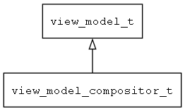

## view\_model\_compositor\_t
### 概述


将多个view model组合起来，当一个view model使用。
----------------------------------
### 函数
<p id="view_model_compositor_t_methods">

| 函数名称 | 说明 | 
| -------- | ------------ | 
| <a href="#view_model_compositor_t_view_model_compositor_add">view\_model\_compositor\_add</a> | 向compositor对象中增加一个view model对象。 |
| <a href="#view_model_compositor_t_view_model_compositor_create">view\_model\_compositor\_create</a> | 创建compositor对象。 |
#### view\_model\_compositor\_add 函数
-----------------------

* 函数功能：

> <p id="view_model_compositor_t_view_model_compositor_add">向compositor对象中增加一个view model对象。

* 函数原型：

```
ret_t view_model_compositor_add (view_model_t* view_model, view_model_t* vm);
```

* 参数说明：

| 参数 | 类型 | 说明 |
| -------- | ----- | --------- |
| 返回值 | ret\_t | 返回RET\_OK表示成功，否则表示失败。 |
| view\_model | view\_model\_t* | compositor对象。 |
| vm | view\_model\_t* | 待加入的view model对象。 |
#### view\_model\_compositor\_create 函数
-----------------------

* 函数功能：

> <p id="view_model_compositor_t_view_model_compositor_create">创建compositor对象。

* 函数原型：

```
view_model_t* view_model_compositor_create (navigator_request_t* req);
```

* 参数说明：

| 参数 | 类型 | 说明 |
| -------- | ----- | --------- |
| 返回值 | view\_model\_t* | 返回view\_model对象。 |
| req | navigator\_request\_t* | 请求参数。 |
