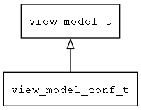

## view\_model\_conf\_t
### 概述


提供XML/JSON/UBJSON/INI等配置信息的访问。
----------------------------------
### 函数
<p id="view_model_conf_t_methods">

| 函数名称 | 说明 | 
| -------- | ------------ | 
| <a href="#view_model_conf_t_view_model_conf_create">view\_model\_conf\_create</a> | 创建conf模型对象。 |
### 属性
<p id="view_model_conf_t_properties">

| 属性名称 | 类型 | 说明 | 
| -------- | ----- | ------------ | 
| <a href="#view_model_conf_t_create_if_not_exist">create\_if\_not\_exist</a> | bool\_t | 如果文件不存在，是否创建。 |
| <a href="#view_model_conf_t_is_dirty">is\_dirty</a> | bool\_t | 文件内容是否已经被修改。 |
| <a href="#view_model_conf_t_prefix">prefix</a> | char* | 读取的配置信息的前缀。 |
| <a href="#view_model_conf_t_type">type</a> | char* | 配置信息的类型。 |
| <a href="#view_model_conf_t_url">url</a> | str\_t | 文件名。 |
#### view\_model\_conf\_create 函数
-----------------------

* 函数功能：

> <p id="view_model_conf_t_view_model_conf_create">创建conf模型对象。

读取文件，访问文件信息(可用于读写设备文件)。

```xml
v-model="json(url='${app_dir}/confs/test.json')"
v-model="json(url='https://www.example.com/confs/test.json')"
v-model="json_array(url='${app_dir}/confs/test.json', prefix='network')"
v-model="json_array(url='https://www.example.com/confs/test.json', prefix='network')"
```

* 函数原型：

```
view_model_t* view_model_conf_create (navigator_request_t* req);
```

* 参数说明：

| 参数 | 类型 | 说明 |
| -------- | ----- | --------- |
| 返回值 | view\_model\_t* | 返回view\_model对象。 |
| req | navigator\_request\_t* | 请求参数。 |
#### create\_if\_not\_exist 属性
-----------------------
> <p id="view_model_conf_t_create_if_not_exist">如果文件不存在，是否创建。

* 类型：bool\_t

| 特性 | 是否支持 |
| -------- | ----- |
| 可直接读取 | 是 |
| 可直接修改 | 否 |
#### is\_dirty 属性
-----------------------
> <p id="view_model_conf_t_is_dirty">文件内容是否已经被修改。

* 类型：bool\_t

| 特性 | 是否支持 |
| -------- | ----- |
| 可直接读取 | 是 |
| 可直接修改 | 否 |
#### prefix 属性
-----------------------
> <p id="view_model_conf_t_prefix">读取的配置信息的前缀。

* 类型：char*

| 特性 | 是否支持 |
| -------- | ----- |
| 可直接读取 | 是 |
| 可直接修改 | 否 |
#### type 属性
-----------------------
> <p id="view_model_conf_t_type">配置信息的类型。

* 类型：char*

| 特性 | 是否支持 |
| -------- | ----- |
| 可直接读取 | 是 |
| 可直接修改 | 否 |
#### url 属性
-----------------------
> <p id="view_model_conf_t_url">文件名。

* 类型：str\_t

| 特性 | 是否支持 |
| -------- | ----- |
| 可直接读取 | 是 |
| 可直接修改 | 否 |
