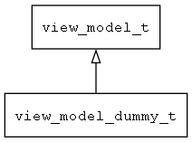

## view\_model\_dummy\_t
### 概述


dummy view_model
----------------------------------
### 函数
<p id="view_model_dummy_t_methods">

| 函数名称 | 说明 | 
| -------- | ------------ | 
| <a href="#view_model_dummy_t_view_model_dummy_create">view\_model\_dummy\_create</a> | 创建dummy模型对象。 |
#### view\_model\_dummy\_create 函数
-----------------------

* 函数功能：

> <p id="view_model_dummy_t_view_model_dummy_create">创建dummy模型对象。

对于一些简单的窗口，只需要简单的导航(打开或关闭窗口)，可以不用实现自己的模型，而使用dummy模型。

* 函数原型：

```
view_model_t* view_model_dummy_create (navigator_request_t* req);
```

* 参数说明：

| 参数 | 类型 | 说明 |
| -------- | ----- | --------- |
| 返回值 | view\_model\_t* | 返回view\_model对象。 |
| req | navigator\_request\_t* | 请求参数。 |
