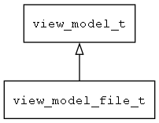

## view\_model\_file\_t
### 概述


提供读写文件，访问文件信息(可用于读写设备文件)，浏览(选择)文件等功能。
----------------------------------
### 函数
<p id="view_model_file_t_methods">

| 函数名称 | 说明 | 
| -------- | ------------ | 
| <a href="#view_model_file_t_view_model_file_create">view\_model\_file\_create</a> | 创建file模型对象。 |
### 属性
<p id="view_model_file_t_properties">

| 属性名称 | 类型 | 说明 | 
| -------- | ----- | ------------ | 
| <a href="#view_model_file_t_auto_load">auto\_load</a> | bool\_t | 是否自动加载文件内容。 |
| <a href="#view_model_file_t_content;">content;</a> | char* | 文件内容。 |
| <a href="#view_model_file_t_filename">filename</a> | str\_t | 文件名。 |
| <a href="#view_model_file_t_is_dirty">is\_dirty</a> | bool\_t | 文件内容是否已经被修改。 |
| <a href="#view_model_file_t_size">size</a> | uint32\_t | 文件大小。 |
#### view\_model\_file\_create 函数
-----------------------

* 函数功能：

> <p id="view_model_file_t_view_model_file_create">创建file模型对象。

读取文件，访问文件信息(可用于读写设备文件)。

```xml
v-model='file(path="/data/data/com.example.app/files/test.txt" auto_load=true)'
v-model='file(path="${temp_dir}/files/test.txt" auto_load=true)'
v-model='file(path="${app_dir}/files/test.txt" auto_load=true)'
v-model='file(path="${user_dir}/files/test.txt" auto_load=true)'
```

* 函数原型：

```
view_model_t* view_model_file_create (navigator_request_t* req);
```

* 参数说明：

| 参数 | 类型 | 说明 |
| -------- | ----- | --------- |
| 返回值 | view\_model\_t* | 返回view\_model对象。 |
| req | navigator\_request\_t* | 请求参数。 |
#### auto\_load 属性
-----------------------
> <p id="view_model_file_t_auto_load">是否自动加载文件内容。

* 类型：bool\_t

| 特性 | 是否支持 |
| -------- | ----- |
| 可直接读取 | 是 |
| 可直接修改 | 否 |
#### content; 属性
-----------------------
> <p id="view_model_file_t_content;">文件内容。

* 类型：char*

| 特性 | 是否支持 |
| -------- | ----- |
| 可直接读取 | 是 |
| 可直接修改 | 否 |
#### filename 属性
-----------------------
> <p id="view_model_file_t_filename">文件名。

* 类型：str\_t

| 特性 | 是否支持 |
| -------- | ----- |
| 可直接读取 | 是 |
| 可直接修改 | 否 |
#### is\_dirty 属性
-----------------------
> <p id="view_model_file_t_is_dirty">文件内容是否已经被修改。

* 类型：bool\_t

| 特性 | 是否支持 |
| -------- | ----- |
| 可直接读取 | 是 |
| 可直接修改 | 否 |
#### size 属性
-----------------------
> <p id="view_model_file_t_size">文件大小。

* 类型：uint32\_t

| 特性 | 是否支持 |
| -------- | ----- |
| 可直接读取 | 是 |
| 可直接修改 | 否 |
