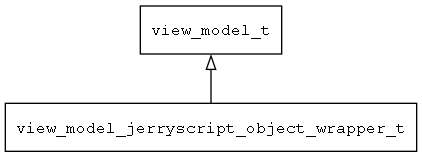

## view\_model\_jerryscript\_object\_wrapper\_t
### 概述


wrap jerryscript object to a view_model
----------------------------------
### 函数
<p id="view_model_jerryscript_object_wrapper_t_methods">

| 函数名称 | 说明 | 
| -------- | ------------ | 
| <a href="#view_model_jerryscript_object_wrapper_t_mvvm_deinit">mvvm\_deinit</a> | ~初始化MVVM。 |
| <a href="#view_model_jerryscript_object_wrapper_t_mvvm_init">mvvm\_init</a> | 初始化MVVM。 |
| <a href="#view_model_jerryscript_object_wrapper_t_view_model_jerryscript_deinit">view\_model\_jerryscript\_deinit</a> | ~初始化jerryscript view model。 |
| <a href="#view_model_jerryscript_object_wrapper_t_view_model_jerryscript_init">view\_model\_jerryscript\_init</a> | 初始化jerryscript view model，注册相应的工厂函数。 |
| <a href="#view_model_jerryscript_object_wrapper_t_view_model_jerryscript_object_wrapper_create">view\_model\_jerryscript\_object\_wrapper\_create</a> | 将jsobj包装成view_model。 |
#### mvvm\_deinit 函数
-----------------------

* 函数功能：

> <p id="view_model_jerryscript_object_wrapper_t_mvvm_deinit">~初始化MVVM。

* 函数原型：

```
ret_t mvvm_deinit ();
```

* 参数说明：

| 参数 | 类型 | 说明 |
| -------- | ----- | --------- |
| 返回值 | ret\_t | 返回RET\_OK表示成功，否则表示失败。 |
#### mvvm\_init 函数
-----------------------

* 函数功能：

> <p id="view_model_jerryscript_object_wrapper_t_mvvm_init">初始化MVVM。

* 函数原型：

```
ret_t mvvm_init ();
```

* 参数说明：

| 参数 | 类型 | 说明 |
| -------- | ----- | --------- |
| 返回值 | ret\_t | 返回RET\_OK表示成功，否则表示失败。 |
#### view\_model\_jerryscript\_deinit 函数
-----------------------

* 函数功能：

> <p id="view_model_jerryscript_object_wrapper_t_view_model_jerryscript_deinit">~初始化jerryscript view model。

* 函数原型：

```
ret_t view_model_jerryscript_deinit ();
```

* 参数说明：

| 参数 | 类型 | 说明 |
| -------- | ----- | --------- |
| 返回值 | ret\_t | 返回RET\_OK表示成功，否则表示失败。 |
#### view\_model\_jerryscript\_init 函数
-----------------------

* 函数功能：

> <p id="view_model_jerryscript_object_wrapper_t_view_model_jerryscript_init">初始化jerryscript view model，注册相应的工厂函数。

* 函数原型：

```
ret_t view_model_jerryscript_init ();
```

* 参数说明：

| 参数 | 类型 | 说明 |
| -------- | ----- | --------- |
| 返回值 | ret\_t | 返回RET\_OK表示成功，否则表示失败。 |
#### view\_model\_jerryscript\_object\_wrapper\_create 函数
-----------------------

* 函数功能：

> <p id="view_model_jerryscript_object_wrapper_t_view_model_jerryscript_object_wrapper_create">将jsobj包装成view_model。

* 函数原型：

```
view_model_t* view_model_jerryscript_object_wrapper_create (jsvalue_t* jsobj);
```

* 参数说明：

| 参数 | 类型 | 说明 |
| -------- | ----- | --------- |
| 返回值 | view\_model\_t* | 返回view\_model对象。 |
| jsobj | jsvalue\_t* | js对象。 |
