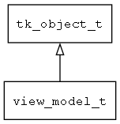

## view\_model\_t
### 概述


视图模型的基类。
----------------------------------
### 函数
<p id="view_model_t_methods">

| 函数名称 | 说明 | 
| -------- | ------------ | 
| <a href="#view_model_t_view_model_can_exec">view\_model\_can\_exec</a> | 检查指定的命令是否可以执行。 |
| <a href="#view_model_t_view_model_create_sub_view_model">view\_model\_create\_sub\_view\_model</a> | 创建子ViewModel。 |
| <a href="#view_model_t_view_model_create_sub_view_model_array">view\_model\_create\_sub\_view\_model\_array</a> | 创建子ViewModelArray。 |
| <a href="#view_model_t_view_model_deinit">view\_model\_deinit</a> | ~初始化。 |
| <a href="#view_model_t_view_model_exec">view\_model\_exec</a> | 执行指定的命令。 |
| <a href="#view_model_t_view_model_get_prop">view\_model\_get\_prop</a> | 获取指定属性的值。 |
| <a href="#view_model_t_view_model_has_prop">view\_model\_has\_prop</a> | 检查指定的属性是否存在。 |
| <a href="#view_model_t_view_model_init">view\_model\_init</a> | 初始化。 |
| <a href="#view_model_t_view_model_notify_items_changed">view\_model\_notify\_items\_changed</a> | 触发items改变事件。 |
| <a href="#view_model_t_view_model_notify_props_changed">view\_model\_notify\_props\_changed</a> | 触发props改变事件。 |
| <a href="#view_model_t_view_model_on_mount">view\_model\_on\_mount</a> | 视图与模型绑定完成后通知模型。 |
| <a href="#view_model_t_view_model_on_unmount">view\_model\_on\_unmount</a> | 视图销毁时通知模型。 |
| <a href="#view_model_t_view_model_on_will_mount">view\_model\_on\_will\_mount</a> | 打开视图即将加载模型时通知view_model。 |
| <a href="#view_model_t_view_model_on_will_unmount">view\_model\_on\_will\_unmount</a> | 视图即将关闭时通知模型。 |
| <a href="#view_model_t_view_model_preprocess_expr">view\_model\_preprocess\_expr</a> | 对表达式预处理。 |
| <a href="#view_model_t_view_model_preprocess_prop">view\_model\_preprocess\_prop</a> | 对属性进行预处理。 |
| <a href="#view_model_t_view_model_set_prop">view\_model\_set\_prop</a> | 设置指定属性的值。 |
#### view\_model\_can\_exec 函数
-----------------------

* 函数功能：

> <p id="view_model_t_view_model_can_exec">检查指定的命令是否可以执行。

* 函数原型：

```
bool_t view_model_can_exec (view_model_t* view_model, const char* name, const char* args);
```

* 参数说明：

| 参数 | 类型 | 说明 |
| -------- | ----- | --------- |
| 返回值 | bool\_t | 返回TRUE表示可以执行，否则表示不可以执行。 |
| view\_model | view\_model\_t* | view\_model对象。 |
| name | const char* | 命令名。 |
| args | const char* | 命令的参数。 |
#### view\_model\_create\_sub\_view\_model 函数
-----------------------

* 函数功能：

> <p id="view_model_t_view_model_create_sub_view_model">创建子ViewModel。

* 函数原型：

```
ret_t view_model_create_sub_view_model (view_model_t* view_model, const char* name);
```

* 参数说明：

| 参数 | 类型 | 说明 |
| -------- | ----- | --------- |
| 返回值 | ret\_t | 返回RET\_OK表示成功，否则表示失败。 |
| view\_model | view\_model\_t* | view\_model对象。 |
| name | const char* | 名称。 |
#### view\_model\_create\_sub\_view\_model\_array 函数
-----------------------

* 函数功能：

> <p id="view_model_t_view_model_create_sub_view_model_array">创建子ViewModelArray。

* 函数原型：

```
ret_t view_model_create_sub_view_model_array (view_model_t* view_model, const char* name);
```

* 参数说明：

| 参数 | 类型 | 说明 |
| -------- | ----- | --------- |
| 返回值 | ret\_t | 返回RET\_OK表示成功，否则表示失败。 |
| view\_model | view\_model\_t* | view\_model对象。 |
| name | const char* | 名称。 |
#### view\_model\_deinit 函数
-----------------------

* 函数功能：

> <p id="view_model_t_view_model_deinit">~初始化。

* 函数原型：

```
ret_t view_model_deinit (view_model_t* view_model);
```

* 参数说明：

| 参数 | 类型 | 说明 |
| -------- | ----- | --------- |
| 返回值 | ret\_t | 返回RET\_OK表示成功，否则表示失败。 |
| view\_model | view\_model\_t* | view\_model对象。 |
#### view\_model\_exec 函数
-----------------------

* 函数功能：

> <p id="view_model_t_view_model_exec">执行指定的命令。

* 函数原型：

```
ret_t view_model_exec (view_model_t* view_model, const char* name, const char* args);
```

* 参数说明：

| 参数 | 类型 | 说明 |
| -------- | ----- | --------- |
| 返回值 | ret\_t | 返回RET\_OK表示成功，否则表示失败。 |
| view\_model | view\_model\_t* | view\_model对象。 |
| name | const char* | 命令名。 |
| args | const char* | 命令的参数。 |
#### view\_model\_get\_prop 函数
-----------------------

* 函数功能：

> <p id="view_model_t_view_model_get_prop">获取指定属性的值。

* 函数原型：

```
ret_t view_model_get_prop (view_model_t* view_model, const char* name, value_t* value);
```

* 参数说明：

| 参数 | 类型 | 说明 |
| -------- | ----- | --------- |
| 返回值 | ret\_t | 返回RET\_OK表示成功，否则表示失败。 |
| view\_model | view\_model\_t* | view\_model对象。 |
| name | const char* | 属性名。 |
| value | value\_t* | 属性值。 |
#### view\_model\_has\_prop 函数
-----------------------

* 函数功能：

> <p id="view_model_t_view_model_has_prop">检查指定的属性是否存在。

* 函数原型：

```
ret_t view_model_has_prop (view_model_t* view_model, const char* name);
```

* 参数说明：

| 参数 | 类型 | 说明 |
| -------- | ----- | --------- |
| 返回值 | ret\_t | 返回RET\_OK表示成功，否则表示失败。 |
| view\_model | view\_model\_t* | view\_model对象。 |
| name | const char* | 属性名称。 |
#### view\_model\_init 函数
-----------------------

* 函数功能：

> <p id="view_model_t_view_model_init">初始化。

* 函数原型：

```
view_model_t* view_model_init (view_model_t* view_model);
```

* 参数说明：

| 参数 | 类型 | 说明 |
| -------- | ----- | --------- |
| 返回值 | view\_model\_t* | 返回view\_model对象。 |
| view\_model | view\_model\_t* | view\_model对象。 |
#### view\_model\_notify\_items\_changed 函数
-----------------------

* 函数功能：

> <p id="view_model_t_view_model_notify_items_changed">触发items改变事件。

* 函数原型：

```
ret_t view_model_notify_items_changed (view_model_t* view_model, tk_object_t* target);
```

* 参数说明：

| 参数 | 类型 | 说明 |
| -------- | ----- | --------- |
| 返回值 | ret\_t | 返回RET\_OK表示成功，否则表示失败。 |
| view\_model | view\_model\_t* | view\_model对象。 |
| target | tk\_object\_t* | 发生变化的items对象。 |
#### view\_model\_notify\_props\_changed 函数
-----------------------

* 函数功能：

> <p id="view_model_t_view_model_notify_props_changed">触发props改变事件。

* 函数原型：

```
ret_t view_model_notify_props_changed (view_model_t* view_model);
```

* 参数说明：

| 参数 | 类型 | 说明 |
| -------- | ----- | --------- |
| 返回值 | ret\_t | 返回RET\_OK表示成功，否则表示失败。 |
| view\_model | view\_model\_t* | view\_model对象。 |
#### view\_model\_on\_mount 函数
-----------------------

* 函数功能：

> <p id="view_model_t_view_model_on_mount">视图与模型绑定完成后通知模型。

* 函数原型：

```
ret_t view_model_on_mount (view_model_t* view_model);
```

* 参数说明：

| 参数 | 类型 | 说明 |
| -------- | ----- | --------- |
| 返回值 | ret\_t | 返回RET\_OK表示成功，否则表示失败。 |
| view\_model | view\_model\_t* | view\_model对象。 |
#### view\_model\_on\_unmount 函数
-----------------------

* 函数功能：

> <p id="view_model_t_view_model_on_unmount">视图销毁时通知模型。

* 函数原型：

```
ret_t view_model_on_unmount (view_model_t* view_model);
```

* 参数说明：

| 参数 | 类型 | 说明 |
| -------- | ----- | --------- |
| 返回值 | ret\_t | 返回RET\_OK表示成功，否则表示失败。 |
| view\_model | view\_model\_t* | view\_model对象。 |
#### view\_model\_on\_will\_mount 函数
-----------------------

* 函数功能：

> <p id="view_model_t_view_model_on_will_mount">打开视图即将加载模型时通知view_model。

* 函数原型：

```
ret_t view_model_on_will_mount (view_model_t* view_model, navigator_request_t* req);
```

* 参数说明：

| 参数 | 类型 | 说明 |
| -------- | ----- | --------- |
| 返回值 | ret\_t | 返回RET\_OK表示成功，否则表示失败。 |
| view\_model | view\_model\_t* | view\_model对象。 |
| req | navigator\_request\_t* | request对象。 |
#### view\_model\_on\_will\_unmount 函数
-----------------------

* 函数功能：

> <p id="view_model_t_view_model_on_will_unmount">视图即将关闭时通知模型。

* 函数原型：

```
ret_t view_model_on_will_unmount (view_model_t* view_model);
```

* 参数说明：

| 参数 | 类型 | 说明 |
| -------- | ----- | --------- |
| 返回值 | ret\_t | 返回RET\_OK表示成功，否则表示失败。 |
| view\_model | view\_model\_t* | view\_model对象。 |
#### view\_model\_preprocess\_expr 函数
-----------------------

* 函数功能：

> <p id="view_model_t_view_model_preprocess_expr">对表达式预处理。

* 函数原型：

```
ret_t view_model_preprocess_expr (view_model_t* view_model, const char* expr);
```

* 参数说明：

| 参数 | 类型 | 说明 |
| -------- | ----- | --------- |
| 返回值 | ret\_t | 返回处理后的表达式。 |
| view\_model | view\_model\_t* | view\_model对象。 |
| expr | const char* | 表达式。 |
#### view\_model\_preprocess\_prop 函数
-----------------------

* 函数功能：

> <p id="view_model_t_view_model_preprocess_prop">对属性进行预处理。

* 函数原型：

```
ret_t view_model_preprocess_prop (view_model_t* view_model, const char* prop);
```

* 参数说明：

| 参数 | 类型 | 说明 |
| -------- | ----- | --------- |
| 返回值 | ret\_t | 返回处理后的表达式。 |
| view\_model | view\_model\_t* | view\_model对象。 |
| prop | const char* | 表达式。 |
#### view\_model\_set\_prop 函数
-----------------------

* 函数功能：

> <p id="view_model_t_view_model_set_prop">设置指定属性的值。

* 函数原型：

```
ret_t view_model_set_prop (view_model_t* view_model, const char* name, value_t* value);
```

* 参数说明：

| 参数 | 类型 | 说明 |
| -------- | ----- | --------- |
| 返回值 | ret\_t | 返回RET\_OK表示成功，否则表示失败。 |
| view\_model | view\_model\_t* | view\_model对象。 |
| name | const char* | 属性名。 |
| value | value\_t* | 属性值。 |
