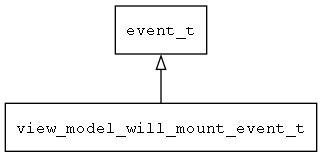

## view\_model\_will\_mount\_event\_t
### 概述


打开视图即将加载模型时通知view_model时的数据结构。
----------------------------------
### 函数
<p id="view_model_will_mount_event_t_methods">

| 函数名称 | 说明 | 
| -------- | ------------ | 
| <a href="#view_model_will_mount_event_t_view_model_get_items_size">view\_model\_get\_items\_size</a> | 获取items的大小。 |
### 属性
<p id="view_model_will_mount_event_t_properties">

| 属性名称 | 类型 | 说明 | 
| -------- | ----- | ------------ | 
| <a href="#view_model_will_mount_event_t_req">req</a> | navigator\_request\_t* | 请求对象。 |
#### view\_model\_get\_items\_size 函数
-----------------------

* 函数功能：

> <p id="view_model_will_mount_event_t_view_model_get_items_size">获取items的大小。

* 函数原型：

```
uint32_t view_model_get_items_size (tk_object_t* obj);
```

* 参数说明：

| 参数 | 类型 | 说明 |
| -------- | ----- | --------- |
| 返回值 | uint32\_t | 返回items的大小。 |
| obj | tk\_object\_t* | items对象。 |
#### req 属性
-----------------------
> <p id="view_model_will_mount_event_t_req">请求对象。

* 类型：navigator\_request\_t*

