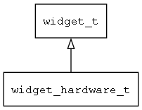

## widget\_hardware\_t
### 概述


wrap hardware device to a widget
----------------------------------
### 函数
<p id="widget_hardware_t_methods">

| 函数名称 | 说明 | 
| -------- | ------------ | 
| <a href="#widget_hardware_t_widget_hardware_cast">widget\_hardware\_cast</a> | 转换为widget_hardware对象(供脚本语言使用)。 |
| <a href="#widget_hardware_t_widget_hardware_create">widget\_hardware\_create</a> | 创建widget_hardware对象 |
| <a href="#widget_hardware_t_widget_hardware_get_widget_vtable">widget\_hardware\_get\_widget\_vtable</a> | 获取 widget_hardware 虚表。 |
#### widget\_hardware\_cast 函数
-----------------------

* 函数功能：

> <p id="widget_hardware_t_widget_hardware_cast">转换为widget_hardware对象(供脚本语言使用)。

* 函数原型：

```
widget_t* widget_hardware_cast (widget_t* widget);
```

* 参数说明：

| 参数 | 类型 | 说明 |
| -------- | ----- | --------- |
| 返回值 | widget\_t* | widget\_hardware对象。 |
| widget | widget\_t* | widget\_hardware对象。 |
#### widget\_hardware\_create 函数
-----------------------

* 函数功能：

> <p id="widget_hardware_t_widget_hardware_create">创建widget_hardware对象

* 函数原型：

```
widget_t* widget_hardware_create (widget_t* parent, xy_t x, xy_t y, wh_t w, wh_t h, const char* type, const char* args);
```

* 参数说明：

| 参数 | 类型 | 说明 |
| -------- | ----- | --------- |
| 返回值 | widget\_t* | 对象。 |
| parent | widget\_t* | 父控件 |
| x | xy\_t | x坐标 |
| y | xy\_t | y坐标 |
| w | wh\_t | 宽度 |
| h | wh\_t | 高度 |
| type | const char* | 设备类型。 |
| args | const char* | 创建参数。 |
#### widget\_hardware\_get\_widget\_vtable 函数
-----------------------

* 函数功能：

> <p id="widget_hardware_t_widget_hardware_get_widget_vtable">获取 widget_hardware 虚表。

* 函数原型：

```
const widget_vtable_t* widget_hardware_get_widget_vtable ();
```

* 参数说明：

| 参数 | 类型 | 说明 |
| -------- | ----- | --------- |
| 返回值 | const widget\_vtable\_t* | 成功返回 widget\_hardware 虚表。 |
