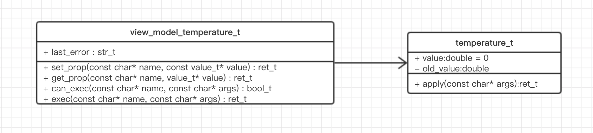

## 用 C 语言实现 ViewModel

用 AWTK-MVVM 开发应用程序时，开发者的主要工作是编写 ViewModel 和 Model 的代码。ViewModel 本身是界面无关的，是可以自动测试的，所以简单的应用程序可以将 ViewModel 和 Model 合二为一，复杂的应用程序可以将两者分开。至于什么时候分开，什么时候合并，开发者可以自行决定。对于 AWTK-MVVM 框架来说，它只关心 ViewModel，开发者按要求实现 ViewModel 接口即可。

用 C 语言实现 ViewModel 时，需要实现几个特定的接口函数。这主要是由 C 语言的特性决定的，C 语言是静态编译的语言，也没有反射的功能，有些事情就比较麻烦了。为了弥补这些缺陷，我们需要实现下列几个接口函数：

1. 没有办法通过属性的名称，从对象中获取属性的值。为此需要实现一个 get_prop 函数，给定一个属性的名称，返回该属性的值：

```
typedef ret_t (*object_get_prop_t)(object_t* obj, const char* name, value_t* v); 
```

2. 没有办法通过属性的名称，去设置对象属性的值。为此需要实现一个 set_prop 函数，给定一个属性的名称和值，去设置该属性的值：

```
typedef ret_t (*object_set_prop_t)(object_t* obj, const char* name, const value_t* v); 
```

3. 没有办法通过函数的名称，去调用对象的成员函数。为此需要实现 exec 函数，给定函数的名称，去执行对象的成员函数。还需要实现 can_exec 函数，检查该函数是否可用。

```
typedef bool_t (*object_can_exec_t)(object_t* obj, const char* name, const char* args);

typedef ret_t (*object_exec_t)(object_t* obj, const char* name, const char* args);
```

简单的说，实现 ViewModel 就是要实现以上这些函数，

### 1. 手工编写 ViewModel

这里，我们以一个温度控制器的例子来介绍如何手工实现一个 ViewModel。给温度控制器设定一个温度，如果该温度与之前的温度不同，才可以把它设置到温度控制器中。

我们把温度控制器的名字取为 temperature，它有：

* 一个 double 类型的 value 属性，代表要设置的温度。
* 还有一个 apply 的命令，负责让设置的温度生效。

我们需要创建两个类：temperature\_t表示模型，view_model\_temperature\_t是对应的视图模型。



**现在我们来定义temperature\_t 类 和 view_model\_temperature\_t类。** 

temperature\_t就是一个简单的结构，在C语言中可以表示一个类。

```
typedef struct _temperature_t {
  double value;
  double old_value;
} temperature_t;
```

> 这里"old_value"成员变量，用来保存之前的旧值，通过比较新旧的值是否相同，来决定"apply"命令是否可用。

在 C 语言中我们用结构体来模拟类，结构体的第一个成员是基类。下面的例子表示，view_model\_temperature\_t 类继承了 view\_model\_t 类。

```
typedef struct _temperature_view_model_t {
  view_model_t view_model;

  /*model object*/
  temperature_t* temperature;
} temperature_view_model_t;
```

**实现 get_prop 函数。** 

当属性名为"value"时，我们把成员变量"value"的值，放到参数"v"里返回给调用者。

```
static ret_t temperature_view_model_get_prop(object_t* obj, const char* name, value_t* v) {
  temperature_view_model_t* vm = (temperature_view_model_t*)(obj);
  temperature_t* temperature = vm->temperature;

  if (tk_str_eq("value", name)) {
    double value = temperature->value;
    value_set_double(v, value);

  } else {
    log_debug("not found %s\n", name);
    return RET_NOT_FOUND;
  }

  return RET_OK;
}
```

**实现 set_prop 函数。** 

当属性名为"value"时，我们把参数"v"的值赋给成员变量"value"。

```
static ret_t temperature_view_model_set_prop(object_t* obj, const char* name, const value_t* v) {
  temperature_view_model_t* vm = (temperature_view_model_t*)(obj);
  temperature_t* temperature = vm->temperature;

  if (tk_str_eq("value", name)) {
    temperature->value = value_double(v);
  
  } else {
    log_debug("not found %s\n", name);
    return RET_NOT_FOUND;
  }
  
  return RET_OK;
}
```

**实现 can_exec 函数。** 

当命令名称为"apply"时，调用函数 temperature\_can\_exec\_apply 去检查"apply"命令是否可用。在函数 temperature\_can\_exec\_apply 中，当新的值和旧的值不同时，返回 TRUE 表示"apply"命令可以执行。

```
static bool_t temperature_can_exec_apply(temperature_t* temperature, const char* args) {
  return temperature->old_value != temperature->value;
}

static bool_t temperature_view_model_can_exec(object_t* obj, const char* name, const char* args) {
  temperature_view_model_t* vm = (temperature_view_model_t*)(obj);
  temperature_t* temperature = vm->temperature;

  if (tk_str_eq("apply", name)) {
    return temperature_can_exec_apply(temperature, args);
  } else {
    return FALSE;
  }
}
```

**实现 exec 函数。** 

当命令名称为"apply"时，调用函数 temperature\_apply。在函数 temperature\_apply 中去执行实际的命令。

```
static ret_t temperature_apply(temperature_t* temperature, const char* args) {
  temperature->old_value = temperature->value;
  return RET_OBJECT_CHANGED;
}

static ret_t temperature_view_model_exec(object_t* obj, const char* name, const char* args) {
  temperature_view_model_t* vm = (temperature_view_model_t*)(obj);
  temperature_t* temperature = vm->temperature;

  if (tk_str_eq("apply", name)) {
    return temperature_apply(temperature, args);
  } else {
    log_debug("not found %s\n", name);
    return RET_NOT_FOUND;
  }
}

```

**ViewModel 构造函数。** 

现在我们用前面实现的函数来初始化 object\_vtable\_t 结构，并实现 ViewModel 的构造函数 temperature\_create。

```
static const object_vtable_t s_temperature_view_model_vtable = {
  .type = "temperature",
  .desc = "temperature controller",
  .size = sizeof(temperature_view_model_t),
  .exec = temperature_view_model_exec,
  .can_exec = temperature_view_model_can_exec,
  .get_prop = temperature_view_model_get_prop,
  .set_prop = temperature_view_model_set_prop,
  .on_destroy = temperature_view_model_on_destroy
};

view_model_t* temperature_view_model_create(navigator_request_t* req) {
  object_t* obj = object_create(&s_temperature_view_model_vtable);
  view_model_t* vm = view_model_init(VIEW_MODEL(obj));
  temperature_view_model_t* temperature_view_model = (temperature_view_model_t*)(vm);

  return_value_if_fail(vm != NULL, NULL);

  temperature_view_model->temperature = temperature_create();
  ENSURE(temperature_view_model->temperature != NULL);

  return vm;
}
```

**将 ViewModel 构造函数注册到工厂。** 

最后，还需要把 ViewModel 构造函数注册到工厂中，这样在 XML 文件中就可以直接指定 ViewModel 的名称了。

```
view_model_factory_register("temperature", temperature_view_model_create);
```

**最后将View Model和 View(XML)关联起来。** 

```
<window anim_hint="htranslate" v-model="temperature">
  <label text="1" x="center" y="30" w="90%" h="40" text="temperature"/>
  <label text="1" x="center" y="middle:-40" w="80%" h="40" v-data:text="{value}"/>
  <slider x="center" y="middle" w="90%" h="20" v-data:value="{value}"/>
  <button text="Apply" x="center" y="middle:40" w="40%" h="40" v-on:click="{apply}"/>
</window>
```

在这个XML文件中：

* v-model="temperature" 表示把窗口关联到名为"temperature"的视图模型，这个名字是前面注册时指定的。
* v-data:text="{value}" 表示把控件的"text"属性绑定到视图模型的"value"属性上。
* v-data:value="{value}" 表示把控件的"value"属性绑定到视图模型的"value"属性上。
* v-on:click="{apply}" 表示点击事件执行"apply"命令。

### 2. 通过接口描述来生成 ViewModel 框架代码

前面我们手工实现了 temperature 的 ViewModel 和 Model，这个过程不难，但是有些单调。如果是用动态语言如JS来实现，几行代码就搞定了。如可能的话，用JS来写是最好的选择，如果确实需要用C语言来写，我们提供了一个工具来生成上面的代码。

代码产生器接受一个JSON格式的文件，它描述了模型的接口。比如，前面的例子，我们可以用下列的JSON来定义：

```
{
  "name":"temperature",
  "props": [
    {   
      "name":"value",
      "type":"double"
    },  
    {   
      "name":"old_value",
      "private": true,
      "type":"double"
    }   
  ],  
  "cmds": [
    {   
      "name":"apply"
    }   
  ]
}
```

gen_vm.js用来生成普通的ViewModel框架代码，用法如下：

```
node gen_vm.js your_idl.json
```

将上面的JSON命名为temperature.json，执行下面的命令：


```
node gen_vm.js temperature.json
```

会生成temperature.h和temperature.c两个文件。

temperature.h

```
#ifndef TK_TEMPERATURE_H
#define TK_TEMPERATURE_H

#include "mvvm/base/view_model.h"

BEGIN_C_DECLS

typedef struct _temperature_t{
  double value;
  double old_value;
} temperature_t;

typedef struct _temperature_view_model_t {
  view_model_t view_model;

  /*model object*/
  temperature_t* temperature;
} temperature_view_model_t;

view_model_t* temperature_view_model_create(navigator_request_t* req);

END_C_DECLS

#endif /*TK_TEMPERATURE_H*/
```

temperature.c

```
#include "tkc/mem.h"
#include "tkc/utils.h"
#include "temperature.h"

static temperature_t* temperature_create(void) {
  return TKMEM_ZALLOC(temperature_t);
} 

static ret_t temperature_destroy(temperature_t* temperature) {
  TKMEM_FREE(temperature);

  return RET_OK;
}

static bool_t temperature_can_exec_apply(temperature_t* temperature, const char* args) {
  return TRUE;
}

static ret_t temperature_apply(temperature_t* temperature, const char* args) {
  
  return RET_OBJECT_CHANGED;
}

static ret_t temperature_view_model_set_prop(object_t* obj, const char* name, const value_t* v) {
  temperature_view_model_t* vm = (temperature_view_model_t*)(obj);
  temperature_t* temperature = vm->temperature;

  if (tk_str_eq("value", name)) {
    temperature->value = value_double(v);

  } else {
    log_debug("not found %s\n", name);
    return RET_NOT_FOUND;
  }

  return RET_OK;
}


static ret_t temperature_view_model_get_prop(object_t* obj, const char* name, value_t* v) {
  temperature_view_model_t* vm = (temperature_view_model_t*)(obj);
  temperature_t* temperature = vm->temperature;

  if (tk_str_eq("value", name)) {
    double value = temperature->value;
    value_set_double(v, value);

  } else {
    log_debug("not found %s\n", name);
    return RET_NOT_FOUND;
  }

  return RET_OK;
}

static bool_t temperature_view_model_can_exec(object_t* obj, const char* name, const char* args) {
  temperature_view_model_t* vm = (temperature_view_model_t*)(obj);
  temperature_t* temperature = vm->temperature;

  if (tk_str_eq("apply", name)) {
    return temperature_can_exec_apply(temperature, args);
  } else {
    return FALSE;
  }
}

static ret_t temperature_view_model_exec(object_t* obj, const char* name, const char* args) {
  temperature_view_model_t* vm = (temperature_view_model_t*)(obj);
  temperature_t* temperature = vm->temperature;

  if (tk_str_eq("apply", name)) {
    return temperature_apply(temperature, args);
  } else {
    log_debug("not found %s\n", name);
    return RET_NOT_FOUND;
  }
}

static ret_t temperature_view_model_on_destroy(object_t* obj) {
  temperature_view_model_t* vm = (temperature_view_model_t*)(obj);
  return_value_if_fail(vm != NULL, RET_BAD_PARAMS);

  temperature_destroy(vm->temperature);

  return view_model_deinit(VIEW_MODEL(obj));
}

static const object_vtable_t s_temperature_view_model_vtable = {
  .type = "temperature",
  .desc = "temperature",
  .size = sizeof(temperature_view_model_t),
  .exec = temperature_view_model_exec,
  .can_exec = temperature_view_model_can_exec,
  .get_prop = temperature_view_model_get_prop,
  .set_prop = temperature_view_model_set_prop,
  .on_destroy = temperature_view_model_on_destroy
};

view_model_t* temperature_view_model_create(navigator_request_t* req) {
  object_t* obj = object_create(&s_temperature_view_model_vtable);
  view_model_t* vm = view_model_init(VIEW_MODEL(obj));
  temperature_view_model_t* temperature_view_model = (temperature_view_model_t*)(vm);

  return_value_if_fail(vm != NULL, NULL);

  temperature_view_model->temperature = temperature_create();
  ENSURE(temperature_view_model->temperature != NULL);

  return vm;
}

```

代码产生器只能产生框架代码，一些具体的实现需要自己补充。比如temperature\_can\_exec\_apply和temperature\_apply是空函数，我们需要自己实现：

```
static bool_t temperature_can_exec_apply(temperature_t* temperature, const char* args) {
  return temperature->old_value != temperature->value;
}

static ret_t temperature_apply(temperature_t* temperature, const char* args) {
  temperature->old_value = temperature->value;
  return RET_OBJECT_CHANGED;
}
```

由此可见，有代码产生器的帮助，开发AWTK-MVVM的程序就容易多了。但是充分理解产生出来的代码，对于调试定位问题是很有帮助的，
所以有必要仔细阅读产生器出来的代码。

前面的JSON文件非常简单，但为了满足不同的需求，JSON有很高级选项，下面我们来介绍一下这些选项，熟练掌握这些选项，可以大大提高效率。

#### JSON的内容介绍

##### 1. name Model的名称 

Model的名称必须是有效的C语言变量名，一般使用小写字母的单词，多个单词之间用下划线连接。如：

```
"name":"temperature",
```

##### 2. desc Model的描述信息(可选)

##### 3. version 版本号(可选)，方便维护。

##### 4. author 作者(可选)，方便维护。

##### 5. init Model 初始化(可选)。

比如，在temperature中，我们指定init如下：

```
"init":"  temperature->value = 20;",
```

生成的temperature_create函数就会变成：

```
temperature_t* temperature_create(void) {
  temperature_t* temperature = TKMEM_ZALLOC(temperature_t);
  return_value_if_fail(temperature != NULL, NULL);
  
  temperature->value = 20; 
  
  return temperature;
} 
```

##### 6.deinit Model 析构(可选)。

比如，在temperature中，我们指定deinit如下：

```
"deinit":"  temperature->value = 0;",
```

生成的temperature_create函数就会变成：

```
static ret_t temperature_destroy(temperature_t* temperature) {
  return_value_if_fail(temperature != NULL, RET_BAD_PARAMS);

  temperature->value = 0;

  TKMEM_FREE(temperature);

  return RET_OK;
}
```

##### 7.属性定义。

1.name 属性的名称 

属性的名称必须是有效的C语言变量名，一般使用小写字母的单词，多个单词之间用下划线连接。如：

```
"name":"value",
```

2.desc 属性的描述信息(可选)

3.type 属性的类型

属性的类型目前支持以下类型：

* int8_t
* int16_t
* int32_t
* int64_t
* uint8_t
* uint16_t
* uint32_t
* uint64_t
* float_t
* float
* double 
* char* 
* void*

4.setter 属性的set方法

如果setter为TRUE表示生成对应的set函数。比如在temperature例子中，属性"value"的"setter"为true，就会生成temperature\_set\_value函数：

```
    {   
      "name":"value",
      "type":"double",
      "setter":true
    }, 
```

```
static ret_t temperature_set_value(temperature_t* temperature, double value) {
  temperature->value = value;

  return RET_OK;
}

```

如果setter是一个字符串，则视为自定义的set方法，代码产生器会把它作为set函数的函数体。


```
    {   
      "name":"value",
      "type":"double",
      "setter":"temperature->value = value + 1;\n  return RET_OK;"
    }, 
```

```
static ret_t temperature_set_value(temperature_t* temperature, double value) {
  temperature->value = value + 1;
  
  return RET_OK;
}

```

5.getter 属性的get方法

如果getter为TRUE表示生成对应的get函数。比如在temperature例子中，属性"value"的"getter"为true，就会生成temperature\_get\_value函数：

如果getter是一个字符串，则视为自定义的get方法，代码产生器会把它作为get函数的函数体。

这个和setter非常类似，就不赘述了。

6.fake 假属性的标识

有的属性并不真正存在，而是有其它属性变化而来的。比如总价是由数量和单价相乘而来。这时可以指定"fake"为true，避免生成实际的变量定义。


##### 8.命令定义。
1.name 命令的名称 

命令的名称必须是有效的C语言变量名，一般使用小写字母的单词，多个单词之间用下划线连接。如：

```
"name":"apply",
```

2.desc 命令的描述信息(可选)

3.impl 命令的实现(可选)

在JSON里写代码通常不是一个好的做法，不过有工具的配合有是另外回事(后期可能会有相应工具配合)。
 