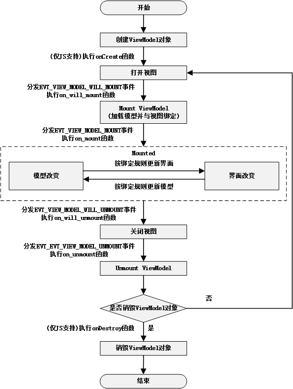

# ViewModel 生命周期

在 AWTK-MVVM 中 ViewModel 的生命周期如下图所示：




## 一、ViewModel 提供的事件

目前 ViewModel 中提供了以下模型相关事件，各事件的分发时机详见上图 (ViewModel 生命周期)：

```c
/**
 * @enum view_model_event_type_t
 *
 * 模型相关的事件。
 */
typedef enum _model_event_type_t {
  /**
   * @const EVT_VIEW_MODEL_WILL_MOUNT
   *
   * 打开视图即将加载模型时通知view_model。
   */
  EVT_VIEW_MODEL_WILL_MOUNT = 0xff,
  /**
   * @const EVT_VIEW_MODEL_MOUNT
   *
   * 视图与模型绑定完成后通知模型。
   */
  EVT_VIEW_MODEL_MOUNT,
  /**
   * @const EVT_VIEW_MODEL_WILL_UNMOUNT
   *
   * 视图即将关闭时通知模型。
   */
  EVT_VIEW_MODEL_WILL_UNMOUNT,
  /**
   * @const EVT_VIEW_MODEL_UNMOUNT
   *
   * 视图销毁时通知模型。
   */
  EVT_VIEW_MODEL_UNMOUNT,
} view_model_event_type_t;
```

## 二、ViewModel 中可重载的函数

除了提供以上事件之外，ViewModel 还提供可重载的函数，以下为常用的重载函数，其调用时机详见上图 (ViewModel 生命周期)：

* on_will_mount：打开视图即将加载模型时调用；
* on_mount：加载模型并 Mount ViewModel 完毕后调用；
* on_will_unmount：视图即将关闭时调用。
* on_unmount：视图销毁并 Unmount ViewModel 时调用；

函数声明如下：

```c
typedef ret_t (*view_model_on_will_mount_t)(view_model_t* view_model, navigator_request_t* req);
typedef ret_t (*view_model_on_mount_t)(view_model_t* view_model);
typedef ret_t (*view_model_on_will_unmount_t)(view_model_t* view_model);
typedef ret_t (*view_model_on_unmount_t)(view_model_t* view_model);

typedef struct _model_vtable_t {
  view_model_on_will_mount_t on_will_mount;
  view_model_on_mount_t on_mount;
  view_model_on_will_unmount_t on_will_unmount;
  view_model_on_unmount_t on_unmount;
} view_model_vtable_t;
```

> 更多 ViewModel 可重载函数请参考：awtk-mvvm/src/mvvm/base/view_model.h。


## 三、JS 中重载函数

在 JS 重载 ViewModel 的函数非常简单，只需按照下表中的函数名进行重载即可，其调用时机详见上图 (ViewModel 生命周期)：

| JS 重载时的函数名 | 对应函数名      | 备注       |
| ----------------- | --------------- | ---------- |
| onCreate          |                 | 仅 JS 支持 |
| onWillMount       | on_will_mount   |            |
| onMount           | on_mount        |            |
| onWillUnmount     | on_will_unmoun  |            |
| onUnmount         | on_will_unmount |            |
| onDestroy         |                 | 仅 JS 支持 |

比如，在图书列表的示例中，重载 onCreate() 函数创建图书数据，代码如下：

```js
  onCreate: function (req) {
    for (var i = 0; i < 100; i++) {
      this._add();
      this._add();
      this._add();
    }
  }
```

Windows 的命令行下，读者可以运行 jsdemo13 来查看实际的效果。

```
bin\jsdemo13
```

在 JS 中重载 ViewModel 的其他函数，代码如下：

```js
  onWillMount: function (req) {
    console.log('onWillMount');
  },
  onMount: function () {
    timerAdd(this.onTimer, 1000);
    console.log('onMount');
  },
  onWillUnmount: function () {
    console.log('onWillUnmount');
  },
  onUnmount: function () {
    console.log('onUnmount');
  }
```

Windows 的命令行下，读者可以运行 jsdemo10 来查看实际的效果。

```
bin\jsdemo10
```
